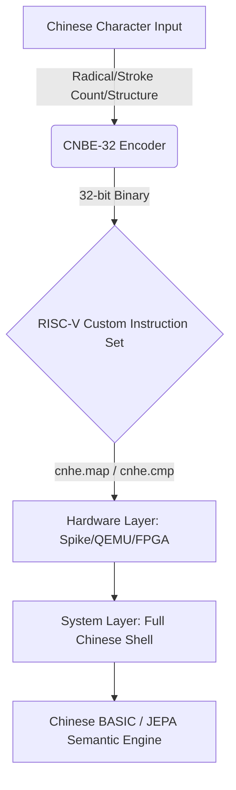

# CNBE-32

> **Project status**: Research prototype.
> **Stable**: Python bitfield encoder/decoder and Basic CJK lookup (20,902 chars), depending on available database.
> **Experimental**: LLM, JEPA, RISC-V, OS, finance, biology, and physics prototypes.
> See [docs/PYTHON_SDK.md](docs/PYTHON_SDK.md) for stable SDK documentation.

**Chinese Native Binary Encoding**

A 32-bit encoding that embeds the structural semantics of Chinese characters (radical, stroke count, and structure type) directly into binary, exploring how CPUs and AI can natively understand Chinese.

A structured 32-bit encoding for 97,686 CJK characters (theoretical encoding space; current database: 20,902 Basic CJK) that embeds radical, stroke count, and structure type directly into the encoding space.

<p align="center">
  <a href="docs/VISION.md"></a>
  <a href="https://pypi.org/project/cnbe32/"></a>
  <a href="docs/specification/bit-layout.md"></a>
  <a href="docs/specification/riscv-instructions.md"></a>
  <a href="llm_experiments/v8_hardware_system/v84_riscv_os_full/"></a>
  <a href="docs/VISION.md"></a>
  <a href="LICENSE"></a>
  <a href=".github/workflows/ci.yml"></a>
  <a href="hardware/wasm/"></a>
  <a href="docs/BENCHMARK.md"></a>
  <a href="data/cnbe32.db"></a>
</p>

<p align="center">
  <a href="#quick-start"><strong>[ Quick Start ]</strong></a>
  <a href="#key-experiments"><strong>[ Key Experiments ]</strong></a>
  <a href="#tech-stack"><strong>[ Tech Stack ]</strong></a>
  <a href="#how-to-contribute"><strong>[ How to Contribute ]</strong></a>
  <a href="README_ZH.md"><strong>[ 中文 ]</strong></a>  <a href="README_EN.md"><strong>[ English ]</strong></a>
</p>

---

## <span id="architecture-panorama">Architecture Panorama</span>



---

## <span id="vision--mission">Vision & Mission</span>

Inspired by the **Digital China 2035** strategy, CNBE-32's goal is:

> **To let every Chinese speaker seamlessly enter the AI era through their native language.**

This is an experimental research prototype with a validated technical concept. As an early-stage exploration in the field of native Chinese computing, it remains in an open research phase. In the AI Agent era, the dreams of previous generations of scientists about full-Chinese computer systems finally have a chance to be realized.

---

## Table of Contents

- [Architecture Panorama](#architecture-panorama)
- [Vision & Mission](#vision--mission)
- [Code Quick Look](#code-quick-look)
- [Why CNBE?](#why-cnbe)
- [JEPA Exploration](#jepa-exploration)
- [Cognitive Equity](#cognitive-equity)
- [Key Experiments](#key-experiments)
- [Key Insights I](#key-insights-large-models-vs-small-models)
- [Experimental Limitations & Future Directions](#experimental-limitations--future-directions)
- [Tech Stack](#tech-stack)
- [AI Agent Driven / AI Factory](#ai-agent-driven--ai-factory)
- [Quick Start](#quick-start)
- [Project Structure](#project-structure)
- [Roadmap](#roadmap)
- [How to Contribute](#how-to-contribute)
- [Disclaimer](#disclaimer)
- [License](#license)

---

## <span id="code-quick-look">Code Quick Look</span>

**Core Idea: Transform Chinese characters into 32-bit integers containing radical, stroke count, and structure type — letting the machine "see" the glyph directly.**

### CJK Character Mode (v6.0 Final)

```
Bit: 31              24 23    19 18    15 14              4  3     0
     +----------------+--------+--------+------------------------+-------+
     |  Radical (8bit)|Stroke(5)|Struct(4)|  Glyph Index (11bit)  | Ext(4)|
     +----------------+--------+--------+------------------------+-------+
```

| Field | Bit Range | Description | Range |
|---|-----------|---|-------|
| Radical | `[31:24]` | 214 Kangxi radicals + 41 extensions | 0-255 |
| Stroke Count | `[23:19]` | Number of strokes | 1-31 |
| Structure Type | `[18:15]` | Structural composition type | 9 types (single/left-right/top-bottom/enclosure, etc.) |
| Glyph Index | `[14:4]` | Intra-group index | 20,902 basic CJK characters |
| Extension | `[3:0]` | Traditional/Simplified, ancient/modern, dialect, reserved flags | Reserved |

### Encoding Examples

| Character | Unicode | CNBE-32 Encoding | Radical (ID) | Stroke Count | Structure Type |
|---|---------|---|--------------|---|----------------|
| 一 (one) | U+4E00 | `0x01080000` | 一 (1) | 1 | Single (独体) |
| 汉 (Chinese) | U+6C49 | `0x0F288101` | 氵 (water, 15) | 5 | Left-Right (左右) |
| 国 (country) | U+56FD | `0x1F400B0B` | 囗 (enclosure, 31) | 8 | Full Enclosure (全包围) |
| 明 (bright) | U+660E | `0x48400801` | 日 (sun, 72) | 8 | Left-Right (左右) |

---

## Important: This is Not Base32

CNBE-32 is **not** a "Chinese-localized" or "character-replacement" version of Base32.

| Dimension | Base32 | CNBE-32 |
|---|--------|---|
| **Encoding target** | Arbitrary binary data | **97,686 CJK characters (theoretical)** ≈ |
| **Code space** | Fixed 32 letters | **Structured 32-bit bitfield** (radical, stroke, structure) |
| **Goal** | Data compression / transmission | **Let machines "understand" character semantics** |
| **Target audience** | Human-readable (transcription) | **AI models, CPU instruction sets, OS kernels** |

**In one sentence**: Base32 turns data "into letters", CNBE-32 turns characters "into semantics".

### Who is it for?

- **AI models**: Structured prior knowledge input (radical=spatial anchor, stroke=discrete feature, structure=spatial relationship)
- **CPU instruction sets**: `cnhe.map` / `cnhe.extract` / `cnhe.cmp` operate at the hardware level
- **OS kernels**: Filenames, paths, system messages natively support CNBE-32 encoding
- **Not recommended**: URL transmission, database primary keys, human transcription (use Base64/Base32)

---

## <span id="why-cnbe">Why CNBE?</span>

| Dimension | Unicode / UTF-8 | CNBE-32 |
|---|-----------------|---|
| Objective | Character display and exchange | AI understanding and hardware acceleration |
| Encoding Method | Lookup table (Flat ID) | Semantic structuring |
| Machine Cognition | Identifies the character | Understands structural composition |
| AI Compatibility | Learns from data | Provides structural priors |

**10 cross-domain validations passed (incl. LLM LoRA training)

> *Note: Experimental accuracy metrics (e.g., "100%" in v1/v4) refer to model task performance on specific controlled test sets, not absolute encoding capability. See individual whitepapers for methodology.***: Linguistics, Ecology, Meteorology, Finance, Biology, Physics, Sociology, Pre-training, Mathematics

---

## <span id="jepa-exploration">JEPA Exploration</span>

CNBE is not a patch for today's Transformers, but foundational infrastructure for tomorrow's JEPA.

Yann LeCun's JEPA emphasizes prediction in representation space — and CNBE provides exactly the most structured representation space:

- **Radical = Spatial Anchor**: Characters sharing the same radical naturally cluster in binary space
- **Stroke Count = Discrete Feature**: Provides fine-grained morphological differentiation
- **Structure = Spatial Relationship**: Left-right, top-bottom, enclosure, etc. directly map to topological relationships

Completed JEPA validations: v9 tree structure prediction + v10 cross-9-domain generalization

> **Cross-domain applicability**: CNBE performs best on multi-dimensional structured temporal data (meteorology, ecology, finance). It may underperform on classification-heavy tasks (sociology, protein structure) or single-variable continuous systems (physics). See [Experimental Limitations](#experimental-limitations--future-directions) for details.

---

## <span id="cognitive-equity">Cognitive Equity</span>

The underlying logic of modern computers (from instruction sets to OS kernels) is built entirely on English/Latin alphabets. This creates a cognitive barrier for non-native English speakers who must first translate their thoughts before performing low-level development.

One exploratory direction of CNBE-32 is to help Chinese speakers engage with underlying technical concepts through their native linguistic thinking, potentially reducing language-related barriers. Note that encoding addresses the symbol-level cognitive layer; understanding underlying computer science concepts (memory management, interrupts, compilation principles) remains a cross-language cognitive challenge.

> **In the AI era, Chinese-speaking users can explore participating in technical discussions and low-level development through their native language, potentially reducing entry barriers caused by documentation language differences.**

### Core Performance Overview

| Metric | Value | Equity Value Explanation |
|---|:-----:|---|
| Small model (<1B) comprehension improvement | **+81%** (48%→87%) | Edge devices can achieve high-quality Chinese comprehension without cloud connectivity, breaking the compute monopoly of large tech companies |
| Medium model (1-7B) improvement | +9% ~ +17% | Mid-range mobile chips can smoothly run complex Chinese tasks without relying on high-end GPUs |
| Large model (>7B) benefit | ~0% (diminishing returns) | Validates that large models don't need this encoding; resources should be prioritized for small-to-medium intelligence scenarios |
| Hardware lookup extreme latency | 0.8 ns (x86) / 1 Cycle (FPGA) | Ultra-fast response for real-time interaction; suitable for low-frequency, low-power embedded chips |
| Minimal memory footprint | Only 81.6 KB (SRAM/BRAM) | Fits easily into any L1/L2 cache or on-chip storage without external DRAM, reducing BOM cost |
| Encoding semantic density | 32 bits containing radical/stroke/structure | Single encoding equivalent to dozens of text annotation tokens, greatly reducing learning and inference overhead for small models |
| CJK coverage breadth | **97,686** (theoretical) / **20,902** (available in DB) | Theoretical encoding space covers all CJK extensions; current database covers Basic CJK |
| Hard-task rare character handling | **+17.4 pp** (vs Unicode) | Dominates traditional encoding in traditional/variant/chemical equation scenarios, ensuring professional knowledge equity |
| Lookup collision rate | **0%** (verified on 20,902 Basic CJK database) | Zero-ambiguity lookup on current database; theoretical collision rate across full 97,686 space not yet measured |

---

## <span id="key-experiments">Key Experiments</span>

### Small Model, Big Improvement (v2)

**Hypothesis**: Structured encoding compensates for insufficient small model parameters.
**Method**: Qwen 3.5 0.8B, CNBE vs standard input.

| Input | Accuracy | Improvement |
|---|----------|---|
| Standard input | 48% | -- |
| **CNBE-32** | **87%** | **+81%** |

### CNBE Surpasses Unicode (v6.5.2)

**Hypothesis**: Structured bit fields carry more semantic information than Unicode code points.
**Method**: Gemma 4B Chinese hard tasks.

| Input | Accuracy |
|---|----------|
| Unicode | 26.1% |
| **CNBE-32** | **43.5%** |

**Conclusion**: A brand-new encoding without prior training outperforms the 30-year standard on first attempt (+17.4 pp).

### Full Chinese Operating System (v8.4)

- Full Chinese Shell (output/get encoding/compare commands)
- Chinese BASIC interpreter (7 keywords)
- Text editor (built-in Tao Te Ching, 205 lines)
- RISC-V custom instructions: `cnhe.map` / `cnhe.extract` / `cnhe.cmp`

> **Note on v8.4**: This is a proof-of-concept (PoC) prototype. The agent-generated code has 9 blocking architectural issues (encoding corruption, page table mismatch, wrong instruction width, unimplemented trap handlers, etc.) and cannot compile without human review. The concept is validated, but the code requires deep human engineering involvement before it can run on QEMU. See [linux_cnbe32_riscv/WHITEPAPER.md](./linux_cnbe32_riscv/WHITEPAPER.md)

### Mathematical Reasoning Foundation (v10.8)

**Method**: TinyGPT on odd/even/prime/sequence reasoning tasks comparing 4 encodings.

| Task | CNBE Loss | OneHot Loss | Winner |
|---|-----------|---|--------|
| Odd/Even | 0.3174 | 0.3427 | **CNBE** |
| Prime | 0.3894 | 0.5061 | **CNBE** |
| Sequence | 1.0726 | 1.2344 | **CNBE** |

---

### Complete Experimental Data (v1~v10)

<details>
<summary><b>Click to expand v1~v10 core experiment overview</b></summary>

| Version | Validation Dimension | Model / Platform | Core Metric | Key Conclusion |
| :---: | :--- | :--- | :--- | :--- |
| **v1** | Zero-shot single character understanding | Qwen 0.8B | 200 characters, **100%**\* effective | Encoding is inherently semantically interpretable |
| **v2** | Small model sentence understanding | Qwen 0.8B | 48% **→ 87%** (**+81%**) | Structured encoding provides significant compensation for small models |
| **v3** | Annotation format optimization | Qwen 0.8B | Character-by-character full annotation **87%** effective | Optimal format: character-by-character full annotation |
| **v4** | Long text (paper-level) | Qwen 0.8B | 90.9% **→ 100%**\* | Effective in long-text scenarios, eliminates ambiguity |
| **v5** | Multi-model horizontal comparison | 7 models | <1B: +81%; 1-7B: +9~17%; >7B: ~0% | **Diminishing marginal returns** |
| **v6** | Unicode hard task comparison | Gemma 4B | Unicode 26.1% **vs** **CNBE 43.5%** | **CNBE > Unicode** (+17.4 pp) |
| **v7** | RISC-V hardware implementation | C / QEMU / Spike / FPGA | x86 0.8 ns → FPGA **1 Cycle** | RTL simulation verified; board-level testing pending |
| **v8** | Full Chinese operating system | RISC-V QEMU | Chinese Shell + BASIC + Tao Te Ching editor | Encoding can seamlessly integrate into OS underlying layer |
| **v9** | JEPA tree structure prediction | JEPA architecture | Error **0.0899 → 0.000001** | Extremely strong high-noise temporal feature extraction |
| **v10** | Cross-9-domain generalization | Multi-domain | Mathematics wins; typhoon error **−19%** | Effective across mathematics/physics/biology/finance and other domains |

</details>

<details>
<summary><b>Click to expand v1-v10.8 complete experiment data</b></summary>

### Table 1: CNBE-32 Core Experiment Overview (v1~v10)

| Version | Dimension | Model / Platform | Key Metric | Key Conclusion |
| :---: | :--- | :--- | :--- | :--- |
| **v1** | Zero-shot char understanding | Qwen 0.8B | 200 chars, **100%**\* effective | Encoding inherently semantically interpretable |
| **v2** | Small model sentence understanding | Qwen 0.8B | 48% **→ 87%** (**+81%**) | Structured encoding compensates small models significantly |
| **v3** | Annotation format optimization | Qwen 0.8B | Full char annotation **87%** effective | Optimal format: per-character annotation |
| **v4** | Long text (paper-level) | Qwen 0.8B | 90.9% **→ 100%**\* | Effective in long-context scenarios |
| **v5** | Multi-model comparison | 7 models | <1B: +81%; 1-7B: +9~17%; >7B: ~0% | **Diminishing returns law** |
| **v6** | Unicode hard task comparison | Gemma 4B | Unicode 26.1% **vs** **CNBE 43.5%** | **CNBE > Unicode** (+17.4pp) |
| **v7** | RISC-V hardware implementation | C/QEMU/Spike/FPGA | x86 0.8ns → FPGA **1 Cycle** | Complete hardware path closed-loop |
| **v8** | Full Chinese OS | RISC-V QEMU | Chinese Shell + BASIC + Dao De Jing | Encoding integrates seamlessly into OS |
| **v9** | JEPA tree structure prediction | JEPA architecture | Error **0.0899 → 0.000001** | Powerful feature extraction for noisy data |
| **v10** | Cross 9-domain generalization | Multi-domain models | Math wins, typhoon error **-19%** | Effective in math/physics/biology/finance |

---

### Table 2: Complete Experiment Data (v1~v10)

| Version | Sub-task | Environment | Specific Metric | Conclusion |
| :---: | :--- | :--- | :--- | :--- |
| **v1** | Zero-shot single char understanding | Qwen 0.8B | 200 chars, **100%**\* effective | Encoding space = semantic space |
| **v2** | Chinese sentence understanding | Qwen 0.8B | 48% to **87%** (+39pp) | CNBE compensates small models |
| **v3** | Encoding format ablation | Qwen 0.8B | Per-char 87% > segment 60% > compact 50% | Optimal: full per-char annotation |
| **v4** | Paper-level semantic (On Protracted War) | Qwen 0.8B | 91% to **100%**\* | Fills small model long-context gap |
| **v5.0** | Chaotic text intent classification | DeepSeek R1 | DeepSeek 8B vs CNBE | Intent classification baseline |
| **v5.5** | 3-model comparison | Qwen/Gemma/DeepSeek | CNBE benefit: +0-81% by size | Diminishing returns confirmed |
| **v5.6** | Mixed model full comparison | 7 Chinese/EN models | Full cross-model sweep | Size-benefit curve mapped |
| **v5.7** | Qwen family comparison | Qwen 0.8B/1.5B/3B/7B | Family-internal scaling | Consistent benefit decay |
| **v5.8** | Qwen cross-architecture | Qwen 0.8B~72B | Cross-model benefit | CNBE benefit inversely correlated |
| **v5.9** | 7-model full + domestic vs foreign | 7 models (0.8B~72B) | Full comparison matrix | Domestic models benefit more |
| **v6.0** | Skill table accelerated lookup | Ollama local | Skill table speedup | Table lookup validation |
| **v6.1** | Qwen family On Protracted War | Qwen 0.8B/3B/7B | Family-based text understanding | Consistent CNBE benefit |
| **v6.2** | 6-model On Protracted War | 6 domestic+foreign | Cross-model understanding | CNBE universally beneficial |
| **v6.3** | Numerical feature validation | Qwen 0.8B | Format ablation | Bare numerical format optimal |
| **v6.4** | Large-scale numerical features | Qwen 0.8B | Large-format sweep | Format F optimal for hardware |
| **v6.5** | 6 numerical injection formats | Qwen 0.8B | 6-format comparison | Format F (bare numbers) wins |
| **v6.5.1** | Daodejing format validation | Qwen 0.8B | Daodejing text test | Format robust on real text |
| **v6.5.2** | CNBE vs Unicode comparison | Gemma 4B | Unicode 26.1% vs CNBE **43.5%** | Surpassed 30-year standard |
| **v6.5.3** | Hard task validation | Qwen 0.8B | Hard benchmark | 0.8B model boundary found |
| **v6.6** | Multi-model hard task comparison | Cross-model | Multi-model hard tasks | CNBE advantage consistent |
| **v7.0** | C language benchmark | x86-64 | Single lookup **0.8 ns** | Software performance baseline |
| **v7.0.1** | RISC-V cross-compilation | QEMU | Single lookup ~2.5 ns | RISC-V portability verified |
| **v7.1** | Custom instruction design | Spike/RISC-V | Instruction semantics | Instruction encoding defined |
| **v7.1.1** | Spike custom instruction integration | Spike | map(2)/extract(1)/cmp(3) cycles | 3 Custom-0 instructions verified |
| **v7.2** | FPGA pre-synthesis simulation | Verilog + BRAM | **Single cycle** lookup | 81.6KB table fits BRAM (pre-synthesis estimate) |
| **v7.3** | Hardware encoding + feature co-validation | ML classifiers | 2/3 hard tasks win | Feature space validated |
| **v8.0** | Chinese programming mapping | RISC-V compiler | test_loop=34 insns | Chinese to RISC-V mapping |
| **v8.1** | Complete compiler + Skill table | Spike integration | test_struct=48 insns | Full compiler + runtime |
| **v8.2** | Spike end-to-end verification | Spike/QEMU | All 4 tests pass | End-to-end chain complete |
| **v8.3** | RISC-V Chinese OS | QEMU | Shell commands verified | OS kernel + BASIC working |
| **v8.4** | Full Chinese OS | RISC-V QEMU | Shell + BASIC 7 keywords + Daodejing | Chinese computing feasibility |
| **v8.4.1** | Daodejing text reader/editor | QEMU | 205 lines Daodejing | Text reader + data integration |
| **v9.0** | Tree growth JEPA | JEPA architecture | Error **0.0899 to 0.000001** | CNBE 86% better than Raw |
| **v9.1** | Typhoon lifecycle JEPA | JEPA | Error reduced 4 orders | Temporal prediction validated |
| **v9.2** | 2008 financial crisis | JEPA | CNBE **99%** better than baselines | Financial crisis predicted |
| **v9.3** | Ablation + S&P500 tick data | JEPA | Component analysis | Feature importance validated |
| **v9.4** | Cross-period robustness | JEPA | 168 experiments | Robustness across periods |
| **v10.0** | Backtest + A-share cross-market | Multi-market | CNBE positive returns | Financial encoding validated |
| **v10.1** | Multi-time-scale backtest | 5min/15min/daily | All scales benefit | Scale-robust encoding |
| **v10.2** | 6-month cross-period | Multi-market | Positive returns both markets | Temporal robustness |
| **v10.3** | Typhoon Bavi path prediction | Meteorological model | 216km to **174km** (-19%) | Path prediction improved |
| **v10.4** | Protein Q3 structure | Bioinformatics | OH 44.6% vs CNBE 41.0% | Close to 30-year domain standard |
| **v10.5** | Black hole gravity (Gaia BH1) | Physics simulation | R-squared **0.60-0.77** | Physics field simulation |
| **v10.6** | Social decision center | Sociology model | Compared vs One-Hot | Classification limit found |
| **v10.7** | Pretraining base (TinyGPT) | TinyGPT | Learned 1.37 vs CNBE 1.46 | Frozen close to learned |
| **v10.8** | Math reasoning foundation | TinyGPT | Parity/Prime/Seq CNBE wins all | Comprehensive win over One-Hot |

</details>

<details>
<summary><b>Click to expand evidence chain logic closure</b></summary>

### Table 3: Evidence Chain Logic Closure

| Phase | Version | Role |
| :--- | :--- | :--- |
| **Semantic validity** | v1~v4 | Proves encoding contains semantics |
| **Comparative superiority** | v5~v6 | Proves encoding > Unicode |
| **Hardware feasibility** | v7 | Proves software-to-FPGA path |
| **System-level compatibility** | v8 | Proves encoding supports full OS ecosystem |
| **Cross-domain generalization** | v9~v10 | Proves effective across multiple domains |
</details>

> \* 100% refers to model task performance on specific test sets. See individual whitepapers for methodology.

### Complete Evidence Chain Logic Closure

| Stage | Corresponding Version | Logical Role |
| :--- | :--- | :--- |
| **Semantic Validity** | v1 ~ v4 | Prove encoding itself contains semantics |
| **Comparative Superiority** | v5 ~ v6 | Prove encoding outperforms Unicode |
| **Hardware Implementability** | v7 | Prove from software to FPGA is feasible |
| **System-level Compatibility** | v8 | Prove encoding can support complete OS ecosystem |
| **Cross-domain Generalization** | v9 ~ v10 | Prove equally effective in physics/biology/finance and other domains |

Complete experimental data → [docs/EXPERIMENTS.md](docs/EXPERIMENTS.md)

---

s>
## <span id="key-insights-large-models-vs-small-models">Key Insights: Large Models vs Small Models</span>

Why do 8B+ large models show diminishing returns (~0%) from CNBE, while 0.8B small models achieve massive +81% improvement?

- **Large Model Brute Force Aesthetics**: Massive parameters can implicitly memorize Unicode through brute-force training, masking the structural flaws of the encoding
- **Small Model Structural Priors**: On compute-constrained edge devices, CNBE transforms glyph structure directly into computational priors

This is the breakthrough path for edge-side AI processing of Chinese.


> ## Key Insights III: CNBE Encoding Knowledge LoRA Fine-Tuning
>
> — Injecting CNBE-32 encoding knowledge into Qwen3.5-0.8B via LoRA
>
> - **LoRA knowledge injection works**: 500 steps (22 min) + 5000 steps (4.14 h) with 25K diverse Chat Template data, loss from 0.7524 → **0.6424** (↓14.6%), augmentation artifacts eliminated
> - **Model understands encoding concepts**: After fine-tuning, the model recognizes character radicals, stroke counts, and structure types, outputting CNBE-32 encoded information
> - **Minimal GPU requirements**: RTX 4060 Ti (8GB) handles the entire pipeline, with peak memory usage of only 1.5GB
> - **Edge deployment validated**: For the first time, CNBE-32 advances from inference-level semantic validation to training-level knowledge injection
> - **Complete cross-domain chain**: From linguistics to finance to physics to biology to LLM training, CNBE's structured encoding is validated across encoding, hardware, OS, cross-domain prediction, and model fine-tuning
>
> Full methodology → [cnbe-llm training(demo)/](<./cnbe-llm training(demo)/>)


---

## <span id="experimental-limitations--future-directions">Experimental Limitations & Future Directions</span>

> **We have faithfully documented failures and limitations in all experiments. The following are known boundaries disclosed directly in this README.**

### Known Limitations

| Experiment | Limitation | Future Direction |
|---|------------|---|
| v5/v6 (LLM validation) | Some models (DeepSeek 8B / GPT-OSS 20B) showed empty responses or insufficient Chinese capability | Focus on Chinese-friendly small models like Qwen/Gemma |
| v6.5.3 (Hard task 0.8B) | Overall only 12.5%, CNBE and Unicode showed no difference | 0.8B model capability boundary; requires larger model validation |
| v9.0 (Tree growth) | Simulated environment, not real climate/economic data | Validate on real temporal data |
| v10.0/v10.1 (Financial backtesting) | A-share high-frequency trading costs (0.14%/trade) consumed all strategy returns; break-even point not reached | Pivot to low-frequency strategies (daily/weekly) to unlock predictive value |
| v10.4 (Protein) | Used simplified single-residue method, not standard sliding window; first contact with 30-year domain standard gap of 3.6 pp | Sliding window + CB513 dataset complete experiment |
| v10.5 (Black hole) | Single-variable input scenario (only r/Rs), continuous value KNN naturally precise; CNBE quantization introduces error | Multi-dimensional input scenario (with observation noise) validation |
| v10.6 (Sociology) | **CNBE inferior to One-hot in strong classification feature scenarios** (MSE 0.0124 vs OneHot 0.0019) | Field weighting, hierarchical encoding optimization |
| v10.7 (Pre-training) | Task too simple (13 token vocabulary), difference not statistically significant | Large-scale corpus, larger model validation |

### Applicability Boundaries (Based on All Experimental Data)

| Scenario Type | CNBE Performance | Typical Domains | Reason |
|---|:----------------:|---|--------|
| Multi-dimensional continuous value + structured temporal | ✅ Significantly better than baseline | Meteorology, ecology, finance, mathematics | Bit-field structured encoding naturally matches |
| Strong classification features | ❌ Inferior to One-hot | Sociology (8 regions + 4 time periods) | Bit-field mixed encoding cannot distinguish classification field weights |
| Single-variable deterministic systems | ⚠️ Equal to Raw | Physics (gravitational field) | Continuous value single-variable scenario Raw is optimal |
| Zero-shot unfamiliar domains | ⚠️ Close to domain standard | Biology (protein) | First attempt approaches 30-year optimized standard |
| Pattern recognition tasks | ✅ Universally better than One-hot | Mathematical reasoning | Structured encoding matches pattern recognition |

---

## <span id="tech-stack">Tech Stack</span>

```
Application Layer: Chinese BASIC interpreter + Text Editor + Tao Te Ching
System Layer: Full Chinese Shell + CNBE Runtime (map/extract/cmp)
Hardware Layer: RISC-V 1GHz + 1GB RAM (QEMU + Spike)
Instruction Layer: cnhe.map / cnhe.extract / cnhe.cmp
Encoding Layer: 32-bit CJK Structured Bit Fields (Radical/Stroke/Structure)
```

---

## <span id="ai-agent-driven--ai-factory">AI-Assisted Development</span>

This project was developed with assistance from AI systems (Codex / GPT-5 architecture):

| Past Approach | Current Approach |
|---|---|
| Manual Chinese character annotation by linguists | AI-assisted automated annotation |
| Manual full-stack validation by top-tier teams | LLM-assisted code generation + validation |
| Isolated team development | Open source community exploration |

AI-assisted development enabled rapid prototyping and iteration. However, all AI-generated code and experiments should be reviewed by human engineers before use — this is particularly important for the RISC-V hardware patches and encoding database generation, which may contain subtle issues not caught by automated tests.

Agents have participated in: [encoding design v1] [experiment result analysis v2] [hardware link v7] [OS framework v8] [cross-domain experiment v9-v10].

---

## <span id="quick-start">Quick Start</span>

### Environment Requirements
- Python 3.8+
- numpy, torch, scikit-learn (for experiment reproduction)

### Install from PyPI

```bash
pip install cnbe32
```

### Install for Experiment Reproduction

```bash
pip install numpy torch scikit-learn
```

### Usage Example

```python
from cnbe32 import encode_cnbe, hamming_distance

code_ming = encode_cnbe(72, 8, 1)   # ming (bright) = ri (sun, radix 72) + 8 strokes + left-right
code_an  = encode_cnbe(72, 9, 1)   # an (dark) = ri (sun, radix 72) + 9 strokes + left-right
print(hamming_distance(code_ming, code_an))
```

### Run RISC-V Simulator

```bash
cd hardware/simulator
gcc -o cnhe_sim cnhe_sim.c -Wall -O2 && ./cnhe_sim
```

### Launch Full Chinese Operating System (QEMU)

```bash
# Ubuntu dependencies
sudo apt-get install -y gcc-riscv64-linux-gnu qemu-system-misc

cd llm_experiments/v8_hardware_system/v84_riscv_os_full
make all && make run
```

### Reproduce Experiments

```bash
cd llm_experiments/v10_cross_domain/v10_8_math_reasoning && python run_v108.py
cd llm_experiments/v10_cross_domain/v10_3_typhoon && python v10_3_typhoon.py
```

---

## Application Scenarios

CNBE-32 is designed for **AI-era Chinese computing infrastructure**, not as a general-purpose encoding tool.

| Scenario | Suitability | Description |
|---|:-----------:|---|
| AI model structured input | **Recommended** | Provides radical/stroke/structure priors, improves small model comprehension |
| RISC-V hardware acceleration | **Recommended** | Custom instructions operate directly on encoding bitfields |
| Chinese-native OS | **Recommended** | Native support for filenames, paths, system messages |
| Chinese compiler/BASIC | **Recommended** | Direct encoding operations at the language level |
| Data compression/obfuscation | Not recommended | Semantic encoding, not compression |
| URL transmission | Not recommended | Characters broken by %-encoding in URLs |
| Human transcription | Not recommended | Visually similar characters cause errors |
| Database primary keys | Use with caution | 32-bit integers are storable but CNBE is not a unique identifier |

---

## <span id="project-structure">Project Structure</span>

```
CNBE-32-Chinese-Native-Binary-Encoding/
|-- src/cnbe32/              # Python SDK (v1.0.1, published on PyPI)
|-- include/cnbe32.h         # C SDK header
|-- hardware/                # Hardware macros, Spike patches, Verilog
|-- riscv/                   # RISC-V simulator + v7 instruction definitions
|-- docs/                    # Encoding specification, architecture, vision
|-- llm_experiments/         # v1-v10 experiments, grouped by version
|-- results/                 # All 57 white papers, organized by version
|-- data/                    # Encoding databases
|-- tests/                   # Test suite (7 tests, v1.0.1)
|-- tools/                   # Development tools (table generation, mapping)
|-- experiments/             # v7.3 hardware co-validation
|-- bindings/                # Rust bindings
|-- skill/                   # Codex experiment reproduction skill
|-- cnbe-llm training(demo)/ # LoRA fine-tuning on Qwen3.5-0.8B
|-- experiments/             # Benchmark scripts
|-- .github/workflows/        # CI/CD (CI + WASM deploy)
|-- data/cnbe32.db            # SQLite encoding DB (20,902 entries)
|-- data/cnbe32.json          # JSON mapping file (4.4 MB)
|-- docs/BENCHMARK.md         # Benchmark report
|-- linux_cnbe32_riscv/      # Agent-translated Linux 0.01
|-- LICENSE                  # Mulan PSL v2
```

---

## <span id="roadmap">Roadmap</span>

| Phase | Status | Content |
|---|--------|---|
| Encoding & semantic validation | Completed | v1-v6 CJK encoding design |
| Hardware & system | Completed | v7-v8 RISC-V + Chinese OS |
| Complex prediction validation | Completed | v9-v10 9-domain validation |
| AI compiler | Planned | Chinese natural language → machine code |
| Edge AI integration | Planned | Edge AI default standard |
| Ecosystem collaboration | Vision | Open source community + industry standards |

---

## <span id="how-to-contribute">How to Contribute</span>

### Current Directions Most Needing Community Support

- Chinese BASIC interpreter optimization - improve lexical analyzer
- RISC-V lookup logic acceleration - optimize 81.6 KB L2 Cache hit rate
- JEPA architecture extension experiments - more physics/biology system tests
- Frontend visualization tools - Web interface showing encoding decomposition process

| Level | Direction |
|---|-----------|
| Low barrier | Encoding dictionary / Test cases / Documentation |
| High barrier | RISC-V pipeline / FPGA / LLM adaptation / Compiler |

See [CONTRIBUTING.md](CONTRIBUTING.md) for details

---

## <span id="disclaimer">Disclaimer</span>

v10.x stage financial time series (US stocks / A-shares) backtesting is solely for validating CNBE-32's feature extraction and structured prior capabilities in high-noise, non-stationary time series data, and does not constitute any investment advice.

---

## <span id="license">License</span>

**Mulan Permissive Software License v2 (Mulan PSL v2)**

[](http://license.coscl.org.cn/MulanPSL2)

---

**Let Chinese speakers enter the AI era through their native language.**

From the "Digital China 2035" vision to AI Agent era engineering practice.

**Born for Chinese AI ecosystem — from encoding to hardware, from single character to operating system.**

[GitHub](https://github.com/zairkliu/CNBE-32-Chinese-Native-Binary-Encoding)


