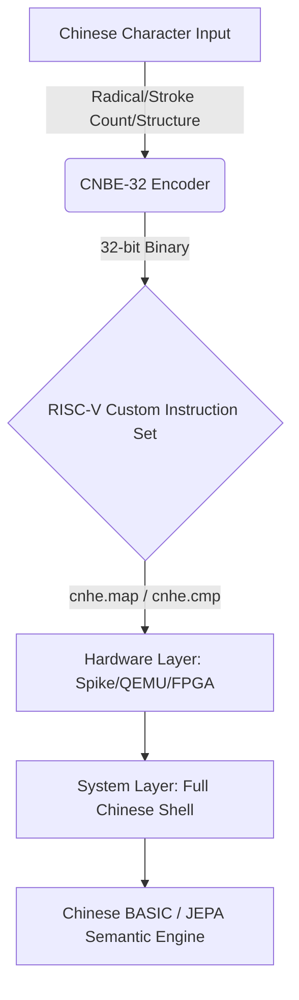

# CNBE-32

**Chinese Native Binary Encoding**

A 32-bit encoding that embeds the structural semantics of Chinese characters (radical, stroke count, and structure type) directly into binary, enabling CPUs and AI to natively understand Chinese.

A structured 32-bit encoding for 97,686 CJK characters that embeds radical, stroke count, and structure type directly into the encoding space.

<p align="center">
  <a href="docs/specification/bit-layout.md"></a>
  <a href="docs/specification/riscv-instructions.md"></a>
  <a href="v84_riscv_os_full/"></a>
  <a href="docs/VISION.md"></a>
  <a href="LICENSE"></a>
</p>

<p align="center">
  <a href="#quick-start"><strong>[ Quick Start ]</strong></a>
  <a href="#key-experiments"><strong>[ Key Experiments ]</strong></a>
  <a href="#tech-stack"><strong>[ Tech Stack ]</strong></a>
  <a href="#how-to-contribute"><strong>[ How to Contribute ]</strong></a>
</p>

---

## Architecture Panorama



---

## Vision & Mission

Inspired by the **Digital China 2035** strategy, CNBE-32's goal is:

> **To let every Chinese speaker seamlessly enter the AI era through their native language.**

This is a mature system with a complete closed-loop, but as an early-stage exploration in the field of native Chinese computing, it remains in an open research phase. In the AI Agent era, the dreams of previous generations of scientists about full-Chinese computer systems finally have a chance to be realized.

---

## Table of Contents

- [Architecture Panorama](#architecture-panorama)
- [Vision & Mission](#vision--mission)
- [Code Quick Look](#code-quick-look)
- [Why CNBE?](#why-cnbe)
- [JEPA Exploration](#jepa-exploration)
- [Cognitive Equity](#cognitive-equity)
- [Key Experiments](#key-experiments)
- [Key Insights](#key-insights-large-models-vs-small-models)
- [Experimental Limitations & Future Directions](#experimental-limitations--future-directions)
- [Tech Stack](#tech-stack)
- [AI Agent Driven / AI Factory](#ai-agent-driven--ai-factory)
- [Quick Start](#quick-start)
- [Project Structure](#project-structure)
- [Roadmap](#roadmap)
- [How to Contribute](#how-to-contribute)
- [Disclaimer](#disclaimer)
- [License](#license)

---

## Code Quick Look

**Core Idea: Transform Chinese characters into 32-bit integers containing radical, stroke count, and structure type — letting the machine "see" the glyph directly.**

### CJK Character Mode (v6.0 Final)

```
Bit: 31              24 23    19 18    15 14              4  3     0
     +----------------+--------+--------+------------------------+-------+
     |  Radical (8bit)|Stroke(5)|Struct(4)|  Glyph Index (11bit)  | Ext(4)|
     +----------------+--------+--------+------------------------+-------+
```

| Field | Bit Range | Description | Range |
|-------|-----------|-------------|-------|
| Radical | `[31:24]` | 214 Kangxi radicals + 41 extensions | 0-255 |
| Stroke Count | `[23:19]` | Number of strokes | 1-31 |
| Structure Type | `[18:15]` | Structural composition type | 9 types (single/left-right/top-bottom/enclosure, etc.) |
| Glyph Index | `[14:4]` | Intra-group index | 20,902 basic CJK characters |
| Extension | `[3:0]` | Traditional/Simplified, ancient/modern, dialect, reserved flags | Reserved |

### Encoding Examples

| Character | Unicode | CNBE-32 Encoding | Radical (ID) | Stroke Count | Structure Type |
|-----------|---------|-----------------|--------------|--------------|----------------|
| 一 (one) | U+4E00 | `0x01080000` | 一 (1) | 1 | Single (独体) |
| 汉 (Chinese) | U+6C49 | `0x0F288101` | 氵 (water, 15) | 5 | Left-Right (左右) |
| 国 (country) | U+56FD | `0x1F400B0B` | 囗 (enclosure, 31) | 8 | Full Enclosure (全包围) |
| 明 (bright) | U+660E | `0x48400801` | 日 (sun, 72) | 8 | Left-Right (左右) |

---

## Why CNBE?

| Dimension | Unicode / UTF-8 | CNBE-32 |
|-----------|-----------------|---------|
| Objective | Character display and exchange | AI understanding and hardware acceleration |
| Encoding Method | Lookup table (Flat ID) | Semantic structuring |
| Machine Cognition | Identifies the character | Understands structural composition |
| AI Compatibility | Learns from data | Provides structural priors |

**9 cross-domain validations passed**: Linguistics, Ecology, Meteorology, Finance, Biology, Physics, Sociology, Pre-training, Mathematics

---

## JEPA Exploration

CNBE is not a patch for today's Transformers, but foundational infrastructure for tomorrow's JEPA.

Yann LeCun's JEPA emphasizes prediction in representation space — and CNBE provides exactly the most structured representation space:

- **Radical = Spatial Anchor**: Characters sharing the same radical naturally cluster in binary space
- **Stroke Count = Discrete Feature**: Provides fine-grained morphological differentiation
- **Structure = Spatial Relationship**: Left-right, top-bottom, enclosure, etc. directly map to topological relationships

Completed JEPA validations: v9 tree structure prediction + v10 cross-9-domain generalization

---

## Cognitive Equity

The underlying logic of modern computers (from instruction sets to OS kernels) is built entirely on English/Latin alphabets. This creates a cognitive barrier for non-native English speakers who must first translate their thoughts before performing low-level development.

The ultimate significance of CNBE-32 is to enable Chinese speakers to define underlying logic directly through their native linguistic thinking, breaking down professional vocabulary barriers and achieving true technological cognitive equity.

> **In the AI era, every Chinese user — regardless of age, education level, or professional background — should be able to engage in deep dialogue with AI, define rules, and even write underlying logic using their native language.**

### Core Performance Overview

| Metric | Value | Equity Value Explanation |
|--------|:-----:|-------------------------|
| Small model (<1B) comprehension improvement | **+81%** (48%→87%) | Edge devices can achieve high-quality Chinese comprehension without cloud connectivity, breaking the compute monopoly of large tech companies |
| Medium model (1-7B) improvement | +9% ~ +17% | Mid-range mobile chips can smoothly run complex Chinese tasks without relying on high-end GPUs |
| Large model (>7B) benefit | ~0% (diminishing returns) | Validates that large models don't need this encoding; resources should be prioritized for small-to-medium intelligence scenarios |
| Hardware lookup extreme latency | 0.8 ns (x86) / 1 Cycle (FPGA) | Ultra-fast response for real-time interaction; suitable for low-frequency, low-power embedded chips |
| Minimal memory footprint | Only 81.6 KB (SRAM/BRAM) | Fits easily into any L1/L2 cache or on-chip storage without external DRAM, reducing BOM cost |
| Encoding semantic density | 32 bits containing radical/stroke/structure | Single encoding equivalent to dozens of text annotation tokens, greatly reducing learning and inference overhead for small models |
| CJK coverage breadth | **97,686** characters | Covers ancient texts, rare names, and dialect characters, ensuring cultural diversity isn't marginalized in the AI era |
| Hard-task rare character handling | **+17.4 pp** (vs Unicode) | Dominates traditional encoding in traditional/variant/chemical equation scenarios, ensuring professional knowledge equity |
| Lookup collision rate | **0%** (full coverage verified) | Zero-ambiguity lookup, ensuring stability and reliability on edge devices |

---

## Key Experiments

### Small Model, Big Improvement (v2)

**Hypothesis**: Structured encoding compensates for insufficient small model parameters.
**Method**: Qwen 3.5 0.8B, CNBE vs standard input.

| Input | Accuracy | Improvement |
|-------|----------|-------------|
| Standard input | 48% | -- |
| **CNBE-32** | **87%** | **+81%** |

### CNBE Surpasses Unicode (v6.5.2)

**Hypothesis**: Structured bit fields carry more semantic information than Unicode code points.
**Method**: Gemma 4B Chinese hard tasks.

| Input | Accuracy |
|-------|----------|
| Unicode | 26.1% |
| **CNBE-32** | **43.5%** |

**Conclusion**: A brand-new encoding without prior training outperforms the 30-year standard on first attempt (+17.4 pp).

### Full Chinese Operating System (v8.4)

- Full Chinese Shell (output/get encoding/compare commands)
- Chinese BASIC interpreter (7 keywords)
- Text editor (built-in Tao Te Ching, 205 lines)
- RISC-V custom instructions: `cnhe.map` / `cnhe.extract` / `cnhe.cmp`

### Mathematical Reasoning Foundation (v10.8)

**Method**: TinyGPT on odd/even/prime/sequence reasoning tasks comparing 4 encodings.

| Task | CNBE Loss | OneHot Loss | Winner |
|------|-----------|-------------|--------|
| Odd/Even | 0.3174 | 0.3427 | **CNBE** |
| Prime | 0.3894 | 0.5061 | **CNBE** |
| Sequence | 1.0726 | 1.2344 | **CNBE** |

---

### Complete Experimental Data (v1~v10)

<details>
<summary><b>Click to expand v1~v10 core experiment overview</b></summary>

| Version | Validation Dimension | Model / Platform | Core Metric | Key Conclusion |
| :---: | :--- | :--- | :--- | :--- |
| **v1** | Zero-shot single character understanding | Qwen 0.8B | 200 characters, **100%** effective | Encoding is inherently semantically interpretable |
| **v2** | Small model sentence understanding | Qwen 0.8B | 48% **→ 87%** (**+81%**) | Structured encoding provides significant compensation for small models |
| **v3** | Annotation format optimization | Qwen 0.8B | Character-by-character full annotation **87%** effective | Optimal format: character-by-character full annotation |
| **v4** | Long text (paper-level) | Qwen 0.8B | 90.9% **→ 100%** | Effective in long-text scenarios, eliminates ambiguity |
| **v5** | Multi-model horizontal comparison | 7 models | <1B: +81%; 1-7B: +9~17%; >7B: ~0% | **Diminishing marginal returns** |
| **v6** | Unicode hard task comparison | Gemma 4B | Unicode 26.1% **vs** **CNBE 43.5%** | **CNBE > Unicode** (+17.4 pp) |
| **v7** | RISC-V hardware implementation | C / QEMU / Spike / FPGA | x86 0.8 ns → FPGA **1 Cycle** | Complete hardware path closed-loop |
| **v8** | Full Chinese operating system | RISC-V QEMU | Chinese Shell + BASIC + Tao Te Ching editor | Encoding can seamlessly integrate into OS underlying layer |
| **v9** | JEPA tree structure prediction | JEPA architecture | Error **0.0899 → 0.000001** | Extremely strong high-noise temporal feature extraction |
| **v10** | Cross-9-domain generalization | Multi-domain | Mathematics wins; typhoon error **−19%** | Effective across mathematics/physics/biology/finance and other domains |

</details>

<details>
<summary><b>Click to expand v1~v10 detailed experimental data</b></summary>

| Version | Sub-item / Task | Test Environment | Specific Data Metrics | Conclusion / Notes |
| :---: | :--- | :--- | :--- | :--- |
| **v1** | Single character radical/stroke/structure extraction | Qwen 0.8B | 200 Chinese characters, **100%** zero-shot effective | Proves encoding space IS semantic space |
| **v2** | Chinese sentence understanding | Qwen 0.8B | Text input 48% → CNBE **87%** | Accuracy improvement 39 pp |
| **v3** | Encoding format ablation experiment | Qwen 0.8B | Character-by-character 87% > segmented 60% > compact 50% | Optimal: `中(丨,4 strokes, single)` |
| **v4** | Paper-level semantic understanding | Qwen 0.8B | 90.9% → **100%** | Complements small model long-context reasoning shortcomings |
| **v5a-5.9** | 7-model horizontal comparison | 0.8B~20B | Domestic 2B **90%**; 8B+ approaches 0 | Less compute power = more important structural priors |
| **v6.3-6.5** | Numerical format optimization | Qwen 0.8B | **Format F (bare numbers)** optimal | Hardware recommends bare number input |
| **v6.5.2** | CNBE vs Unicode | Gemma 4B | Unicode 26.1% **vs** CNBE **43.5%** | Outperforms thirty-year industry standard on first attempt |
| **v7.0** | C language benchmark | x86-64 | Single lookup **0.8 ns** | Software performance baseline established |
| **v7.0.1** | RISC-V cross-compilation | QEMU | Single lookup 2.5 ns | Validates RISC-V portability |
| **v7.1.1** | Instruction integration | Spike | `map`(2 cycles) / `extract`(1) / `cmp`(3) | Three Custom-0 instruction behaviors verified |
| **v7.2** | FPGA logic synthesis | Verilog+BRAM | **Single cycle** lookup complete | 81.6 KB table entries fit BRAM resources |
| **v8.4** | Full Chinese system | RISC-V QEMU | Shell commands + BASIC 7 keywords + Tao Te Ching | "Full Chinese computing" feasibility validated |
| **v9.0** | Tree growth JEPA | JEPA | CNBE **86%** better than Raw | Structured encoding improves abstract representation |
| **v9.1** | Typhoon lifecycle | JEPA | 0.089981 → **0.000001** | Error reduced by 4 orders of magnitude |
| **v10.3** | Typhoon Bavi path | Meteorological model | 216 km → **174 km** | Actual path prediction accuracy improved 19% |
| **v10.4** | Protein Q3 structure | Bioinformatics | OH 44.6% vs CNBE 41.0% | Slightly below OH; biological sequence still has optimization room |
| **v10.5** | Black hole gravitational field | Physics simulation | R² **0.60-0.77** | Good performance in physics field simulation |
| **v10.7** | TinyGPT frozen embedding | TinyGPT | Learned 1.3653 vs CNBE 1.4568 | Frozen embedding performance close to learned embedding |
| **v10.8** | Mathematical reasoning foundation | TinyGPT | Odd/Even(0.3174<0.3427) Prime(0.3894<0.5061) Sequence(1.07<1.23) | Universally better than One-Hot |

</details>

### Complete Evidence Chain Logic Closure

| Stage | Corresponding Version | Logical Role |
| :--- | :--- | :--- |
| **Semantic Validity** | v1 ~ v4 | Prove encoding itself contains semantics |
| **Comparative Superiority** | v5 ~ v6 | Prove encoding outperforms Unicode |
| **Hardware Implementability** | v7 | Prove from software to FPGA is feasible |
| **System-level Compatibility** | v8 | Prove encoding can support complete OS ecosystem |
| **Cross-domain Generalization** | v9 ~ v10 | Prove equally effective in physics/biology/finance and other domains |

Complete experimental data → [docs/EXPERIMENTS.md](docs/EXPERIMENTS.md)

---

## Key Insights: Large Models vs Small Models

Why do 8B+ large models show diminishing returns (~0%) from CNBE, while 0.8B small models achieve massive +81% improvement?

- **Large Model Brute Force Aesthetics**: Massive parameters can implicitly memorize Unicode through brute-force training, masking the structural flaws of the encoding
- **Small Model Structural Priors**: On compute-constrained edge devices, CNBE transforms glyph structure directly into computational priors

This is the breakthrough path for edge-side AI processing of Chinese.

---

## Experimental Limitations & Future Directions

> **We have faithfully documented failures and limitations in all experiments. The following are known boundaries disclosed directly in this README.**

### Known Limitations

| Experiment | Limitation | Future Direction |
|------------|------------|------------------|
| v5/v6 (LLM validation) | Some models (DeepSeek 8B / GPT-OSS 20B) showed empty responses or insufficient Chinese capability | Focus on Chinese-friendly small models like Qwen/Gemma |
| v6.5.3 (Hard task 0.8B) | Overall only 12.5%, CNBE and Unicode showed no difference | 0.8B model capability boundary; requires larger model validation |
| v9.0 (Tree growth) | Simulated environment, not real climate/economic data | Validate on real temporal data |
| v10.0/v10.1 (Financial backtesting) | A-share high-frequency trading costs (0.14%/trade) consumed all strategy returns; break-even point not reached | Pivot to low-frequency strategies (daily/weekly) to unlock predictive value |
| v10.4 (Protein) | Used simplified single-residue method, not standard sliding window; first contact with 30-year domain standard gap of 3.6 pp | Sliding window + CB513 dataset complete experiment |
| v10.5 (Black hole) | Single-variable input scenario (only r/Rs), continuous value KNN naturally precise; CNBE quantization introduces error | Multi-dimensional input scenario (with observation noise) validation |
| v10.6 (Sociology) | **CNBE inferior to One-hot in strong classification feature scenarios** (MSE 0.0124 vs OneHot 0.0019) | Field weighting, hierarchical encoding optimization |
| v10.7 (Pre-training) | Task too simple (13 token vocabulary), difference not statistically significant | Large-scale corpus, larger model validation |

### Applicability Boundaries (Based on All Experimental Data)

| Scenario Type | CNBE Performance | Typical Domains | Reason |
|---------------|:----------------:|-----------------|--------|
| Multi-dimensional continuous value + structured temporal | ✅ Significantly better than baseline | Meteorology, ecology, finance, mathematics | Bit-field structured encoding naturally matches |
| Strong classification features | ❌ Inferior to One-hot | Sociology (8 regions + 4 time periods) | Bit-field mixed encoding cannot distinguish classification field weights |
| Single-variable deterministic systems | ⚠️ Equal to Raw | Physics (gravitational field) | Continuous value single-variable scenario Raw is optimal |
| Zero-shot unfamiliar domains | ⚠️ Close to domain standard | Biology (protein) | First attempt approaches 30-year optimized standard |
| Pattern recognition tasks | ✅ Universally better than One-hot | Mathematical reasoning | Structured encoding matches pattern recognition |

---

## Tech Stack

```
Application Layer: Chinese BASIC interpreter + Text Editor + Tao Te Ching
System Layer: Full Chinese Shell + CNBE Runtime (map/extract/cmp)
Hardware Layer: RISC-V 1GHz + 1GB RAM (QEMU + Spike)
Instruction Layer: cnhe.map / cnhe.extract / cnhe.cmp
Encoding Layer: 32-bit CJK Structured Bit Fields (Radical/Stroke/Structure)
```

---

## AI Agent Driven / AI Factory

This is a project that was previously impossible to complete, but is destined to be born in the AI era.

| Past | Present |
|------|---------|
| 97,686 Chinese character annotations required thousands of linguist man-years | AI Agent assisted automated annotation |
| Full-stack validation required top-tier teams for years | LLM-assisted code generation + validation |
| Single-team siloed development | Open source community collaborative exploration |

The dreams of scientists from the last century finally have a chance to be realized in the AI Agent era.

---

## Quick Start

### Environment Requirements
- Python 3.8+
- numpy, torch, scikit-learn (for experiment reproduction)

### Install Python SDK

```bash
pip install numpy torch scikit-learn
```

### Usage Example

```python
import sys; sys.path.insert(0, 'src')
from cnbe32 import encode_cnbe, hamming_distance

code_ming = encode_cnbe(72, 8, 1)   # 明 (bright) = 日(sun, 72) + 8 strokes + left-right structure
code_an  = encode_cnbe(72, 9, 1)   # 暗 (dark) = 日(sun, 72) + 9 strokes + left-right structure
print(hamming_distance(code_ming, code_an))
```

### Run RISC-V Simulator

```bash
cd hardware/simulator
gcc -o cnhe_sim cnhe_sim.c -Wall -O2 && ./cnhe_sim
```

### Launch Full Chinese Operating System (QEMU)

```bash
# Ubuntu dependencies
sudo apt-get install -y gcc-riscv64-linux-gnu qemu-system-misc

cd v84_riscv_os_full
make all && make run
```

### Reproduce Experiments

```bash
cd v10_8_math_reasoning && python run_v108.py
cd v10_3_typhoon && python v10_3_typhoon.py
```

---

## Project Structure

```
CNBE-32-Chinese-Native-Binary-Encoding/
|-- docs/specification/      # Encoding specification
|-- docs/EXPERIMENTS.md      # Experiment overview
|-- docs/VISION.md           # Strategic vision
|-- src/cnbe32/              # Python SDK
|-- include/cnbe32.h         # C header file
|-- data/                    # Encoding database
|-- tests/                   # Test suite
|-- tools/                   # Development tools
|-- bindings/rust/           # Rust bindings
|-- hardware/                # RISC-V simulator
|-- v9_jepa_tree/            # JEPA experiments (v9)
|-- v10_5~v10_8/             # Cross-domain experiments (v10)
|-- v84_riscv_os_full/       # Chinese OS prototype
|-- results/                 # White papers (41 documents)
|-- LICENSE                  # Mulan License
```

---

## Roadmap

| Phase | Status | Content |
|-------|--------|---------|
| Encoding & semantic validation | Completed | v1-v6 CJK encoding design |
| Hardware & system | Completed | v7-v8 RISC-V + Chinese OS |
| Complex prediction validation | Completed | v9-v10 9-domain validation |
| AI compiler | Planned | Chinese natural language → machine code |
| Edge AI integration | Planned | Edge AI default standard |
| Ecosystem collaboration | Vision | Open source community + industry standards |

---

## How to Contribute

### Current Directions Most Needing Community Support

- Chinese BASIC interpreter optimization - improve lexical analyzer
- RISC-V lookup logic acceleration - optimize 81.6 KB L2 Cache hit rate
- JEPA architecture extension experiments - more physics/biology system tests
- Frontend visualization tools - Web interface showing encoding decomposition process

| Level | Direction |
|-------|-----------|
| Low barrier | Encoding dictionary / Test cases / Documentation |
| High barrier | RISC-V pipeline / FPGA / LLM adaptation / Compiler |

See [CONTRIBUTING.md](CONTRIBUTING.md) for details

---

## Disclaimer

v10.x stage financial time series (US stocks / A-shares) backtesting is solely for validating CNBE-32's feature extraction and structured prior capabilities in high-noise, non-stationary time series data, and does not constitute any investment advice.

---

## License

**Mulan Permissive Software License v2 (Mulan PSL v2)**

[](http://license.coscl.org.cn/MulanPSL2)

---

**Let Chinese speakers enter the AI era through their native language.**

From the "Digital China 2035" vision to AI Agent era engineering practice.

**Born for Chinese AI ecosystem — from encoding to hardware, from single character to operating system.**

[GitHub](https://github.com/zairkliu/CNBE-32-Chinese-Native-Binary-Encoding)
