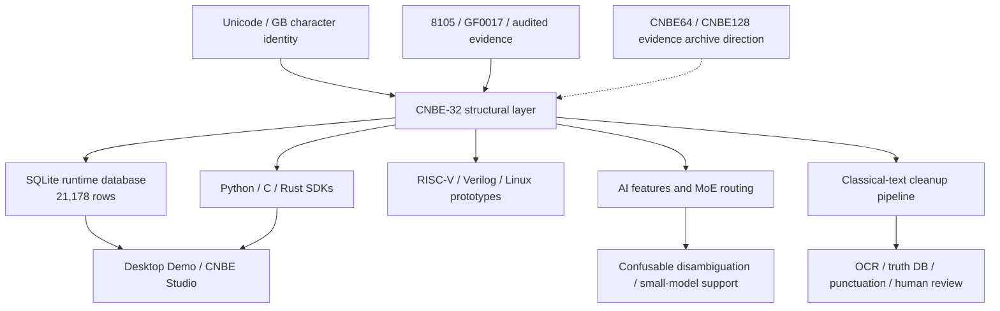

<p align="center">
  <strong>CNBE-32</strong><br>
  Chinese Native Computing Foundation · Unified Chinese Structural Representation from Machine Code to Applications
</p>

<p align="center">
  <a href="./README.md">English</a> ·
  <a href="./README_ZH.md">简体中文</a> ·
  <a href="./README_EN.md">English mirror</a>
</p>

<p align="center">
  
  
  
  <a href="https://pypi.org/project/cnbe32/"></a>
  <a href="https://github.com/zairkliu/CNBE-32-Chinese-Native-Binary-Encoding/releases/tag/demo-v1.0.0"></a>
  
  
</p>

CNBE-32 is a complete native encoding infrastructure for Chinese, aiming to
provide a unified, computable Chinese structural representation across machine
code, instruction sets, operating systems, compilers/decoders, programming
languages, and applications. It carries computable morphology in a 32-bit field
algebra (radix/stroke/struct/index/ext), spans RISC-V instructions, Verilog
prototypes, the Linux kernel layer, compilers/decoders, C++/Python/Rust, and
applications. Compatibility with existing CJK/Unicode/GB encodings is a gradual,
patch-friendly evolution path for current computer systems, not a rewrite; its
academic value lies in a structure-aware encoding substrate for computational
linguistics, Chinese philology, and digital humanities on classical texts.
With AI, domestic chips, RISC-V, and open-source AI systems advancing rapidly,
the historical vision of a complete Chinese computing system now has a concrete
basis for renewed discussion and engineering.
In the AI era, Chinese should be one of the foundations, not an option.

See [CNBE32_PROJECT_POSITION_ZH.md](./docs/CNBE32_PROJECT_POSITION_ZH.md).

## Abstract

CNBE-32 asks a specific systems question: given that Unicode already carries
character identity and Unicode/GB already anchor the real-world ecosystem, can
Chinese still have a compatible, computable structural layer that exposes
radicals, strokes, layouts, and glyph indices to SDKs, databases, instructions,
hardware prototypes, and AI models?

The answer proposed here is not to replace existing encodings. Unicode/GB carry
identity and interchange; CNBE-32 carries structural fingerprints and
computable features. The repository now contains a 21,178-row runtime database,
Python/C/Rust SDKs, RISC-V and Verilog prototypes, a desktop demo, a
24.38M-character seven-corpus validation, QLoRA small-model training,
CNBE-MoE routing prototypes, and evidence boundaries governed by the 8105
common standardized Chinese character table and GF0017.

This is a Chinese-computing idea that becomes discussable again in the AI era:
compute, open-source models, RISC-V, domestic chips, and agentic workflows turn
"can Chinese structure enter lower levels of computation?" from a historical
vision into a reproducible engineering research question.

## Contributions

| Contribution | Description | Reproducible entry |
|---|---|---|
| Compatible Chinese structural encoding | 32-bit bitfields carry radix/stroke/structure/index/ext without replacing Unicode/GB | [`src/cnbe32/`](./src/cnbe32), [`spec/golden_vectors.json`](./spec/golden_vectors.json) |
| Standards and evidence governance | 8105 as the national-standard core; `standard`, `legacy`, and Agent-standard candidates remain separated | [Standards statement](./docs/CNBE_STANDARDS_COMPLIANCE_STATEMENT.md), [field freeze](./docs/FIELD_SEMANTICS_FREEZE_v1.1.md) |
| Software and demo deployment | Python SDK, SQLite lookup, desktop demo, Windows/macOS/Linux packaging scripts | [Desktop demo](#desktop-demo), [`docs/soft_copyright/`](./docs/soft_copyright/) |
| AI and MoE validation | QLoRA, DeepSeek/Ollama reproduction, 64-expert three-field hard routing, API ablation | [`llm_experiments/`](./llm_experiments/), [`experiments/2026-08-03_cnbe_moe/`](./experiments/2026-08-03_cnbe_moe/) |
| Classical-text boundary work | Shows that small LLMs should not do page-level exact transcription; pivots to OCR/truth DB + CNBE checks + LLM punctuation | [`llm_experiments/2026-08-02_yongle_failures/`](./llm_experiments/2026-08-02_yongle_failures/) |
| Full-stack prototype | Bitfields, C/Rust, RISC-V, Verilog, and Linux prototypes share the same field semantics | [`riscv/`](./riscv/), [`hardware/`](./hardware/), [`linux_cnbe32_riscv/`](./linux_cnbe32_riscv/) |

## System Overview


```mermaid
flowchart TD
  A["Unicode / GB character identity"] --> B["CNBE-32 structural layer"]
  B --> C["SQLite runtime database<br/>21,178 rows"]
  B --> D["Python / C / Rust SDKs"]
  B --> E["RISC-V / Verilog / Linux prototypes"]
  B --> F["AI features and MoE routing"]
  B --> G["Classical-text cleanup pipeline"]
  C --> H["Desktop Demo / CNBE Studio"]
  D --> H
  F --> I["Confusable disambiguation / small-model support"]
  G --> J["OCR / truth DB / punctuation / human review"]
  K["8105 / GF0017 / audited evidence"] --> B
  L["CNBE64 / CNBE128 evidence archive direction"] -.-> B
```

Read linearly, the README follows the shape of a systems paper: problem
statement, historical compatibility strategy, system design, standards
governance, experiments, limitations, reproducibility, and roadmap.

## Reproducibility Map

| What to reproduce | Entry | Notes |
|---|---|---|
| SDK install and basic encoding | [Quick start](#quick-start), [Python SDK example](#python-sdk-example) | Bitfield encode/decode, Hamming distance, SQLite lookup |
| Bitfield consistency | [`spec/golden_vectors.json`](./spec/golden_vectors.json), [Implementation consistency](#implementation-consistency) | Shared golden vectors for Python/C/Rust/hardware directions |
| Desktop software | [Desktop demo](#desktop-demo) | Local run and Windows/macOS/Linux packaging |
| Seven-corpus compression and Volume | [`experiments/2026-08-02_seven_corpora_compression/`](./experiments/2026-08-02_seven_corpora_compression/) | 24.38M characters, compression, random access, routing proxies |
| MoE prototype | [`experiments/2026-08-03_cnbe_moe/`](./experiments/2026-08-03_cnbe_moe/) | Dense/MoE, hard routing, three-field mapping, Triton experiments |
| Classical OCR boundary | [`llm_experiments/2026-08-02_yongle_failures/`](./llm_experiments/2026-08-02_yongle_failures/) | Yongle postmortem, truth library, punctuation pivot |
| Mathematical definitions and review | [CNBE-32 Mathematical Structure](./docs/CNBE32_MATHEMATICAL_STRUCTURE.md), [P1 external review kit](./docs/review/P1_EXTERNAL_REVIEW_EXECUTION_KIT.md) | 13/13 formula verification, WS-4 pre-registration |
| Standards governance | [Current standards restart](#current-standards-restart), [Evidence level](#evidence-level) | 8105, GF0017, no-write gates, evidence boundaries |

## How to Read This Project

CNBE-32 is both a runnable software project and a growing body of research
notes, evidence boundaries, and engineering roadmap. Different readers can
enter from different angles:

| Reader | Best entry point | What you will find |
|---|---|---|
| Chinese NLP / AI practitioners | [Experiment Summary](#experiment-summary), [CNBE-MoE](#2026-08-03-cnbe-moe-prototype-and-api-ablation) | CNBE as a small-model feature, MoE routing prior, and confusable-character signal |
| Chinese philology / digital humanities | [Ancient OCR postmortem](#2026-08-02-ancient-ocr-failure-postmortem-and-punctuation-pivot), [Project rationale](#project-rationale) | OCR, truth databases, punctuation, segmentation, collation, and Hanzi evidence boundaries |
| Systems / chip / compiler engineers | [Technology Stack by Layer](#technology-stack-by-layer), [Bitfield layout](#bitfield-layout), [For geeks](#for-geeks) | How bitfields, RISC-V, Verilog, Linux, and SDKs connect into a full-stack prototype |
| Policy / standards / industry readers | [Compatibility Strategy](#compatibility-strategy-gradual-evolution-not-a-rewrite), [Current standards restart](#current-standards-restart), [Evidence level](#evidence-level) | How CNBE stays compatible with Unicode/GB and separates prototype claims from standards evidence |
| Demo / copyright users | [Desktop demo](#desktop-demo) | Runnable demo software, cross-platform packaging, and software-copyright materials |

## Thesis: Vision, Paper, Boundary, Deployment

This project is not merely another character table. It reopens, under AI-era
compute and model conditions, a question that was historically difficult to
engineer: can Chinese have a computable structural representation at lower
levels of the computing stack?

The rest of this README is organized around four threads:

1. **Vision**: Chinese structure belongs not only in dictionaries and fonts, but
   can enter bitfields, instructions, systems, and models;
2. **Paper**: bitfield algebra, morphological distance, hyperbolic embeddings,
   MoE routing, and HDC/VSA are treated as candidate computational layers with
   verifiable definitions;
3. **Boundary**: CNBE does not replace Unicode, does not ask LLMs to perform
   deterministic encoding, and does not treat OCR/dictionaries/model outputs as
   direct national-standard authority;
4. **Deployment**: SDKs, the desktop demo, seven-corpus experiments,
   classical-text cleanup, RISC-V/Verilog prototypes, and MoE experiments form
   a runnable engineering path.

## Result Map and Next Direction

The most important result is not a single metric. The project now has a loop
from encoding, evidence, software, models, and systems prototypes:

| Direction | Current result | Next step |
|---|---|---|
| CNBE Studio / demo | Desktop demo, cross-platform packaging scripts, copyright guide | Batch encoding, Volume viewer, MoE routing visualization, classical-text cleanup demo |
| Classical-text cleanup | Yongle failure postmortem, OCR/truth boundary, punctuation pivot | OCR/truth DB -> CNBE coverage check -> confusable risk -> LLM punctuation/segmentation -> human review queue |
| CNBE-MoE | 8/16/64 experts, three-field hard routing, DeepSeek V4 ablation | Equal-parameter/equal-compute controls, 128/256-expert cloud-GPU validation |
| LLM and small-model boundary | QLoRA, DeepSeek/Ollama reproduction, 1.5B failure boundary | 1.5B/7B/14B scale curves, length scans, punctuation F1 and confusable-disambiguation stability |
| Standards and evidence | 8105 baseline, GF0017 gates, unified evidence index | Keep no-write gates, design CNBE64/CNBE128 evidence archive paths |
| Low-level systems | RISC-V instructions, Verilog, Linux prototypes, C/Rust/Python SDKs | Move the structural layer from demos into toolchains and measurable benchmarks |

## Project Positioning

**CNBE-32 is a complete native encoding infrastructure for Chinese**, aiming to
provide a unified, computable Chinese structural representation across machine
code, instruction sets, operating systems, compilers/decoders, programming
languages, and applications.

| Layer | CNBE-32 Counterpart |
|---|---|
| Machine code / registers | 32-bit field layout aligned with bitwise operations |
| Instruction set | RISC-V custom instructions (extract / compare / lookup) |
| Operating system | Kernel, filesystem, terminal character handling |
| Compiler / decoder | CNBE ↔ Unicode/GB bidirectional conversion |
| Programming languages | Python / C / Rust SDKs |
| Applications | Classical-text OCR, MoE structural routing, desktop demo |

The 32-bit width is the current carrier best suited for simulating Chinese
structural encoding, not the end goal; future work may extend the bit width or
introduce variable-length encodings to cover classical and historical Chinese.

## Compatibility Strategy: Gradual Evolution, Not a Rewrite

CNBE-32 is compatible with existing CJK/Unicode/GB encodings rather than
replacing them, based on historical lessons:

- Failed radical approaches (proprietary Chinese terminal encodings, overdesigned
  DBCS, HZ protocol) paid high ecosystem costs because of incompatibility;
- Successful cases (UTF-8 backward compatibility with ASCII, the GB series
  stepwise evolution, modular RISC-V extensions) show that compatible evolution
  is the viable path for major change;
- CNBE-32 route: bidirectional conversion SDK; land in niche scenarios first
  (classical-text digitization, OCR correction, confusable-character
  disambiguation); then gradually move into OS, compilers, and AI models;
  add CNBE support as patches, not replacements, in Linux kernels and RISC-V
  toolchains.

> Core principle: CNBE-32 is not "starting over" but "adding bricks"—making
> Chinese structural information an optional, compatible layer of the existing
> computing system.

## Current Status and Roadmap (2026-08-04)

### Completed (locally validated)

| Module | Content | Status |
|---|---|:---:|
| Encoding spec | 32-bit field layout, national-standard alignment | ✅ Done |
| Dataset | 21,178 entries, 7,602 standard-track 8105 rows | ✅ Done |
| Software stack | Python / C / Rust SDKs, desktop demo | ✅ Done |
| Compression | Seven-corpus (24.38M chars) CNBE stream and Volume | ✅ Done |
| MoE routing | 8/16/64 experts, three-field mapping, Gini 0.15 | ✅ Done |
| Hardware prototype | RISC-V custom instructions, Verilog core | ✅ Done |
| API ablation | Confusable-character +33.3pp vs plain text | ✅ Done |
| Copyright materials | Software copyright application submitted | ✅ Done |

### Planned (requires cloud GPU large-scale validation)

The following work is **not yet started** and is planned after obtaining
A100/H100 compute, estimated at 2-4 hours per experiment:

- Scale MoE experts to 128-256 and validate hard-routing gains on larger data;
- Increase d_model to 512-1024 and evaluate Triton kernel gains;
- Fuse with a 9B QLoRA punctuation model to validate downstream F1;
- Build an end-to-end classical-text cleanup tool integrating CNBE into OCR
  post-processing.

> ⚠️ These items are in the **planning stage**; the current core deliverable is
> a locally validated research prototype.

## Technology Stack by Layer

1. Bit-field spec: `radix(8) | stroke(5) | struct(4) | index(11) | ext(4)`,
   see `docs/specification/bit-layout.md`;
2. Formal mathematics: morphological Hamming distance, hyperbolic embeddings,
   golden-vector consistency;
3. Instruction set and hardware: RISC-V custom instructions
   (map / extract / cmp / skill), Verilog core and FPGA validation;
4. Operating system: Linux kernel patch examples (`linux_cnbe32_riscv/`);
5. Compiler / decoder: `cnbe32` Python package, C/Rust bindings,
   bidirectional conversion;
6. Applications and tools: desktop demo, classical-text OCR validation,
   MoE structural routing.

## Experiment Summary

| Experiment | Result | Conclusion |
|---|---|---|
| Seven-corpus compression | CNBE stream ≈ gzip +13~47% | Compression is not the main edge; computable structure is |
| CNBE Volume | O(1) random access | Suitable for random access |
| MoE-64 hard routing | Next-code +3.26pp, Gini 0.153 | Hard routing works; three-field mapping is more balanced |
| API confusable disambiguation | CNBE hint 0.933 vs plain 0.600 | Structural fields help character-level tasks significantly |

## Version History

- **v1.1.0 (2026-08-04)**: positioning redefined; added compatibility
  strategy, status/roadmap, technology-stack layering, and limitations;
- **v1.0.4 (2026-07-27)**: first stable release with 21,178 entries,
  desktop demo, and MoE prototype.

> **CNBE-32 is a research prototype.**
> The checked-in Python SDK runtime now contains **21,178 entries**, including the 276 PENC276 characters completed under the project human-audit baseline.
> The broader **97,686 CJK** figure is an intended / experimental extended scope, not current packaged SDK coverage.
> The latest published package is **cnbe32 1.0.4**, matching the GitHub `v1.0.4` release checkpoint.
> The repository database has since been migrated to **v1.1** (21,178 rows); see the confirmed state below.

## Desktop demo

This repository includes the **CNBE-32 Desktop Demo**, a Tkinter/SQLite application for software-copyright application materials, live project demos, and internal review. It accepts Hanzi input and displays Unicode identity, CNBE-32 hexadecimal / decimal / 32-bit binary output, radical/root, stroke count, structure type, glyph index, extension bits, and runtime status.

- Demo release: [CNBE-32 Desktop Demo v1.0.0](https://github.com/zairkliu/CNBE-32-Chinese-Native-Binary-Encoding/releases/tag/demo-v1.0.0)
- Demo source: `src/cnbe32_demo/`
- Copyright/demo guide: [`docs/soft_copyright/CNBE32_DEMO_EXE_GUIDE.md`](./docs/soft_copyright/CNBE32_DEMO_EXE_GUIDE.md)
- Windows 11 x64 packaging: `tools/windows/build_demo_exe.ps1`
- macOS packaging: `tools/macos/build_demo_app.sh`
- Linux x64 packaging: `tools/linux/build_demo_exe.sh`

Run locally:

```bash
python -m pip install -e .
cnbe32-demo
```

Package examples:

```powershell
# Windows 11 x64
.\tools\windows\build_demo_exe.ps1
```

```bash
# macOS
bash tools/macos/build_demo_app.sh

# Linux x64
bash tools/linux/build_demo_exe.sh
```

The demo is a project presentation and runtime lookup application. It does not change the standards boundary: CNBE remains a research prototype aligning to national language and writing standards, not a claim of completed national-standard certification.

## Current standards restart

CNBE is being reorganized around a stricter standards-aligned workflow.

The **8105 common standardized Chinese character table** is now the national-standard core for the rebuild. Existing CNBE rows are treated as legacy/current runtime data until they pass the renewed evidence gates. The former 20,902-row Agent pre-encoding pool is preserved as the pre-PENC276 baseline; the current checked-in runtime contains 21,178 rows. The 97,686-row full catalog remains an extended research target.

The restart target is to rebuild CNBE as a national-language-standard-aligned encoding project: the Agent performs controlled Hanzi structure work, every promoted row carries evidence and review state, and the repository separates runtime code, evidence, reports, historical experiments, and reproducible research outputs.

Current confirmed state:

- release checkpoint: `v1.0.4`
- published Python package: `cnbe32==1.0.4`
- 8105 baseline rows: `8105`
- human-approved 8105 Agent structure baseline: `8105 / 8105`
- runtime CNBE32 rows patched from the approved 8105 dry run: `6712`
- additional conservative standardized runtime repairs: `598`
- total patched 8105 runtime rows after repair: `7310`
- force-approved rows retained for later insertion/radical strategy: `795`
- runtime JSON and SQLite databases now contain the 21,178-row authorized project runtime

Post-migration state (v1.1, applied 2026-07-25 under owner authorization):

- dual-source repairs applied: `620` (503 strokes, 111 structure, 6 radical)
- authorized PENC276 encoding write: `276` human-audited rows now have CNBE values in JSON and both SQLite runtime databases (`cnbe` non-null; `needs_encoding=0`). Their authority label is `HUMAN_AUDIT_PROJECT_BASELINE_USER_AUTHORIZED_2026_07_27`: a project human-audit baseline, not a national-standard claim.
- dual-source disagreements held from the migration period for expert adjudication: `348`. This is a separate historical v1.1 migration queue, not a failure or revocation of the 108-character human audit.
- total runtime rows: `21178`
- track column: `standard 7602 / legacy 13576`
- migration is idempotent (second dry-run plans 0 ops) and recorded in `migration_meta`

Governance documents:

- [CNBE Standards Compliance Statement](./docs/CNBE_STANDARDS_COMPLIANCE_STATEMENT.md)
- [CNBE 8105 Encoding Governance](./docs/CNBE8105_ENCODING_GOVERNANCE.md)
- [CNBE Research Position Statement](./docs/CNBE_RESEARCH_POSITION_STATEMENT.md)
- [CNBE Reproducible Agent Workflow](./docs/CNBE_REPRODUCIBLE_AGENT_WORKFLOW.md)
- [CNBE Version Governance](./docs/CNBE_VERSION_GOVERNANCE.md)
- [Repository Structure](./docs/REPOSITORY_STRUCTURE.md)
- [Repository-published Agent skill](./skill/cnbe-hanzi-structure-encoding-agent/SKILL.md)
- [GitHub Copilot Cloud Agent Status](./docs/COPILOT_CLOUD_AGENT_LIMITATION.md)
- [CNBE 8105 Encoding Comparison](./evidence/8105/CNBE8105_ENCODING_COMPARISON_REPORT.md)
- [CNBE 8105 Runtime Promotion](./reports/8105_CNBE32_RUNTIME_PROMOTION.md)
- [CNBE 8105 Standardized Runtime Repair](./reports/8105_STANDARDIZED_RUNTIME_REPAIR.md)
- [Field Semantics Freeze v1.1](./docs/FIELD_SEMANTICS_FREEZE_v1.1.md)
- [v1.1 Migration Tooling and Verification](./reports/MIGRATION_V1_1_WS7WS8.md)
- [276-character authorized encoding candidates](./evidence/8105/pending276/PENC276_AUTHORIZED_ENCODING_CANDIDATES.csv) — Unicode-first, human-audited candidate table used for the completed runtime write
- [276-character authorized encoding report](./reports/PENC276_AUTHORIZED_ENCODING_APPLY.md) — reproducible write result for JSON and both SQLite runtime databases
- [iHandian network-dictionary cross-reference rule](./skill/references/ihandian.md) — Unicode-first, single-character, read-only reference at the same review tier as dictionary/ZDIC context
- [WS-4 Benchmark Pre-Registration](./docs/benchmarks/WS4_BENCHMARK_PRE_REGISTRATION.md)

### T3 exploratory batch: human audit first

All 276 PENC276 characters have completed **human structure/decomposition audit**: the first 108 characters (`PENC_169`–`PENC_276`) form the T3 baseline, and the remaining 168 were completed through the same Chinese review packet. The recorded human audit is the final project working baseline. 8105 and related national language-and-writing standards, Unihan, ZDIC, dictionaries, and iHandian are used for alignment, cross-checking, and difference discovery; they are not a “gold standard” that automatically overrides human conclusions. When external sources disagree, are incomplete, or expose glyph-rendering limits, the workflow preserves the original discrepancy and pending-adjudication state. Candidate generation and the runtime write were performed only after explicit owner authorization; the completed codes retain the project human-audit authority label rather than claiming national-standard certification.

The 168-character completion audit means all 276 rows now have human-reviewed structure/decomposition records. A stratified iHandian smoke test aligned Unicode and returned decomposition fields for 14/14 samples; 13 matched human decomposition exactly. `PENC_022` contains a human-approved nonrenderable component-glyph exception: its human decomposition is retained and it is not counted as a web-reference difference. The 348 historical migration disagreements remain a separate queue and are not closed by this result.

- [Human-audit evidence policy](./docs/PENC276_T3_HUMAN_AUDIT_EVIDENCE_POLICY.md)
- [Final 108-character human-audit baseline](./evidence/8105/pending276/T3_169_276_FINAL_HUMAN_AUDIT_BASELINE.csv)
- [Machine-readable baseline summary](./reports/PENC276_T3_169_276_FINAL_HUMAN_AUDIT_BASELINE.json)

Mathematics and review program:

- [CNBE-32 Mathematical Structure](./docs/CNBE32_MATHEMATICAL_STRUCTURE.md) — standalone presentation of the 13 research formulas
- [Formal Mathematical Specification (EN)](./docs/specification/CNBE_FORMAL_MATHEMATICAL_SPECIFICATION.md) / [中文版](./docs/specification/CNBE_FORMAL_MATHEMATICAL_SPECIFICATION_ZH.md)
- [Formula Verification Report](./experiments/morphology_computing/reports/FORMAL_FORMULA_VERIFICATION_REPORT.md) — 13/13 mathematical PASS, 0 scientific performance claims validated
- [Verification Manifest](./experiments/morphology_computing/reports/formal_formula_verification_manifest.json) — machine-readable, SHA-256 pinned
- [P1 External Review Method (EN)](./docs/specification/P1_EXTERNAL_REVIEW_METHOD.md) / [中文版](./docs/specification/P1_EXTERNAL_REVIEW_METHOD_ZH.md)
- [P1 External Review Execution Kit](./docs/review/P1_EXTERNAL_REVIEW_EXECUTION_KIT.md) — reviewer-facing instructions for the 600-row blinded packet
- [External Review Packet](./experiments/morphology_computing/review_packets/P1_EXTERNAL_INDEPENDENT_REVIEW_PACKET_EDITABLE.csv) — 600 blinded rows awaiting independent review

Earlier AI-generated catalog fields are now treated as a historical test
baseline only. They remain useful for regression localization, but they are not
used as authority for structure, radical, stroke, teaching, or research claims.

> **Wording red line**: this project is *aligning to* national language and writing standards. Until every item in the standards-alignment matrix reads "aligned", the project does not claim to "conform to national standards". Full alignment status and known gaps: [CNBE Standards Compliance Statement](./docs/CNBE_STANDARDS_COMPLIANCE_STATEMENT.md).

## Project rationale

CNBE-32 is useful only if the encoding process is stricter than the early
AI-generated catalog that inspired it. The current project rationale is:

- use Unicode as the compatibility identity, never as something CNBE replaces;
- use the 8105 common standardized Chinese character table as the release-track
  national-standard core;
- use GF/GB/GG language and writing standards for each Hanzi attribute (alignment status: [Standards Compliance Statement](./docs/CNBE_STANDARDS_COMPLIANCE_STATEMENT.md)):
  - structure → GF 0017-2013 §3.12 (independent + 12 compound types; the project's 13 labels map one-to-one)
  - radicals → GF 0011-2009 / GF 0012-2009 (anchoring in progress)
  - independent characters → GF 0013-2009 (direction aligned, not yet verified per character)
  - components and decomposition → GF 0014-2009 / GF 3001-1997 (direction aligned, not yet verified per character)
  - stroke order and stroke shapes → GF 0023-2020 / GF 3002-1999
- character identity is carried by the Unicode code point; a bidirectional mapping layer with GB 18030-2022 is on the roadmap;
- use dictionaries, character-origin resources, Wikipedia, and ZDIC only as
  review context or source-discovery aids unless a field is explicitly labeled
  as non-national-standard context;
- keep CNBE32 as a compact runtime carrier while preserving richer evidence for
  CNBE64/CNBE128 or review archives when 32 bits are too narrow;
- publish only checkpoints that can be traced to committed evidence, reports,
  tests, and release notes.

This makes the repository a standards-aligned research workflow rather than a
large generated table with unclear authority.

For a one-page research framing of the current direction, time point,
reproducibility path, technical feasibility, and scientific value, see
[CNBE Research Position Statement](./docs/CNBE_RESEARCH_POSITION_STATEMENT.md).

## v11: 8105 QLoRA Deep Learning Training (Jul 2026)

5,000-step QLoRA fine-tuning on DeepSeek-R1-Distill-Qwen-1.5B with 8105 national-standard data.

| Metric | Value |
|--------|:-----:|
| Training steps | 5,000 |
| Training time | 5.8h (RTX 4060 Ti) |
| Final training loss | 0.1493 |
| Final eval loss | 0.09179 |
| LoRA adapter size | 73.9 MB |

### Evaluation Results

| Task | Result |
|:-----|:------:|
| Structure classification | **66.0%** |
| Confusing character discrimination | **92.7%** |
| Stroke count (+-2) | **54.0%** |
| Unseen character generalization | Matches seen chars |
| Semantic clustering | ratio=0.99x (boundary: structural encoding != semantic embedding) |

### Deployment

- **API Server**: FastAPI REST service on port 8000
- **Ollama**: `ollama create cnbe-32`
- **OCR Pipeline**: PDF → deepseek-ocr → CNBE encoding

See `tools/deploy/` for details.

### Model and documentation

- **ModelScope model page**: [zairkliu/CNBE-32](https://www.modelscope.cn/models/zairkliu/CNBE-32) — GGUF FP16 inference model (3.55 GB), ready for `ollama create`
- [Technical White Paper v1.1](./docs/CNBE32_技术白皮书_v1.1.md)
- [v11 experiment notes](./llm_experiments/v11_8105_qlora/README.md)
- [Training Report](./reports/v11_8105_qlora/TRAINING_REPORT.md)
- [Field-level evaluation supplement](./reports/v11_8105_qlora/FIELD_EVAL_SUPPLEMENT.md)
- [Deployment Guide](./tools/deploy/README.md)

## 2026-08-02: Ancient OCR Failure Postmortem and Punctuation Pivot

On the 37-page human-corrected 《永乐大典》卷821-823 experiment, a 1.5B
generative model failed page-level OCR transcription (400-500 chars): exact
match was about 20%, and eval loss could rise to 9.9.

| Path | Result |
|---|---:|
| PaddleOCR PP-OCRv4 coverage | 18.05% |
| DeepSeek-OCR v1 (deduplicated) coverage | 37.76% |
| 1.5B page correction (v3/v4) | about 20-21% |
| Page-anchored truth library | 37/37 hits, score=1.0 |
| Shidianguji 《诗话六十三》 cross-validation | 16,082/16,082 (100%) |

Conclusions:

1. Small LLMs must not perform page-level sequence transcription. OCR plus the
   truth library handles transcription; the LLM only punctuates and segments.

Documents:

- [Failure Summary](./llm_experiments/2026-08-02_yongle_failures/FAILURE_SUMMARY_2026-08-02.md)
- [Small-Model Boundary Analysis](./llm_experiments/2026-08-02_yongle_failures/BOUNDARY_ANALYSIS.md)

Model weights and the complete training archive (about 1.47 GB) are not stored
in Git; they are archived locally in `outputs/training_data_2026-08-02_full.zip`.

### 2026-08-02: Seven-Corpus CNBE Compression Validation

The same day, a 24,381,237-character, seven-corpus CNBE validation was completed
(Zizhi Tongjian, Lu Xun, Agatha Christie, Linux Programming, Jin Yong, Caixin
Weekly, and Su Shi's poetry collection). gzip remains the best pure compressor;
CNBE Volume trades about +40% size for O(1) random access; CNBE structural
routing is near-perfectly load balanced.

- [Seven-Corpus Validation Overview](./experiments/2026-08-02_seven_corpora_compression/README.md)
- [Compression Details](./experiments/2026-08-02_seven_corpora_compression/SEVEN_CORPORA_COMPRESSION.md)
- [Reproducible Results](./experiments/2026-08-02_seven_corpora_compression/results/)

### 2026-08-03: CNBE-MoE Prototype and API Ablation

Completed 8/16/64-expert CNBE-MoE prototypes, three-field balanced mapping,
Triton grouped GEMM kernels, learned-router comparison, and DeepSeek V4 API
field-hint ablation. Recommendation: 64-expert three-field hard routing
(Gini 0.153); CNBE structural fields help confusable-character disambiguation
but not punctuation.

- [CNBE-MoE Entry](./experiments/2026-08-03_cnbe_moe/README.md)
- [Final Report](./experiments/2026-08-03_cnbe_moe/CNBE_MoE_最终报告.md)
- [API Ablation Report](./experiments/2026-08-03_cnbe_moe/CNBE_MoE_API消融实验报告.md)

## Agent and automation boundary

The repository includes a GitHub-compatible Agent profile and Copilot
instructions, but GitHub Copilot cloud agent execution is an optional paid
integration. It is not required for open-source reproduction, research review,
or release-track CNBE work.

The project keeps its reproducible baseline in committed skills, tests,
reports, review packets, and ordinary GitHub Actions. Maintainers without
Copilot cloud agent access can still run the CNBE Agent workflow locally or
through normal pull requests. See
[GitHub Copilot Cloud Agent Status](./docs/COPILOT_CLOUD_AGENT_LIMITATION.md).

---

## Why this is interesting

Unicode tells computers *which* character this is.

CNBE-32 asks a different question:

> Can part of a CJK character's visual and structural logic be carried directly in a compact binary form?

That makes CNBE-32 interesting for experiments in CJK-aware embeddings, low-level lookup tables, hardware-friendly text features, and language-specific model inputs.

---

## The idea in one picture

```text
31              24 23        19 18     15 14                 4 3        0
┌────────────────┬────────────┬─────────┬─────────────────────┬──────────┐
│ Radical/Radix  │  Stroke    │ Struct  │     Glyph Index     │   Ext    │
│     8 bits     │  5 bits    │ 4 bits  │       11 bits       │  4 bits  │
└────────────────┴────────────┴─────────┴─────────────────────┴──────────┘
```

Think of it as a compact structural fingerprint, not a replacement for Unicode.

---

## Quick start

```bash
python -m pip install cnbe32
```

```python
from cnbe32 import encode_cnbe, decode_cnbe, bit_hamming_distance

# Note: radix is a project-internal radical/root numbering, not yet anchored to
# GF 0011-2009; do not use it for cross-project exchange before anchoring lands.
a = encode_cnbe(radix=72, stroke=8, struct=1, index=123, ext=0)
b = encode_cnbe(radix=72, stroke=9, struct=1, index=124, ext=0)

print(decode_cnbe(a))
print(bit_hamming_distance(a, b))
```

---

## What is stable today

- CNBE-32 field encoding and decoding
- strict validation of all bitfield ranges
- true bit-level Hamming distance and legacy field-weighted distance
- optional SQLite database lookup (v1.1 migrated schema with `track` column)
- explicit `SkillTable` construction for experiments
- wheel build, pip install, pytest, ruff, GitHub Actions CI

---

## What is experimental

- LLM prompting and feature experiments
- JEPA-style representation learning
- RISC-V and hardware instruction prototypes
- OS and kernel-level experiments (teaching proof-of-concept: the current code does not compile and serves only as an Agent-workflow research sample, not a usable system)
- finance, biology, physics, and social-science-style experiments

These should be interpreted as **preliminary research prototypes** unless the corresponding directory includes fixed datasets, reproducible scripts, baseline comparisons, random seeds, and clear train/test separation.

---

## Coverage terminology

| Term | Meaning |
|---|---|
| **8105 national-standard core** | 8,105 common standardized Chinese characters used as the release-track standards baseline |
| **Published package checkpoint** | `cnbe32==1.0.4`; release metadata is distinct from the checked-in runtime data state |
| **Repository and checked-in SDK database** | 21,178 rows: 7,602 standard + 13,576 legacy; all 276 PENC276 rows have an authorized project-baseline CNBE value |
| **Agent-standard candidate scope** | project-controlled candidate outputs that must align to 8105 before promotion |
| **Experimental extended scope** | 97,686 CJK characters as a design / research target, not a validated release claim; the figure anchors the Unicode CJK Unified Ideographs total and must be updated with Unicode versions and GB 18030-2022 amendments |
| **Experiment-specific coverage** | depends on the dataset and reproduction script for each experiment |

Claims about collision rate, full coverage, or extended CJK breadth should be interpreted only within the scope of the specific dataset and script used for that experiment.

---

## Evidence level

This repository contains research prototypes and early experiments. Results should be interpreted as preliminary unless the corresponding experiment includes:

- fixed dataset versions,
- reproducible scripts,
- baseline comparisons,
- random seeds or deterministic settings,
- raw outputs or result artifacts,
- and clear train/test separation where applicable.

---

## Bitfield layout

| Field | Bits | Description |
|---|---:|---|
| Radical / Radix | 8 | Radical or structural root field |
| Stroke | 5 | Stroke-count field |
| Structure | 4 | Character structure field |
| Glyph Index | 11 | Basic CJK glyph index field |
| Extension | 4 | Experimental extension field |

> **Field semantics freeze status (v1.1, after the 2026-07-25 migration; see [Field Semantics Freeze v1.1](./docs/FIELD_SEMANTICS_FREEZE_v1.1.md)):**
> - **Radical/Radix: in transition.** Currently stored under the Kangxi 214-radical convention; re-anchoring to the 201 main radicals of GF 0011-2009 awaits an authoritative mapping table (freeze §4).
> - **Stroke: semantics frozen.** The data layer stores true values per GF 0013-2009; overflow representation beyond the 5-bit field (max 31) is an encoding-protocol concern (WS-6), and the data layer does not truncate.
> - **Structure: frozen.** The 13 labels map one-to-one to GF 0017-2013 §3.12; `struct_type` is frozen to the Chinese-track 13-value numbering (0=independent ... 12=inlay), and the English-track numbering is deprecated.
> - **Glyph Index: deprecated.** `idx = (unicode - 0x4E00) mod 2048` is a lossy hash and must not be used as an addressing key; the Unicode code point is the sole identifier. idx is read-only compatibility from v1.1 and will be removed in v1.2.
> - **Ext: experimental.** No compatibility promises.

---

## Formal mathematics (research definitions)

The encoding admits a compact formalization: bitfield extraction and binary-vector operators, a field-weighted morphological distance, and three candidate computational layers — a Poincaré-ball embedding with a morphology-alignment loss, a bitwise MoE router, and a hyperdimensional (HDC/VSA) representation.

Every formula group has a reference implementation with numerical property tests (reversibility, identity, symmetry, bounds, closure). These are **research definitions**: they do not certify the linguistic correctness of any field, and they do not by themselves demonstrate task-level gains. Candidate layers remain gated on external independent review.

Full presentation: [CNBE-32 Mathematical Structure](./docs/CNBE32_MATHEMATICAL_STRUCTURE.md). Verification evidence: [13/13 formula report](./experiments/morphology_computing/reports/FORMAL_FORMULA_VERIFICATION_REPORT.md) and [SHA-256 pinned manifest](./experiments/morphology_computing/reports/formal_formula_verification_manifest.json). Task-level evaluation is pre-registered in [WS-4](./docs/benchmarks/WS4_BENCHMARK_PRE_REGISTRATION.md) and blocked pending the [P1 external review](./docs/review/P1_EXTERNAL_REVIEW_EXECUTION_KIT.md).

---

## Python SDK example

```python
from cnbe32 import (
    encode_cnbe, decode_cnbe,
    bit_hamming_distance, field_weighted_distance,
)

# radix is a project-internal numbering; do not use it for cross-project
# exchange before GF 0011-2009 anchoring lands (see Field Semantics Freeze v1.1).
a = encode_cnbe(radix=72, stroke=8, struct=1, index=123, ext=0)
b = encode_cnbe(radix=72, stroke=9, struct=1, index=124, ext=0)

print(decode_cnbe(a))
print(bit_hamming_distance(a, b))
print(field_weighted_distance(a, b))
```

---

## For geeks

| If you like... | CNBE-32 gives you... |
|---|---|
| bitfields | a fixed 32-bit CJK structure layout |
| language internals | radical, stroke, structure, glyph-index fields |
| ML features | compact CJK-aware feature inputs |
| hardware experiments | a layout testable near RISC-V / instruction prototypes |
| weird text encoding ideas | a research sandbox for Chinese-native representation |

---

## For Chinese language enthusiasts

Chinese characters are not just arbitrary symbols. Many carry visible structure: components, strokes, layout, and historical form.

CNBE-32 does not claim to fully understand characters. It simply asks whether some of that visible structure can be encoded in a way computers can use directly.

The project's structure taxonomy (independent, top-bottom, left-right, enclosure, and the other approved types — 13 labels in total) maps one-to-one to the Hanzi structure classification in GF 0017-2013.

---

## Roadmap

1. Keep the Python SDK build, install, test, and lint pipeline green.
2. Add reproducible scripts for each experiment.
3. Separate stable SDK claims from experiment-specific claims.
4. Publish dataset provenance and coverage validation scripts.
5. Add golden vectors shared across Python, C, Rust, and hardware prototypes.
6. Add benchmark baselines (Unicode codepoint, one-hot, IDS, learned embeddings).
7. Run the P1 external independent review, then execute the pre-registered WS-4 benchmarks.
8. Maintain the completed 276-character encoding as a reproducible project human-audit baseline through the [candidate table](./evidence/8105/pending276/PENC276_AUTHORIZED_ENCODING_CANDIDATES.csv) and [write report](./reports/PENC276_AUTHORIZED_ENCODING_APPLY.md); future changes require new evidence and explicit authorization.

---


## Implementation consistency

CNBE-32 includes machine-readable golden vectors in [spec/golden_vectors.json](./spec/golden_vectors.json). These vectors define canonical bitfield encode/decode examples for Python, C, Rust, and hardware-oriented implementations. The same vector set is now exercised by Python tests, a minimal C consistency test, and a minimal Rust consistency test.


## Project maintenance

- [Changelog](./CHANGELOG.md)
- [Release process](./RELEASE.md)
- [v1.0.4 release notes](./docs/releases/v1.0.4.md)
- [Contributing guide](./CONTRIBUTING.md)
- [Security policy](./SECURITY.md)

## License

MulanPSL-2.0
