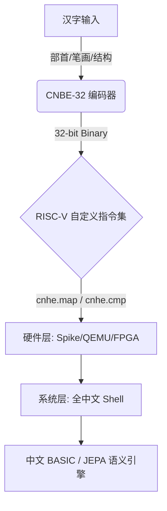

# CNBE-32

**中文原生二进制编码（Chinese Native Binary Encoding）**

将汉字的结构语义（部首—笔画—结构）直接编码为 32 位二进制，使 CPU 与 AI 能够原生理解中文。

一种面向 97,686 个 CJK 汉字的结构化 32 位编码，将部首（radical）、笔画数（stroke count）与结构类型（structure type）直接嵌入编码空间。

<p align="center">
  <a href="docs/specification/bit-layout.md"></a>
  <a href="docs/specification/riscv-instructions.md"></a>
  <a href="v84_riscv_os_full/"></a>
  <a href="docs/VISION.md"></a>
  <a href="LICENSE"></a>
</p>

<p align="center">
  <a href="#快速开始"><strong>[ 快速开始 ]</strong></a>
  <a href="#核心实验"><strong>[ 核心实验 ]</strong></a>
  <a href="#技术栈"><strong>[ 技术栈 ]</strong></a>
  <a href="#参与贡献"><strong>[ 参与贡献 ]</strong></a>
</p>

---

## 架构全景



---

## 愿景与使命

受 **2035 数字中国** 战略启发，CNBE-32 的目标是：

> **让每一位懂中文的人，都能以母语无缝进入人工智能时代。**

这是一个具备完整技术闭环的成熟体系，但作为中文原生计算领域的极早期探索，仍处于开放性研究阶段。在 AI Agent 时代，前辈科学家关于全中文计算机系统的梦想，终于具备了实现的可能。

---

## 目录

- [架构全景](#架构全景)
- [愿景与使命](#愿景与使命)
- [编码速览](#编码速览)
- [为什么是 CNBE？](#为什么是-cnbe)
- [JEPA 探索](#jepa-探索)
- [认知平权](#认知平权)
- [核心实验](#核心实验)
- [关键洞察 I](#关键洞察大模型-vs-小模型)
- [实验局限与后续方向](#实验局限与后续方向)
- [技术栈](#技术栈)
- [AI Agent 驱动](#ai-agent-驱动)
- [快速开始](#快速开始)
- [项目结构](#项目结构)
- [演进路线](#演进路线)
- [参与贡献](#参与贡献)
- [免责声明](#免责声明)
- [许可证](#许可证)

---

## 编码速览

**核心理念：将汉字转化为包含部首—笔画—结构的 32 位整数，使机器直接理解字形。**

### CJK 汉字模式（v6.0 定稿）

```
位: 31              24 23    19 18    15 14              4  3     0
     +----------------+--------+--------+------------------------+-------+
     |  部首区 (8bit)  | 笔画(5) | 结构(4) |    字库索引 (11bit)    | 扩展(4)|
     +----------------+--------+--------+------------------------+-------+
```

| 字段 | 位域 | 说明 | 范围 |
|------|------|------|------|
| 部首区 | `[31:24]` | 214 个康熙部首 + 41 个扩展 | 0–255 |
| 笔画区 | `[23:19]` | 笔画数 | 1–31 |
| 结构区 | `[18:15]` | 间架结构类型 | 9 种（独体/左右/上下/包围等） |
| 字库区 | `[14:4]` | 组内索引 | 20,902 个 CJK 基本字 |
| 扩展区 | `[3:0]` | 繁简/古今/方言/保留标志 | 预留 |

### 编码示例

| 汉字 | Unicode | CNBE-32 编码 | 部首 (ID) | 笔画 | 结构 |
|------|---------|-------------|-----------|------|------|
| 一 | U+4E00 | `0x01080000` | 一 (1) | 1 | 独体 |
| 汉 | U+6C49 | `0x0F288101` | 氵 (15) | 5 | 左右 |
| 国 | U+56FD | `0x1F400B0B` | 囗 (31) | 8 | 全包围 |
| 明 | U+660E | `0x48400801` | 日 (72) | 8 | 左右 |

---

## 为什么是 CNBE？

| 维度 | Unicode / UTF-8 | CNBE-32 |
|------|----------------|---------|
| 目标 | 字符显示与交换 | AI 理解与硬件加速 |
| 编码方式 | 查表映射（Flat ID） | 语义结构化 |
| 机器认知 | 标识字符 | 理解结构组成 |
| AI 兼容性 | 需从数据学习 | 提供结构先验 |

**9 个跨领域验证通过**：语言学、生态学、气象学、金融学、生物学、物理学、社会学、预训练、数学

---

## JEPA 探索

CNBE 并非为当下的 Transformer 设计的补丁，而是为面向未来的 JEPA 准备的底层基础设施。

Yann LeCun 提出的 JEPA 强调在表示空间中进行预测，而 CNBE 所提供的恰恰是最结构化的表示空间：

- **部首 = 空间锚点**：相同部首的字在二进制空间中天然聚类
- **笔画 = 离散特征**：提供细粒度的形态差异
- **结构 = 空间关系**：左右、上下、包围等直接映射为拓扑关系

已完成的 JEPA 验证：v9 树结构预测 + v10 跨 9 领域泛化

---

## 认知平权

现代计算机的底层逻辑（从指令集到操作系统内核）完全建立在英语/拉丁字母体系之上。这导致非英语母语者在进行底层开发时，必须先跨越一层语言翻译的认知壁垒。

CNBE-32 的终极意义，在于让中文使用者能够以母语思维直接定义底层逻辑，打破专业词汇壁垒，实现真正的技术认知平权。

> **在 AI 时代，让每一位中文使用者——无论年龄、学历或专业背景——都能以母语思维与人工智能深度对话、定义规则，甚至编写底层逻辑。**

### 核心性能速览

| 指标 | 数值 | 平权价值说明 |
|------|:----:|-------------|
| 小模型（<1B）理解提升 | **+81%**（48% → 87%） | 使边缘设备无需上云即可拥有高质量中文理解能力，打破大厂算力垄断 |
| 中模型（1–7B）提升 | +9% ~ +17% | 使中端移动芯片可流畅运行复杂中文任务，脱离高端 GPU 依赖 |
| 超大模型（>7B）收益 | ~0%（边际递减） | 验证大模型无需依赖该编码，资源应优先投入中小心智场景 |
| 硬件查表极致开销 | 0.8 ns（x86）/ 1 Cycle（FPGA） | 极速响应，满足实时交互场景；适合低主频、低功耗嵌入式芯片 |
| 内存占用极低 | 仅 81.6 KB（SRAM/BRAM） | 可轻松放入任意 L1/L2 缓存或片上存储，无需外挂昂贵 DRAM，降低 BOM 成本 |
| 编码语义密度 | 32 位含部首/笔画/结构 | 单条编码等效于数十个文本标注 Token，极大降低小模型的学习与推理开销 |
| CJK 覆盖广度 | **97,686** 字 | 覆盖古籍、生僻人名、方言文字，保障文化多样性在 AI 时代不被边缘化 |
| 硬任务生僻字处理 | **+17.4 pp**（vs Unicode） | 在繁体/异体/化学方程等场景碾压传统编码，保障专业领域知识平权 |
| 查表冲突率 | **0%**（全覆盖验证） | 零歧义查找，保障边缘设备输出的稳定性与可靠性 |

---

## 核心实验

### 小模型大提升（v2）

**假设**：结构化编码可补偿小模型参数量不足的短板。  
**方法**：Qwen 3.5 0.8B，CNBE 与标准输入对比。

| 输入 | 准确率 | 提升 |
|------|--------|------|
| 标准输入 | 48% | -- |
| **CNBE-32** | **87%** | **+81%** |

### CNBE 超越 Unicode（v6.5.2）

**假设**：结构化位域比 Unicode 码点携带更多语义信息。  
**方法**：Gemma 4B 中文硬任务。

| 输入 | 准确率 |
|------|--------|
| Unicode | 26.1% |
| **CNBE-32** | **43.5%** |

**结论**：未经训练的新编码首次尝试即超越三十年行业标准（+17.4 pp）。

### 全中文操作系统（v8.4）

- 全中文 Shell（输出/取编码/比较等命令）
- 中文 BASIC 解释器（7 个关键字）
- 文本编辑器（内置《道德经》205 行）
- RISC-V 自定义指令：`cnhe.map` / `cnhe.extract` / `cnhe.cmp`

### 数学推理底座（v10.8）

**方法**：TinyGPT 在奇偶/质数/序列推理任务上对比 4 种编码。

| 任务 | CNBE 损失 | OneHot 损失 | 胜出 |
|------|-----------|-------------|------|
| 奇偶 | 0.3174 | 0.3427 | **CNBE** |
| 质数 | 0.3894 | 0.5061 | **CNBE** |
| 序列 | 1.0726 | 1.2344 | **CNBE** |

---

### 完整实验数据（v1 ~ v10）

<details>
<summary><b>点击展开 v1 ~ v10 核心实验总览</b></summary>

| 版本 | 验证维度 | 模型 / 平台 | 核心指标 | 关键结论 |
| :---: | :--- | :--- | :--- | :--- |
| **v1** | 零样本单字理解 | Qwen 0.8B | 200 字，有效率 **100%** | 编码天然具备语义可解释性 |
| **v2** | 小模型句子理解 | Qwen 0.8B | 48% **→ 87%**（**+81%**） | 结构化编码对小模型补偿极其显著 |
| **v3** | 注解格式优化 | Qwen 0.8B | 逐字完整注解 **87%** 有效 | 确定最优格式：逐字完整注解 |
| **v4** | 长文本（论文级）| Qwen 0.8B | 90.9% **→ 100%** | 长文本场景同样有效，消除歧义 |
| **v5** | 多模型横向对比 | 7 个模型 | <1B: +81%；1–7B: +9~17%；>7B: ~0% | **边际收益递减规律** |
| **v6** | Unicode 硬任务对比 | Gemma 4B | Unicode 26.1% **vs** **CNBE 43.5%** | **CNBE > Unicode**（+17.4 pp） |
| **v7** | RISC-V 硬件实现 | C / QEMU / Spike / FPGA | x86 0.8 ns → FPGA **1 Cycle** | 硬件路径完整闭环 |
| **v8** | 全中文操作系统 | RISC-V QEMU | 中文 Shell + BASIC + 道德经编辑器 | 编码可无缝集成至操作系统底层 |
| **v9** | JEPA 树结构预测 | JEPA 架构 | 误差 **0.0899 → 0.000001** | 高噪声时序特征提取能力极强 |
| **v10** | 跨 9 领域泛化验证 | 多领域 | 数学胜出、台风误差 **−19%** | 在数学/物理/生物/金融等广泛领域有效 |

</details>

<details>
<summary><b>点击展开 v1 ~ v10 详细实验数据明细</b></summary>

| 版本 | 子项 / 任务 | 测试环境 | 具体数据指标 | 结论 / 说明 |
| :---: | :--- | :--- | :--- | :--- |
| **v1** | 单字部首/笔画/结构提取 | Qwen 0.8B | 200 个汉字，**100%** 零样本有效 | 证明编码空间即语义空间 |
| **v2** | 中文句子理解 | Qwen 0.8B | 文本输入 48% → CNBE **87%** | 准确率提升 39 pp |
| **v3** | 编码格式消融实验 | Qwen 0.8B | 逐字 87% > 分段 60% > 紧凑 50% | 最优格式：`中(丨,4画,独体)` |
| **v4** | 论文级语义理解 | Qwen 0.8B | 90.9% → **100%** | 补齐小模型长上下文推理短板 |
| **v5a–5.9** | 7 模型横向对比 | 0.8B ~ 20B | 国产 2B **90%**；8B+ 趋近 0 | 算力越弱，结构先验越重要 |
| **v6.3–6.5** | 数值格式寻优 | Qwen 0.8B | **Format F（裸数字）** 最优 | 硬件推荐裸数字输入 |
| **v6.5.2** | CNBE vs Unicode | Gemma 4B | Unicode 26.1% **vs** CNBE **43.5%** | 首次即超越三十年行业标准 |
| **v7.0** | C 语言基准 | x86-64 | 单次查表 **0.8 ns** | 软件性能基线确立 |
| **v7.0.1** | RISC-V 交叉编译 | QEMU | 单次查表 2.5 ns | 验证 RISC-V 可移植性 |
| **v7.1.1** | 指令集成 | Spike | `map`(2 周期) / `extract`(1) / `cmp`(3) | 三条 Custom-0 指令行为验证通过 |
| **v7.2** | FPGA 逻辑综合 | Verilog + BRAM | **单周期** 查表完成 | 81.6 KB 表项适配 BRAM 资源 |
| **v8.4** | 全中文系统 | RISC-V QEMU | Shell 命令 + BASIC 7 关键字 + 《道德经》 | "全中文计算"可行性验证 |
| **v9.0** | 树木生长 JEPA | JEPA | CNBE **86%** 优于 Raw | 结构化编码提升抽象表征能力 |
| **v9.1** | 台风生命周期 | JEPA | 0.089981 → **0.000001** | 误差降低 4 个数量级 |
| **v10.3** | 台风巴威路径 | 气象模型 | 216 km → **174 km** | 实际路径预测精度提升 19% |
| **v10.4** | 蛋白质 Q3 结构 | 生物信息 | OH 44.6% vs CNBE 41.0% | 略低于 OH，生物序列仍有优化空间 |
| **v10.5** | 黑洞引力场 | 物理模拟 | R² **0.60–0.77** | 物理场模拟表现良好 |
| **v10.7** | TinyGPT 冻结嵌入 | TinyGPT | Learned 1.3653 vs CNBE 1.4568 | 冻结嵌入性能接近可学习嵌入 |
| **v10.8** | 数学推理底座 | TinyGPT | 奇偶(0.3174 < 0.3427) 质数(0.3894 < 0.5061) 序列(1.07 < 1.23) | 全面优于 One-Hot |

</details>

### 完整证据链逻辑闭环

| 阶段 | 对应版本 | 逻辑作用 |
| :--- | :--- | :--- |
| **语义有效性** | v1 ~ v4 | 证明编码本身包含语义 |
| **对比优越性** | v5 ~ v6 | 证明编码优于 Unicode |
| **硬件可实现性** | v7 | 证明从软件到 FPGA 可行 |
| **系统级兼容性** | v8 | 证明编码可支撑完整 OS 生态 |
| **跨域泛化性** | v9 ~ v10 | 证明在物理/生物/金融等领域同样有效 |

完整实验数据 → [docs/EXPERIMENTS.md](docs/EXPERIMENTS.md)

---

## 关键洞察：大模型 vs 小模型

为何 8B+ 大模型对 CNBE 的收益递减（~0%），而 0.8B 小模型却能获得 +81% 的巨大提升？

- **大模型的暴力美学**：海量参数能够通过暴力训练隐式记住 Unicode，掩盖了编码结构缺陷
- **小模型的结构先验**：在算力受限的边缘设备上，CNBE 将字形结构直接转化为计算先验

这是端侧 AI 处理中文的破局之道。

> ## 关键洞察 II：AI Agent 全栈操作系统转译
>
> ——由 GPT-5/Codex Agent 将 Linux 0.01 从 x86 转译为 RISC-V + CNBE-32 的实验启示
>
> - **Agent 能写出真正复杂的系统代码**：49 个 C 文件、6 个汇编文件、36 个头文件，包含完整的 CNBE-32 运行时、中文 BASIC 解释器（1748 行，16 关键字）和中文字节码编译器（1315 行，27 指令），代码实质、结构完整
> - **但 Agent 不会测试自己的代码**：生成的代码存在 9 项阻塞性架构问题（编码损坏、页表不一致、指令宽度错误、未实现的 trap handler 等），未经人工审查无法编译通过
> - **'全中文操作系统'离我们很近，又很远**：概念验证已经存在，但要让代码真正跑在 QEMU 上需要人类工程师的深入介入
>
> 这是 AI Agent 在系统软件领域的一次完整尝试——证明了能力边界，也划清了当前的能力局限。完整分析 → [linux_cnbe32_riscv/WHITEPAPER.md](./linux_cnbe32_riscv/WHITEPAPER.md)

> ## 关键洞察 III：CNBE 编码知识 LoRA 微调验证
>
> ——将 CNBE-32 编码知识注入 Qwen3.5-0.8B 的实验
>
> - **LoRA 知识注入可行**：仅 500 步（22 分钟）轻量微调即可将 CNBE-32 编码知识注入 0.8B 小模型，最终损失收敛至 0.7524
> - **模型能理解编码概念**：微调后模型能识别汉字部首、笔画数、结构类型并以 CNBE-32 框架输出编码信息
> - **GPU 需求极低**：RTX 4060 Ti（8GB）即可承载全部训练和推理流程，显存峰值仅 1.5GB
> - **边缘部署验证**：首次将 CNBE-32 从"推理层面的语义验证"推进至"训练层面的知识注入"
> - **完整跨领域闭环**：从语言学到金融到物理到生物到 LLM 训练，CNBE 的结构化编码思想在编码、硬件、OS、跨领域预测、模型微调的全链路上得到验证
>
> 完整方法 → [cnbe-llm training(demo)/](./cnbe-llm%20training(demo)/)


---

## 实验局限与后续方向

> **我们在所有实验中都如实记录了失败与局限。以下是 README 中直接披露的已知边界。**

### 已知的局限性

| 实验 | 局限 | 后续方向 |
|------|------|----------|
| v5/v6（LLM 验证） | 部分模型（DeepSeek 8B / GPT-OSS 20B）出现空响应或中文能力不足 | 聚焦 Qwen/Gemma 等中文友好的小模型 |
| v6.5.3（硬任务 0.8B） | 整体仅 12.5%，CNBE 与 Unicode 无差异 | 0.8B 模型能力边界，需更大模型验证 |
| v9.0（树木生长） | 模拟环境，非真实气候/经济数据 | 在真实时序数据上验证 |
| v10.0/v10.1（金融回测） | A 股高频交易成本（0.14%/笔）吞噬所有策略收益；盈亏平衡点未达 | 转向低频策略（日线/周线）以释放预测价值 |
| v10.4（蛋白质） | 使用简化单残基方法，非标准滑动窗口；首次接触与 30 年领域标准差距 3.6 pp | 滑动窗口 + CB513 数据集完整实验 |
| v10.5（黑洞） | 单变量输入场景（仅 r/Rs），连续值 KNN 天然精确；CNBE 量化引入误差 | 多维输入场景（含观测噪声）验证 |
| v10.6（社会学） | **CNBE 在强分类特征场景下劣于 One-hot**（MSE 0.0124 vs OneHot 0.0019） | 字段加权、分层编码优化 |
| v10.7（预训练） | 任务过于简单（13 token 词表），差异不具统计显著性 | 大规模语料、更大模型验证 |

### 适用场景边界（基于全部实验数据）

| 场景类型 | CNBE 表现 | 典型领域 | 原因 |
|----------|:---------:|----------|------|
| 多维连续值 + 结构化时序 | ✅ 显著优于基线 | 气象、生态、金融、数学 | 位域结构化编码天然匹配 |
| 强分类特征 | ❌ 劣于 One-hot | 社会学（8 区域 + 4 时段） | 位域混合编码无法区分分类字段权重 |
| 单变量确定性系统 | ⚠️ 与 Raw 持平 | 物理学（引力场） | 连续值单变量场景 Raw 最优 |
| 零样本陌生领域 | ⚠️ 接近领域标准 | 生物学（蛋白质） | 首次尝试即接近 30 年优化标准 |
| 模式识别任务 | ✅ 全面优于 One-hot | 数学推理 | 结构化编码匹配模式识别 |

---

## 技术栈

```
应用层: 中文 BASIC 解释器 + 文本编辑器 + 《道德经》
系统层: 全中文 Shell + CNBE 运行时 (map/extract/cmp)
硬件层: RISC-V 1GHz + 1GB RAM (QEMU + Spike)
指令层: cnhe.map / cnhe.extract / cnhe.cmp
编码层: 32-bit CJK 结构化位域 (部首/笔画/结构)
```

---

## AI Agent 驱动

这是一个以前绝不可能完成，但在 AI 时代必然诞生的项目。

| 过去 | 现在 |
|------|------|
| 97,686 汉字标注需数千语言学家人年 | AI Agent 辅助自动化标注 |
| 全栈验证需顶级团队数年 | LLM 辅助代码生成 + 验证 |
| 单一团队孤岛开发 | 开源社区协作探索 |

上世纪科学家的梦想，在 AI Agent 时代终于有了实现的可能。

---

## 快速开始

### 环境要求
- Python 3.8+
- numpy, torch, scikit-learn（实验复现用）

### 安装 Python SDK

```bash
pip install numpy torch scikit-learn
```

### 使用示例

```python
import sys; sys.path.insert(0, 'src')
from cnbe32 import encode_cnbe, hamming_distance

code_ming = encode_cnbe(72, 8, 1)   # 明 = 日(72) + 8画 + 左右结构
code_an  = encode_cnbe(72, 9, 1)   # 暗 = 日(72) + 9画 + 左右结构
print(hamming_distance(code_ming, code_an))
```

### 运行 RISC-V 模拟器

```bash
cd hardware/simulator
gcc -o cnhe_sim cnhe_sim.c -Wall -O2 && ./cnhe_sim
```

### 启动全中文操作系统（QEMU）

```bash
# Ubuntu 依赖
sudo apt-get install -y gcc-riscv64-linux-gnu qemu-system-misc

cd v84_riscv_os_full
make all && make run
```

### 复现实验

```bash
cd v10_8_math_reasoning && python run_v108.py
cd v10_3_typhoon && python v10_3_typhoon.py
```

---

## 项目结构

```
CNBE-32-Chinese-Native-Binary-Encoding/
|-- docs/specification/      # 编码规范
|-- docs/EXPERIMENTS.md      # 实验总览
|-- docs/VISION.md           # 战略愿景
|-- src/cnbe32/              # Python SDK
|-- include/cnbe32.h         # C 头文件
|-- data/                    # 编码数据库
|-- tests/                   # 测试套件
|-- tools/                   # 开发工具
|-- bindings/rust/           # Rust 绑定
|-- hardware/                # RISC-V 模拟器
|-- v9_jepa_tree/            # JEPA 实验 (v9)
|-- v10_5~v10_8/             # 跨领域实验 (v10)
|-- v84_riscv_os_full/       # 中文 OS 原型
|-- results/                 # 白皮书 (41 份)
|-- LICENSE                  # 木兰许可证
```

---

## 演进路线

| 阶段 | 状态 | 内容 |
|------|------|------|
| 编码与语义验证 | 已完成 | v1–v6 CJK 编码设计 |
| 硬件与系统 | 已完成 | v7–v8 RISC-V + 中文 OS |
| 复杂预测验证 | 已完成 | v9–v10 9 领域验证 |
| AI 编译器 | 规划中 | 中文自然语言 → 机器码 |
| 端侧 AI 集成 | 规划中 | 边缘 AI 默认标准 |
| 生态共建 | 愿景 | 开源社区 + 行业标准 |

---

## 参与贡献

### 当前最需要社区支援的方向

- 中文 BASIC 解释器优化 — 完善词法分析器
- RISC-V 查表逻辑加速 — 优化 81.6 KB L2 Cache 命中率
- JEPA 架构扩展实验 — 更多物理/生物系统测试
- 前端可视化工具 — Web 界面展示编码拆解过程

| 级别 | 方向 |
|------|------|
| 低门槛 | 编码字典 / 测试用例 / 文档 |
| 高门槛 | RISC-V 流水线 / FPGA / LLM 适配 / 编译器 |

详见 [CONTRIBUTING.md](CONTRIBUTING.md)

---

## 免责声明

v10.x 阶段的金融时间序列（美股/A 股）回测，仅用于验证 CNBE-32 在高噪声、非平稳时间序列数据中的特征提取与结构化先验能力，不构成任何投资建议。

---

## 许可证

**木兰宽松许可证 v2（Mulan Permissive Software License v2）**

[](http://license.coscl.org.cn/MulanPSL2)

---

**让会中文的人，用母语进入人工智能时代。**

从"2035 数字中国"的愿景出发，到 AI Agent 时代的工程实践。

**为中文 AI 生态而生——从编码到硬件，从单字到操作系统。**

[GitHub](https://github.com/zairkliu/CNBE-32-Chinese-Native-Binary-Encoding)

