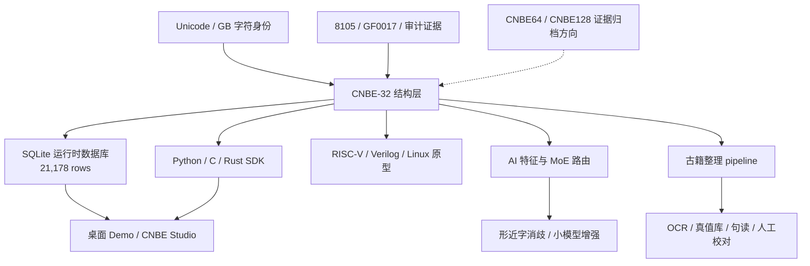

<p align="center">
  <strong>CNBE-32</strong><br>
  中文原生计算基座 · 从机器码到应用的统一中文结构表示
</p>

<p align="center">
  <a href="./README.md">English</a> ·
  <a href="./README_ZH.md">简体中文</a> ·
  <a href="./README_EN.md">English mirror</a>
</p>

<p align="center">
  
  
  
  <a href="https://pypi.org/project/cnbe32/"></a>
  <a href="https://github.com/zairkliu/CNBE-32-Chinese-Native-Binary-Encoding/releases/tag/demo-v1.0.0"></a>
  
  
</p>

CNBE-32 是一项面向中文的完整原生编码体系，目标是在机器码、指令集、操作系统、
编译/解码器、编程语言与应用之间建立统一的、可计算的中文结构表示。它以 32 位
字段代数承载可计算的形态学信息（部首/笔画/结构/索引/扩展位），并贯通 RISC-V
指令、Verilog 硬件原型、Linux 内核层、编译/解码器、C++/Python/Rust 语言与应用。
兼容现有 CJK/Unicode/GB 编码，是让现有计算机系统以补丁式转码和低改动网络传输
逐步演进，而非另起炉灶。其学术价值体现在计算语言学、汉字学与古籍数字人文的
结构感知编码基座。
在人工智能、国产芯片、RISC-V 与开源 AI 系统快速发展的时代条件下，
“全中文计算系统”这一历史设想已具备重新讨论与工程化的基础。
中文在人工智能时代不应是选项，而是地基之一。

项目定位见 [CNBE32_PROJECT_POSITION_ZH.md](./docs/CNBE32_PROJECT_POSITION_ZH.md)。

## 2026-08-18/19：CCF-A 论文与结构敏感实验证据

仓库现包含 CCF-A 论文包、OCR 候选重排实验、embedding 对照和古籍 PDF 语料方案：

- [CCF-A 论文与技术数据库](./research/2026-08-18_ccfa_cnbe_moe/README.md)
- [OCR 候选重排实验](./experiments/2026-08-19_small_scale_ocr_rerank/REPORT.md)
- [ChineseBERT / BERT embedding 对照](./experiments/2026-08-19_small_scale_ocr_rerank/EMBEDDING_COMPARISON_REPORT.md)
- [古籍 PDF 语料方案与清单](./experiments/2026-08-19_ancient_pdf_corpus/PLAN.md)

关键结果：

- 真实 OCR 重排：GBDT + CNBE 特征 66.39%，Unicode 50.42%；
- DeepSeek V4 API：CNBE 92.31%、Unicode 85.71%、plain 71.43%；
- embedding：bert-base-chinese 40.58%、ChineseBERT 18.12%、raw CNBE 15.94%；
- 永乐大典 37 页端到端：90.91% -> 92.64%；
- 古籍 OCR pilot：CNBE 覆盖率 100%。

## TL;DR（30 秒速览）

**CNBE-32 是什么？** 一套兼容 Unicode/GB 的中文结构计算层，用 32 位字段表达
汉字的部首/笔画/结构/索引/扩展位，让中文结构能进入 SDK、数据库、指令、
硬件原型和 AI 模型。

**谁应该关注？** 大模型与 MoE 架构研究者、RISC-V/系统工程师、古籍数字化与
OCR 工程师、中文信息处理研究者、政策与标准化观察者、中文技术爱好者。

**当前到了哪里？** 已有 21,178 行运行时数据库、多语言 SDK、桌面 Demo、
七语料 24.38M 字验证、MoE-64 三字段硬路由、本地 QLoRA 与 DeepSeek/Ollama
复现实验；第一轮 SCNet L20 128 共享专家云训练已完成，下一阶段是 256 专家
规模化验证、CNBE Studio 与古籍整理 pipeline。

## 成熟度声明

- **已锁定 / 可复现**：CNBE32 位域编码/解码、golden vectors、Python SDK、
  SQLite 运行时查询、21,178 行检入数据库、桌面 Demo、核心测试。
- **已本地实证**：七语料压缩与 Volume、MoE-8/16/64 硬路由、三字段均衡映射、
  DeepSeek V4 API 字段消融、1.5B 小模型边界复盘。
- **云实证（第一轮）**：SCNet L20、128 共享专家、24.38M CNBE 码、
  next-code 19.12%、Gini 0.207。
- **云实证（第二轮）**：SCNet DCU BW x2、544M CNBE token、128 共享专家、
  626M 参数、next-code 23.56%、struct 44.07%、Gini 0.297。
- **v1 受控对比**：MoE-128 22.96%、Dense 2.61%、Unicode 0.001%；
  等参数 Dense 确认 MoE 增益。
- **A800 5.4B 训练**：v2 冻结语料、配置与运行脚本已就绪；
  下一步为 smoke 测试。
- **规划中 / 待规模化验证**：256 专家 MoE、d_model 512-1024、9B 句读模型融合、
  端到端古籍整理工具、CNBE64/CNBE128 证据归档。
- **项目状态**：研究原型 -> 工程验证中。仓库会明确标注每项工作的证据等级，
  避免把规划、实验观察和稳定发布混为一谈。

## 摘要

CNBE-32 研究的问题是：在 Unicode 已经承担字符身份、GB/Unicode 已经构成
现实生态基础的前提下，中文是否还能拥有一个兼容的、可计算的结构层，使汉字的
部首、笔画、构型与字形索引能够进入 SDK、数据库、指令、硬件原型和 AI 模型？

本项目给出的答案不是“替代现有编码”，而是构建一个兼容层：Unicode/GB 负责
字符身份与交换，CNBE-32 负责结构指纹与可计算特征。当前仓库已经包含 21,178 行
运行时数据库、Python/C/Rust SDK、RISC-V 与 Verilog 原型、桌面 Demo、七语料
24.38M 字实验、QLoRA 小模型训练、CNBE-MoE 路由原型，以及按 8105 和 GF0017
治理的证据边界。

这是一项 AI 时代重新具备讨论条件的中文计算构想：算力、开源模型、RISC-V、
国产芯片和 Agent 工作流让“中文结构能否进入计算底层”从历史设想变成可复现的
工程研究问题。

## 为什么现在

中文计算的许多关键结构是在英文线性文本、ASCII、早期操作系统和早期网络协议
已经定型之后被接入的。中文当然已经被 Unicode 成功统一编码，但“字符身份被编码”
并不等于“汉字结构能被计算系统直接使用”。部首、笔画、构型、形近关系与历史字形
长期停留在字体、字典、输入法、OCR 后处理和人工知识库中。

AI 时代改变了这个问题的可行性边界：

- **Agent 工作流**让长周期资料整理、审计、重构、测试和文档维护可以持续推进；
- **开源模型与本地推理**让中文结构特征可以进入小模型、句读、消歧和古籍整理实验；
- **MoE 架构**让“用结构字段做硬路由先验”从概念变成可训练、可比较的模型问题；
- **RISC-V 与开源硬件**让中文结构字段可以被放到指令和硬件原型附近验证；
- **国产算力与中文语料生态**让中文不只是被通用模型处理的对象，也可以成为
  模型结构、工具链和系统设计的输入。

因此，CNBE-32 不是怀旧式地重造编码表，而是在 AI 时代重新提出一个更具体的问题：
中文结构能否成为计算结构的一部分？

## 核心贡献

| 贡献 | 说明 | 可复现入口 |
|---|---|---|
| 兼容型中文结构编码 | 以 32 位位域承载部首/笔画/结构/索引/扩展位，不替代 Unicode/GB | [`src/cnbe32/`](./src/cnbe32)、[`spec/golden_vectors.json`](./spec/golden_vectors.json) |
| 标准与证据治理 | 以 8105 为国家标准核心，区分 `standard`、`legacy`、Agent-standard 候选 | [标准符合性声明](./docs/CNBE_STANDARDS_COMPLIANCE_STATEMENT.md)、[字段语义冻结](./docs/FIELD_SEMANTICS_FREEZE_v1.1.md) |
| 软件与展示落地 | Python SDK、SQLite 查询、桌面 Demo、Windows/macOS/Linux 打包脚本 | [桌面 Demo](#桌面展示-demo)、[`docs/soft_copyright/`](./docs/soft_copyright/) |
| AI 与 MoE 验证 | QLoRA、DeepSeek/Ollama 复现、64 专家三字段硬路由、API 消融 | [`llm_experiments/`](./llm_experiments/)、[`experiments/2026-08-03_cnbe_moe/`](./experiments/2026-08-03_cnbe_moe/) |
| 古籍数字化边界 | 证明小模型不适合整页精确转录，转向 OCR/真值库 + CNBE 校验 + LLM 句读 | [`llm_experiments/2026-08-02_yongle_failures/`](./llm_experiments/2026-08-02_yongle_failures/) |
| 全栈原型 | 位域、C/Rust、RISC-V、Verilog、Linux 原型贯通同一字段语义 | [`riscv/`](./riscv/)、[`hardware/`](./hardware/)、[`linux_cnbe32_riscv/`](./linux_cnbe32_riscv/) |

## 系统结构


```mermaid
flowchart TD
  A["Unicode / GB 字符身份"] --> B["CNBE-32 结构层"]
  B --> C["SQLite 运行时数据库<br/>21,178 rows"]
  B --> D["Python / C / Rust SDK"]
  B --> E["RISC-V / Verilog / Linux 原型"]
  B --> F["AI 特征与 MoE 路由"]
  B --> G["古籍整理 pipeline"]
  C --> H["桌面 Demo / CNBE Studio"]
  D --> H
  F --> I["形近字消歧 / 小模型增强"]
  G --> J["OCR / 真值库 / 句读 / 人工校对"]
  K["8105 / GF0017 / 审计证据"] --> B
  L["CNBE64 / CNBE128 证据归档方向"] -.-> B
```

顺读本文时，可以把下面各章理解为一篇系统论文的展开：问题提出、相关历史经验、
系统设计、标准治理、实验结果、能力边界、复现入口与路线图。

## 可复现索引

| 你想复现什么 | 入口 | 说明 |
|---|---|---|
| SDK 安装与基础编码 | [快速开始](#快速开始)、[Python SDK 示例](#python-sdk-示例) | 位域编码/解码、Hamming distance、SQLite 查询 |
| 位域一致性 | [`spec/golden_vectors.json`](./spec/golden_vectors.json)、[实现一致性](#实现一致性) | Python/C/Rust/硬件方向共享 golden vectors |
| 桌面软件 | [桌面展示 Demo](#桌面展示-demo) | 本地运行与 Win/macOS/Linux 打包 |
| RISC-V v8 模拟器栈 | [`riscv/v8/`](./riscv/v8/)、[验证过程公示](./riscv/v8/docs/VERIFICATION_REPORT_2026-08-05.md) | Python/C/QEMU/Verilog/Spike 五层一致性，真实 21,178 行技能表 |
| Linux mini-kernel 启动 | [`linux_cnbe32_riscv/`](./linux_cnbe32_riscv/)、[模拟启动报告](./linux_cnbe32_riscv/docs/SIMULATION_REPORT_2026-08-05.md) | Linux 0.01 CNBE-32 RISC-V 在 QEMU/OpenSBI 下启动，运行时与 v8 对拍 55/55 |
| 数学基础实验 | [`experiments/2026-08-05_cnbe_math/`](./experiments/2026-08-05_cnbe_math/) | 伪度量边界、分配格、信息熵、双曲几何、代数性质 |
| 七语料压缩与 Volume | [`experiments/2026-08-02_seven_corpora_compression/`](./experiments/2026-08-02_seven_corpora_compression/) | 24.38M 字，压缩、随机访问、路由代理 |
| MoE 原型 | [`experiments/2026-08-03_cnbe_moe/`](./experiments/2026-08-03_cnbe_moe/) | Dense/MoE、硬路由、三字段映射、Triton 实验 |
| 古籍 OCR 边界 | [`llm_experiments/2026-08-02_yongle_failures/`](./llm_experiments/2026-08-02_yongle_failures/) | 永乐大典失败复盘、真值库与句读转向 |
| 数学定义与外部评审 | [CNBE-32 数学结构](./docs/CNBE32_MATHEMATICAL_STRUCTURE.md)、[P1 外部评审包](./docs/review/P1_EXTERNAL_REVIEW_EXECUTION_KIT.md) | 13/13 公式验证、WS-4 预注册 |
| 标准治理 | [当前标准重启状态](#当前标准重启状态)、[证据等级](#证据等级) | 8105、GF0017、no-write gate、证据边界 |

## 如何阅读这个项目

CNBE-32 既是一个可运行的软件项目，也是一组正在形成的研究论文、工程边界与
长期路线图。不同读者可以从不同入口进入：

| 读者 | 最相关入口 | 你会看到什么 |
|---|---|---|
| 中文信息处理 / 人工智能从业者 | [实验结果摘要](#实验结果摘要)、[CNBE-MoE](#2026-08-03cnbe-moe-原型与-api-消融) | CNBE 如何作为小模型特征、MoE 路由先验和形近字消歧线索 |
| 中文文字 / 古籍数字化研究者 | [古籍 OCR 失败复盘](#2026-08-02古籍-ocr-失败复盘与句读转向)、[项目合理性](#项目合理性) | OCR、真值库、句读、分段、校勘和汉字结构证据的分工 |
| 系统 / 芯片 / 编译器方向 | [RISC-V v8 模拟器栈](#2026-08-05risc-v-v8-模拟器与数学基座)、[技术栈分层](#技术栈分层)、[位域布局](#位域布局)、[给 geek 的看点](#给-geek-的看点) | 位域、RISC-V、Verilog、Linux、SDK 如何连成全栈原型 |
| 政策制定 / 标准化 / 产业观察者 | [兼容性策略](#兼容性策略渐进演进而非另起炉灶)、[当前标准重启状态](#当前标准重启状态)、[证据等级](#证据等级) | 项目如何兼容 Unicode/GB，如何区分研究原型、标准对齐和证据边界 |
| 软件著作权 / 演示使用者 | [桌面展示 Demo](#桌面展示-demo) | 可运行展示程序、三端打包方式和软著材料 |

## 项目主线：构想、论文、边界、落地

这个项目的核心不是“再造一张字表”，而是在 AI 时代重新讨论一个曾经因算力、
生态与模型条件不足而难以落地的构想：中文能否在计算机底层拥有可计算的结构表示？

README 后续内容按四条主线组织：

1. **构想**：中文结构信息不只属于字典和字体，也可以进入位域、指令、系统和模型；
2. **论文**：以位域代数、形态距离、双曲嵌入、MoE 路由、HDC/VSA 等候选计算层
   给出可验证定义；
3. **边界**：CNBE 不替代 Unicode，不让 LLM 做确定性编码，不把 OCR/辞书/模型输出
   直接当作国家标准证据；
4. **落地**：SDK、桌面 Demo、七语料实验、古籍整理 pipeline、RISC-V/Verilog、
   MoE 原型共同构成可运行的工程路径。

## 成果地图与下一步方向

当前最重要的成果不是单点指标，而是项目已经形成了从编码、证据、软件、模型到
系统原型的闭环：

| 方向 | 已有成果 | 下一步 |
|---|---|---|
| CNBE Studio / 软著演示 | 桌面 Demo、三端打包脚本、软著说明 | 批量编码、Volume 查看、MoE 路由可视化、古籍整理 Demo |
| 古籍整理 | 永乐大典失败复盘、OCR/真值库边界、句读转向 | OCR/真值库 -> CNBE 覆盖检查 -> 形近字风险 -> LLM 句读分段 -> 人工校对队列 |
| CNBE-MoE | 8/16/64 专家、三字段硬路由、DeepSeek V4 字段消融 | 等参数/等计算预算对照，128/256 专家云 GPU 验证 |
| 大模型与小模型边界 | QLoRA、DeepSeek/Ollama 复现、1.5B 失败边界 | 1.5B/7B/14B 规模曲线，长度扫描，句读 F1 与形近字消歧稳定性 |
| 标准与证据 | 8105 基线、GF0017 门禁、统一证据索引 | 保持 no-write gate，推进 CNBE64/CNBE128 证据归档设计 |
| 底层系统 | RISC-V 指令、Verilog、Linux 原型、C/Rust/Python SDK | 把结构层从演示推进到工具链与可测 benchmark |

## 路线图与验收标准

| 阶段 | 时间口径 | 目标 | 验收标准 |
|---|---|---|---|
| Phase 0：本地验证 | 已完成 | 编码规范、21,178 行数据库、SDK、Demo、七语料、MoE-64、API 消融 | 关键结果已有报告、脚本或结果文件，核心 SDK 测试通过 |
| Phase 1：云 GPU 规模化 | 近期规划 | 128/256 专家，d_model 512-1024，Triton 在更大模型上复测 | 与 Dense 做等参数/等计算预算对照；报告 loss、next-code、Gini、吞吐 |
| Phase 2：CNBE Studio | 近期规划 | 批量编码、Volume 查看、MoE 路由可视化、软著演示增强 | 桌面应用可打包运行，README 与软著文档同步更新 |
| Phase 3：古籍整理 pipeline | 中期规划 | OCR/真值库 -> CNBE 覆盖检查 -> 形近字风险 -> LLM 句读分段 -> 人工校对 | 至少一个公开样例包，含输入、输出、错误分析与人工校对队列 |
| Phase 4：扩展位宽与标准化 | 长期规划 | CNBE64/CNBE128、GB 18030/Unicode 双向映射、外部评审 | 设计文档、golden vectors、证据归档 schema、P1/WS-4 评审结果 |

## 项目定位

**CNBE-32 是一项面向中文的完整原生编码体系**，目标是在机器码、指令集、
操作系统、编译/解码器、编程语言与应用之间，建立统一的、可计算的中文结构表示。

| 层级 | CNBE-32 对应物 |
|---|---|
| 机器码 / 寄存器 | 32 位字段位域，天然对齐位运算与寄存器 |
| 指令集 | RISC-V 自定义指令（提取 / 比较 / 查表） |
| 操作系统 | 内核、文件系统、终端的字符处理 |
| 编译/解码器 | CNBE ↔ Unicode/GB 双向转换 |
| 编程语言 | Python / C / Rust SDK |
| 应用层 | 古籍 OCR、MoE 结构路由、桌面 Demo |

32 位是当前最适合模拟中文结构编码的载体，但不是终点；未来将按需扩展位宽，
或引入可变长编码，以覆盖古籍用字与汉字发展历史。

## 兼容性策略：渐进演进，而非另起炉灶

CNBE-32 兼容现有 CJK/Unicode/GB 编码体系，而非彻底取代，这一决策建立在
历史经验之上：

- **失败教训**：早期中文编码私有方案、IBM 双字节字符集过度设计、
  HZ 编码协议等，均因与 ASCII/Unicode 不兼容而付出高昂生态成本；
- **成功经验**：UTF-8 兼容 ASCII、GB 系列逐代向后兼容、RISC-V 模块化
  扩展指令集，都证明兼容演进是重大变革可行且必要的路径；
- **CNBE-32 路线**：提供双向转换 SDK；先在古籍数字化、OCR 修正、
  形近字消歧等局部场景落地，再逐步推向操作系统、编译器与 AI 模型；
  对 Linux 内核和 RISC-V 工具链采用“补丁而非替换”的接入方式。

> 核心原则：CNBE-32 不是“另起炉灶”，而是“添砖加瓦”——让中文结构信息
> 成为现有计算机体系的可选、兼容的附加层。

## 当前状态与进展（2026-08-05）

### 已完成（本地验证）

| 模块 | 内容 | 状态 |
|---|---|:---:|
| 编码规范 | 32 位位域定义、国标对齐 | ✅ 完成 |
| 数据集 | 21,178 条编码，7,602 条 8105 标准轨 | ✅ 完成 |
| 软件栈 | Python / C / Rust SDK，桌面 Demo | ✅ 完成 |
| 压缩实验 | 七语料（24.38M 字）CNBE 流与 Volume | ✅ 完成 |
| MoE 路由 | 8/16/64 专家硬路由，三字段映射，Gini 0.15 | ✅ 完成 |
| 硬件原型 | RISC-V 自定义指令、Verilog core | ✅ 完成 |
| RISC-V v8 模拟器 | Python/C/QEMU/Verilog/Spike 五层一致性，真实技能表 | ✅ 完成 |
| Linux 0.01 CNBE-32 RISC-V | 编译、链接并在 QEMU/OpenSBI 下启动；运行时与 v8 对齐 | ✅ 完成 |
| 数学模型深化 | 度量/格/信息论/几何/代数五类实验 | ✅ 完成 |
| API 消融 | 形近字消歧 +33.3pp（vs 原文） | ✅ 完成 |
| 软著材料 | 已提交计算机软件著作权登记 | ✅ 完成 |

### 规划中（需云 GPU 大规模验证）

128 共享专家第一轮云训练已在 SCNet L20 完成
（[验收报告](./experiments/2026-08-08_cnbe_moe_scnet/REPORT_SCNET_CNBE_MOE_L20.md)）。
以下工作仍需更大规模云算力：

- MoE 专家数扩展至 256，在更大数据上验证硬路由收益；
- d_model 增大至 512-1024，评估 Triton kernel 性能收益；
- 与 9B QLoRA 句读模型融合，验证下游 F1 提升；
- 端到端古籍整理工具，将 CNBE 结构编码集成到 OCR 后处理管线。

> ⚠️ 以上为项目路线图中的**规划阶段**，当前核心交付物为本地已验证的
> 研究原型。

## 技术栈分层

1. 位域规范：`radix(8) | stroke(5) | struct(4) | index(11) | ext(4)`，
   见 `docs/specification/bit-layout.md`；
2. 形式化数学：形态汉明距离、双曲嵌入、golden vectors 一致性测试；
   2026-08-05 实验新增度量公理、格与范围查询、熵分析与代数性质测试；
3. 指令集与硬件：RISC-V 自定义指令（map / extract / cmp / skill），
   v8 五层模拟器（Python / C / QEMU / Verilog / Spike）、Verilog core 与
   FPGA 验证；
4. 操作系统：Linux 0.01 CNBE-32 RISC-V mini-kernel，可在 QEMU/OpenSBI
   下启动（`linux_cnbe32_riscv/`）；
5. 编译/解码器：`cnbe32` Python 包、C/Rust 绑定、双向转换；
6. 应用与工具：桌面 Demo、古籍 OCR 校验原型、MoE 结构路由验证。

## 实验结果摘要

| 实验 | 结果 | 结论 |
|---|---|---|
| 七语料压缩 | CNBE 定长流 ≈ gzip +13~47% | 压缩非主优势，结构可计算为主 |
| CNBE Volume | O(1) 定位 | 适合随机访问 |
| MoE-64 硬路由 | Next-code +3.26pp，Gini 0.153 | 硬路由有效，三字段映射更均衡 |
| SCNet L20 128 共享专家 | Next-code 19.12%，struct 34.14%，Gini 0.207 | CNBE 码可学习；小语料限制 struct/Gini |
| API 形近字消歧 | CNBE 提示 0.933 vs 原文 0.600 | 结构字段对字符级任务显著有效 |
| v8 五层模拟器 | Python/C/QEMU/Verilog/Spike 全 PASS，Linux 运行时 55/55 | 指令语义与运行时在同一真实技能表上对齐 |
| 度量公理 | 20 万对除同一性外全 PASS；50,728 对零距离 | `cnbe.cmp` 是伪度量，需明确结构等价类语义 |
| 格与范围查询 | 分配格成立；三维前缀和约 1500x 加速 | 结构范围检索 O(1)，可用于索引设计 |
| 信息论 | H(tuple) 13.28 bit，相对 17 bit 冗余约 3.7 bit | 熵优化属于存储层，不改 RISC-V 字段语义 |
| 代数性质 | 160,000+ 断言，0 失败 | 可作为 TLA+/Coq 形式化验证的入口 |

## 版本历史

- **v1.2.0（2026-08-05）**：RISC-V v8 五层模拟器基座、Linux 0.01
  CNBE-32 RISC-V 在 QEMU/OpenSBI 下启动、数学模型深化实验（伪度量边界、
  格/范围查询、信息论、双曲几何、代数性质）；
- **v1.1.0（2026-08-04）**：定位重定义，增加兼容性策略、状态与规划、
  技术栈分层与局限性说明；
- **v1.0.4（2026-07-27）**：首个稳定发布，含 21,178 条编码、桌面 Demo、
  MoE 原型。

> **CNBE-32 是研究原型。**
> 当前检入的 Python SDK 运行时包含 **21,178 条记录**，其中包括按项目人工审核基线完成的 276 个 PENC276 字符。
> 更大的 **97,686 CJK** 数字是计划中 / 实验性的扩展范围，不代表当前随包 SDK 覆盖。
> 最新发布包是 **cnbe32 1.0.4**，对应 GitHub `v1.0.4` 发布检查点。
> 仓库数据库此后已迁移至 **v1.1**（21,178 行）；迁移后已确认状态见下文。

## 桌面展示 Demo

本仓库提供 **CNBE-32 中文原生计算基座展示程序**，用于软件著作权申请、项目路演和内部评审演示。展示程序以 **中文原生二进制编码** 为核心，支持输入汉字并输出 Unicode、CNBE-32 十六进制 / 十进制 / 32 位二进制、部首/根编号、笔画、结构、索引、扩展位和运行时状态。

- Demo 发布页：[CNBE-32 Chinese Native Computing Foundation Demo v1.0.0](https://github.com/zairkliu/CNBE-32-Chinese-Native-Binary-Encoding/releases/tag/demo-v1.0.0)
- 程序源码：`src/cnbe32_demo/`
- 软著说明与操作文档：[`docs/soft_copyright/CNBE32_DEMO_EXE_GUIDE.md`](./docs/soft_copyright/CNBE32_DEMO_EXE_GUIDE.md)
- Windows 11 x64 打包：`tools/windows/build_demo_exe.ps1`
- macOS 打包：`tools/macos/build_demo_app.sh`
- Linux x64 打包：`tools/linux/build_demo_exe.sh`

本地运行：

```bash
python -m pip install -e .
cnbe32-demo
```

打包示例：

```powershell
# Windows 11 x64
.\tools\windows\build_demo_exe.ps1
```

```bash
# macOS
bash tools/macos/build_demo_app.sh

# Linux x64
bash tools/linux/build_demo_exe.sh
```

说明：该 Demo 是项目展示和运行时查询软件，不改变 CNBE 的标准边界；项目仍表述为“以国家语言文字规范为对齐目标”，不宣称已获得国家标准认证。

## 当前标准重启状态

CNBE 正在按更严格的国家语言文字规范证据链重新组织。

**8105 通用规范汉字表**现在是本轮重写编码的国家标准核心。现有 CNBE 行在通过新的证据门禁前，只能视为旧版 / 当前运行时数据。原 20,902 行 Agent 预编码池保留为 PENC276 之前的基线；当前检入运行时为 21,178 行。97,686 行全目录仍是扩展研究目标。

本轮重启目标是把 CNBE 重建为一个对齐国家语言文字规范的编码项目：Agent 负责受控执行汉字结构工作，每个可提升结果都必须携带证据和审核状态，仓库结构必须区分运行时代码、证据、报告、历史实验和科研复现产物。

当前已确认状态：

- 发布检查点：`v1.0.4`
- 已发布 Python 包：`cnbe32==1.0.4`
- 8105 基线行数：`8105`
- 人工审核通过的 8105 Agent 结构基线：`8105 / 8105`
- 已从批准后的 8105 dry run 提升到运行时 CNBE32 的行数：`6712`
- 额外完成的保守标准化运行时修复行数：`598`
- 当前已修复的 8105 运行时总行数：`7310`
- 强制通过但保留到后续插入 / 部首策略队列的行数：`795`
- 运行时 JSON 和 SQLite 数据库当前均为经授权的 21,178 行项目运行时

迁移后状态（v1.1，2026-07-25 经所有者授权执行）：

- 双源一致修复：`620`（笔画 503、结构 111、部首 6）
- PENC276 授权编码写入：`276` 条人工审核记录已在 JSON 和两份 SQLite 运行时数据库中写入 CNBE 值（`cnbe` 非空、`needs_encoding=0`）。其权威标签为 `HUMAN_AUDIT_PROJECT_BASELINE_USER_AUTHORIZED_2026_07_27`，表示项目人工审核基线，不构成国家标准声明。
- 迁移期双源分歧挂起待专家裁决：`348`：这是独立的历史 v1.1 迁移队列，不是上述 108 字人工审核的失败或撤销。
- 运行时总行数：`21178`
- track 列：`standard 7602 / legacy 13576`
- 迁移幂等（二次 dry-run 计划 0 操作），并记录于 `migration_meta`

治理文档：

- [CNBE 标准符合性声明](./docs/CNBE_STANDARDS_COMPLIANCE_STATEMENT.md)
- [CNBE 8105 编码治理](./docs/CNBE8105_ENCODING_GOVERNANCE.md)
- [CNBE 研究定位声明](./docs/CNBE_RESEARCH_POSITION_STATEMENT.md)
- [CNBE 可复现 Agent 工作流](./docs/CNBE_REPRODUCIBLE_AGENT_WORKFLOW.md)
- [CNBE 版本治理](./docs/CNBE_VERSION_GOVERNANCE.md)
- [仓库结构](./docs/REPOSITORY_STRUCTURE.md)
- [仓库发布版 Agent skill](./skill/cnbe-hanzi-structure-encoding-agent/SKILL.md)
- [GitHub Copilot 云端智能体状态](./docs/COPILOT_CLOUD_AGENT_LIMITATION.md)
- [CNBE 8105 编码比对报告](./evidence/8105/CNBE8105_ENCODING_COMPARISON_REPORT.md)
- [CNBE 8105 运行时提升报告](./reports/8105_CNBE32_RUNTIME_PROMOTION.md)
- [CNBE 8105 标准化运行时修复](./reports/8105_STANDARDIZED_RUNTIME_REPAIR.md)
- [字段语义冻结规范 v1.1](./docs/FIELD_SEMANTICS_FREEZE_v1.1.md)
- [v1.1 迁移工具与验证报告](./reports/MIGRATION_V1_1_WS7WS8.md)
- [276 字授权编码候选表](./evidence/8105/pending276/PENC276_AUTHORIZED_ENCODING_CANDIDATES.csv) — Unicode 优先、人工审核的候选表，已用于完成运行时写入
- [276 字授权编码报告](./reports/PENC276_AUTHORIZED_ENCODING_APPLY.md) — JSON 与两份 SQLite 运行时数据库的可复现写入结果
- [iHandian 网页字典交叉参考规则](./skill/references/ihandian.md) — 单字、Unicode 优先、只读的网络字典参考；与辞书、ZDIC 同为审核辅助层
- [WS-4 基准预注册](./docs/benchmarks/WS4_BENCHMARK_PRE_REGISTRATION.md)

### T3 探索批次：人工审核优先

PENC276 的 276 字已完成**人工结构/拆解审核**：`PENC_169`–`PENC_276` 的 108 字作为先行 T3 基线，其余 168 字通过同一中文审核包完成。人工审核是本项目的最终工作基线。8105 及相关国家语言文字规范、Unihan、ZDIC、辞书和 iHandian 在此批次中用于对齐、交叉核验和暴露差异；它们不是自动覆盖人工结论的“金标准”。外部来源存在分歧、缺项或字形显示限制时，系统保留原始差异和待裁决状态。候选生成与运行时写入只在获得所有者明确授权后执行；已完成编码保留项目人工审核权威标签，不宣称国家标准认证。

168 字补充审核已完成，因此 276 字均具有人审结构/拆解记录。iHandian 的分层冒烟测试在 14/14 样本上完成 Unicode 对齐并返回拆字字段；其中 13 条与人工拆字逐字一致，`PENC_022` 的不可显现组件字形已获人工确认，保留人工拆字且不计为网页参考差异。历史迁移期的 348 条双源分歧仍是独立工作队列，不能由本轮结论一并关闭。

- [人工审核证据政策](./docs/PENC276_T3_HUMAN_AUDIT_EVIDENCE_POLICY.md)
- [108 字最终人工审核基线](./evidence/8105/pending276/T3_169_276_FINAL_HUMAN_AUDIT_BASELINE.csv)
- [机器可读基线摘要](./reports/PENC276_T3_169_276_FINAL_HUMAN_AUDIT_BASELINE.json)

数学与评审计划：

- [CNBE-32 数学结构](./docs/CNBE32_MATHEMATICAL_STRUCTURE.md) — 13 个研究公式的独立呈现
- [形式数学规范（EN）](./docs/specification/CNBE_FORMAL_MATHEMATICAL_SPECIFICATION.md) / [中文版](./docs/specification/CNBE_FORMAL_MATHEMATICAL_SPECIFICATION_ZH.md)
- [公式验证报告](./experiments/morphology_computing/reports/FORMAL_FORMULA_VERIFICATION_REPORT.md) — 13/13 数学性质 PASS；0 项科学性能声明被验证
- [验证 manifest](./experiments/morphology_computing/reports/formal_formula_verification_manifest.json) — 机器可读，SHA-256 锚定
- [P1 外部评审方法（EN）](./docs/specification/P1_EXTERNAL_REVIEW_METHOD.md) / [中文版](./docs/specification/P1_EXTERNAL_REVIEW_METHOD_ZH.md)
- [P1 外部评审执行包](./docs/review/P1_EXTERNAL_REVIEW_EXECUTION_KIT.md) — 600 行盲审包的评审人操作手册
- [外部评审包](./experiments/morphology_computing/review_packets/P1_EXTERNAL_INDEPENDENT_REVIEW_PACKET_EDITABLE.csv) — 600 行盲审数据，等待独立评审

早期 AI 生成的目录字段现在只作为历史测试基线处理。它们可用于定位旧版回归问题，但不能作为结构、部首、笔画、教学或科研声明的依据。

> **措辞红线**：本项目“以国家语言文字规范为对齐目标”。在标准对齐矩阵全部转为“已对齐”之前，本项目不自称“符合国家标准”。完整对齐状态与已知缺陷见[标准符合性声明](./docs/CNBE_STANDARDS_COMPLIANCE_STATEMENT.md)。

## 项目合理性

CNBE-32 只有在编码流程比早期 AI 生成目录更严格时才有研究价值。本项目当前的合理性建立在以下边界上：

- 以 Unicode 作为兼容身份，不把 CNBE 描述成 Unicode 的替代品；
- 以 8105 通用规范汉字表作为发布轨道的国家标准核心；
- 按下列国家语言文字规范逐项处理汉字属性（对齐状态见[标准符合性声明](./docs/CNBE_STANDARDS_COMPLIANCE_STATEMENT.md)）：
  - 结构分类 → GF 0017-2013 §3.12（独体 + 12 种合体，项目 13 个标签已逐条对应）
  - 部首 → GF 0011-2009《汉字部首表》/ GF 0012-2009《GB13000.1字符集汉字部首归部规范》（锚定中）
  - 独体字 → GF 0013-2009《现代常用独体字规范》（方向一致，未逐字核验）
  - 部件与拆分 → GF 0014-2009 / GF 3001-1997（方向一致，未逐字核验）
  - 笔顺笔形 → GF 0023-2020《通用规范汉字笔顺规范》/ GF 3002-1999
- 字符身份由 Unicode 码位承担；与 GB 18030-2022 的双向映射层在路线图中；
- 辞书、字源资料、Wikipedia、ZDIC 只作为审核上下文或来源发现辅助，除非字段明确标注为非国家标准上下文；
- CNBE32 作为紧凑运行时载体，32 位容纳不下的证据保留给 CNBE64 / CNBE128 或审核归档；
- 只发布能够追溯到已提交证据、报告、测试和发布说明的检查点。

因此，本仓库不是一个来源不明的大型生成表，而是一个对齐规范、可审核、可复现的中文结构编码研究流程。

关于当前方向、时间点、复现路径、技术可行性和科学价值的一页式说明，见[CNBE 研究定位声明](./docs/CNBE_RESEARCH_POSITION_STATEMENT.md)。

## v11: 8105 QLoRA 深度学习训练（2026-07）

基于 8105 国家标准的 QLoRA 微调实验，在 DeepSeek-R1-Distill-Qwen-1.5B 上完成 5000 步训练。

### 训练结果

| 指标 | 值 |
|------|:----:|
| 训练步数 | 5,000 |
| 训练时间 | 5.8 小时（RTX 4060 Ti） |
| 最终训练 loss | 0.1493 |
| 最终验证 loss | 0.09179 |
| LoRA 适配器 | 73.9 MB（18.5M 参数） |

### 实验验证

| 实验 | 结果 | 说明 |
|:----|:----:|:-----|
| 结构分类 | **66.0%** | 13 种结构类型 |
| 形近字区分 | **92.7%** | 混淆对区分率 |
| 笔画感知 | **54% ±2** | 笔画预测容忍度 |
| 生僻字泛化 | 持平 | 未见字符泛化验证 |
| 语义聚类 | ratio=0.99x | 边界确认（结构编码 ≠ 语义嵌入） |

### 古籍 OCR 验证

| 古籍 | 页数 | 字数 | OCR引擎 |
|:-----|:----:|:----:|:--------:|
| 大明会典（明内府刻本） | 5 | 7,480 | deepseek-ocr |
| 永乐大典·卷981（哈佛藏） | 5 | 3,373 | deepseek-ocr |

### 部署方式

详见 `tools/deploy/`：
1. **API Server**: FastAPI REST 服务（推荐）
2. **Ollama 自定义模型**: `ollama create cnbe-32`
3. **OCR 管线**: 古籍 PDF → OCR → CNBE 编码

### 模型与完整文档

- **ModelScope 模型页**：[zairkliu/CNBE-32](https://www.modelscope.cn/models/zairkliu/CNBE-32) — GGUF FP16 推理模型（3.55 GB），可直接 `ollama create` 部署
- [技术白皮书 v1.1](./docs/CNBE32_技术白皮书_v1.1.md)
- [v11 实验说明](./llm_experiments/v11_8105_qlora/README.md)
- [训练报告](./reports/v11_8105_qlora/TRAINING_REPORT.md)
- [位域评估补充](./reports/v11_8105_qlora/FIELD_EVAL_SUPPLEMENT.md)
- [部署文档](./tools/deploy/README.md)

---

## 2026-08-02：古籍 OCR 失败复盘与句读转向

在《永乐大典》卷821-823“诗字”37 页人工校订实验中发现：1.5B 生成式模型
无法完成 400-500 字整页 OCR 转录，精确匹配仅约 20%，Eval Loss 可升至 9.9。

### 关键实验数据

| 路径 | 结果 |
|---|---:|
| PaddleOCR PP-OCRv4 覆盖率 | 18.05% |
| DeepSeek-OCR v1 去重后覆盖率 | 37.76% |
| 1.5B 整页修正（v3/v4） | 约 20-21% |
| 页面锚定真值库 | 37/37 命中，score=1.0 |
| 识典公开《诗话六十三》交叉验证 | 16,082/16,082 逐字一致（100%） |

### 结论

1. 小模型不能做整页序列转录；转录交给 OCR + 真值库，大模型只做句读与分段。

完整文档：

- [失败总结](./llm_experiments/2026-08-02_yongle_failures/FAILURE_SUMMARY_2026-08-02.md)
- [小模型能力边界讨论](./llm_experiments/2026-08-02_yongle_failures/BOUNDARY_ANALYSIS.md)

大模型权重与完整训练数据（约 1.47 GB）不放入 Git，归档于本地
`outputs/training_data_2026-08-02_full.zip`。

### 2026-08-02：七语料 CNBE 压缩验证

同日完成七类语料（资治通鉴、鲁迅全集、阿加莎全集、Linux 程序设计、金庸全集、
财新周刊、蘇文忠公詩集）共 24,381,237 字的 CNBE 压缩、Volume 随机访问、
MoE 路由代理与 DeepSeek V4 API 复现。核心结论：gzip 仍是最优纯压缩；
CNBE Volume 以约 +40% 体积换 O(1) 随机定位；CNBE 结构路由负载近似完全均衡。

- [七语料压缩验证总报告](./experiments/2026-08-02_seven_corpora_compression/README.md)
- [压缩验证详情](./experiments/2026-08-02_seven_corpora_compression/SEVEN_CORPORA_COMPRESSION.md)
- [可复现结果](./experiments/2026-08-02_seven_corpora_compression/results/)

### 2026-08-03：CNBE-MoE 原型与 API 消融

完成 8/16/64 专家 CNBE-MoE 原型、三字段均衡映射、Triton grouped GEMM kernel、
学习式路由对比与 DeepSeek V4 API 字段提示消融。结论：64 专家三字段硬路由为
当前推荐配置（Gini 0.153）；CNBE 结构字段对形近字消歧收益显著，对句读无增益。

- [CNBE-MoE 实验入口](./experiments/2026-08-03_cnbe_moe/README.md)
- [最终报告](./experiments/2026-08-03_cnbe_moe/CNBE_MoE_最终报告.md)
- [API 消融报告](./experiments/2026-08-03_cnbe_moe/CNBE_MoE_API消融实验报告.md)

### 2026-08-05：RISC-V v8 模拟器与数学基座

RISC-V 层以“模拟器优先”重建为 v8 基座（`riscv/v8/`）：所有技能表与
golden vectors 均来自真实 `data/cnbe32.db`（21,178 行），同一套指令语义
在 Python、C、QEMU、Verilog、Spike 五层中一致通过；随后 Linux 0.01
CNBE-32 RISC-V mini-kernel 完成编译、链接，并在 QEMU/OpenSBI 下启动，
输出中文系统信息，运行时与 v8 对拍 55/55。

同一份真实数据库支撑了五类数学深化实验：

| 方向 | 结果 | 边界 |
|---|---|---|
| 度量公理 | 非负/对称/三角 PASS；同一性 FAIL | `cnbe.cmp` 是伪度量（50,728 对零距离）；需定义结构等价类 |
| 格与范围查询 | 分配格成立；三维前缀和约 1500x 加速 | 范围检索 O(1)；join/meet 结果不一定落在现有字表内 |
| 信息论 | H(tuple) 13.28 bit；相对 17 bit 冗余约 3.7 bit | 熵优化属于存储层设计，不改 RISC-V 字段语义 |
| 双曲几何 | 同部首 AUC 0.7092 vs 加权 0.9845 | 无标注形近字集，不能支持 92.7%→95% 声称；方向暂缓 |
| 代数性质 | 160,000+ 断言，0 失败 | 轻量公理通过；下一步 TLA+/Coq + CBMC/SymbiYosys 形式化 |

文档：

- [v8 验证过程公示](./riscv/v8/docs/VERIFICATION_REPORT_2026-08-05.md)
- [v8 对齐地图](./riscv/v8/docs/ALIGNMENT.md)
- [Linux 0.01 模拟启动报告](./linux_cnbe32_riscv/docs/SIMULATION_REPORT_2026-08-05.md)
- [数学实验报告](./experiments/2026-08-05_cnbe_math/REPORT_2026-08-05.md)
- [TLA+ 草稿](./experiments/2026-08-05_cnbe_math/spec/CNBE32_ALGEBRA.tla)

统一本地复现：`scripts/verify_project.sh`。

### 2026-08-10：SCNet L20 CNBE-MoE 第一轮云训练

在 SCNet L20（NVIDIA L20，CUDA 12.4）完成第一轮云训练：128 专家跨层共享、
24.38M CNBE 码、46,874 步。最终指标：next-code 19.12%、radix 20.23%、
struct 34.14%、strokes 24.38%、Gini 0.207、参数量 289.9M。验证 CNBE 码流
可学习；struct 与 Gini 的进一步优化需要更大语料。

- [验收报告](./experiments/2026-08-08_cnbe_moe_scnet/REPORT_SCNET_CNBE_MOE_L20.md)
- [训练记录](./experiments/2026-08-08_cnbe_moe_scnet/SCNET_TRAINING_RECORD_2026-08-10.md)
- [实验日志](./outputs/experiment_logs/2026-08-10.md)

### 2026-08-14：v2 语料冻结与 A800 5.4B 训练计划

v2 语料已正式冻结：

| 项目 | 值 |
|---|---:|
| 文件数 | 15,589 |
| 总字符 | 5,152,417,784 |
| train 物理词数 | 5,069,667,334 |
| vocab（含 code 0） | 20,535 |
| mapping 模板 | 14,248 |
| train / eval / val 文件 | 15,288 / 145 / 156 |

下一阶段在 A800 x2 上使用 v2 全量 train 码流训练：

| 项目 | 值 |
|---|---:|
| 模型 | d_model=1024、12 层、16 头 |
| MoE | 128 专家、Top-2 硬路由 |
| seq_len / batch per GPU | 256 / 16 |
| 全局 batch | 8,192 token/step |
| 预计步数 | 约 618,750 |
| checkpoint | 每 10,000 步 |

- [A800 前置准备](./docs/A800_PRETRAIN_PREP_2026-08-14.md)
- [A800 训练计划审阅稿](./docs/A800_5_4B_TRAINING_PLAN_REVIEW_2026-08-14.md)
- [A800 5.4B 实验包](./experiments/2026-08-14_a800_5_4b/)

### 2026-08-19：结构敏感重排与古籍 PDF 语料

为回答“CNBE 作为计算结构指纹层的差异化优势”这一问题，项目完成了一组结构敏感实验：

| 实验 | 结果 |
|---|---|
| 真实 OCR 重排，Unicode baseline | 50.42% Top-1 |
| 真实 OCR 重排，GBDT + CNBE 特征 | 66.39% Top-1 |
| DeepSeek V4 API，plain / Unicode / CNBE | 71.43% / 85.71% / 92.31% |
| bert-base-chinese / ChineseBERT / raw CNBE | 40.58% / 18.12% / 15.94% |
| 永乐大典 37 页端到端 | 90.91% -> 92.64% |

链接：

- [OCR 重排实验](./experiments/2026-08-19_small_scale_ocr_rerank/REPORT.md)
- [Embedding 对照](./experiments/2026-08-19_small_scale_ocr_rerank/EMBEDDING_COMPARISON_REPORT.md)
- [古籍 PDF 语料](./experiments/2026-08-19_ancient_pdf_corpus/PLAN.md)

---

## Agent 与自动化边界

仓库包含 GitHub 兼容的 Agent profile 和 Copilot 指令，但 GitHub Copilot cloud agent 执行能力属于可选付费集成，不是开源复现、科研审核或发布轨道 CNBE 工作的必要依赖。

项目的可复现基线保存在已提交的 skill、测试、报告、review packet 和普通 GitHub Actions 中。没有 Copilot cloud agent 访问权限的维护者，仍可在本地或通过普通 pull request 执行 CNBE Agent 工作流。详见[GitHub Copilot 云端智能体状态](./docs/COPILOT_CLOUD_AGENT_LIMITATION.md)。

## 当前标准重启状态

CNBE 正在按更严格的国家语言文字规范证据链重新组织。

**8105 通用规范汉字表**现在是本轮重写编码的国家标准核心。现有 CNBE 行在通过新的证据门禁前，只能视为旧版 / 当前运行时数据。20,902 行 Agent 预编码池是项目候选输出，97,686 行全目录仍是扩展研究目标。

本轮重启目标是把 CNBE 重建为一个对齐国家语言文字规范的编码项目：Agent 负责受控执行汉字结构工作，每个可提升结果都必须携带证据和审核状态，仓库结构必须区分运行时代码、证据、报告、历史实验和科研复现产物。

当前已确认状态：

- 8105 基线行数：`8105`
- 当前 CNBE 中落入 8105 范围的行数：`7829`
- 当前 CNBE 中缺失的 8105 行数：`276`
- 人工审核通过的 8105 Agent 结构基线：`8105 / 8105`
- 已从批准后的 8105 dry run 提升到运行时 CNBE32 的行数：`6712`
- 强制通过但保留到后续插入 / 部首策略队列的行数：`1393`
- 运行时 JSON 和 SQLite 数据库已从批准后的 20,902 行源表重建

治理文档：

- [CNBE 8105 编码治理](./docs/CNBE8105_ENCODING_GOVERNANCE.md)
- [CNBE 可复现 Agent 工作流](./docs/CNBE_REPRODUCIBLE_AGENT_WORKFLOW.md)
- [CNBE 版本治理](./docs/CNBE_VERSION_GOVERNANCE.md)
- [仓库结构](./docs/REPOSITORY_STRUCTURE.md)
- [CNBE 8105 核心确认](./reports/CNBE8105_CORE_CONFIRMATION.md)
- [CNBE 8105 运行时提升报告](./reports/8105_CNBE32_RUNTIME_PROMOTION.md)

---

## 为什么有趣

Unicode 告诉计算机：这是哪一个字符。

CNBE-32 问的是一个不同的问题：

> 能不能把中文的视觉与结构逻辑，直接放在从机器码到应用的完整二进制体系里？

这让 CNBE-32 在以下方向值得实验：CJK-aware 嵌入、低层查找表、硬件友好的文本特征、面向特定语言的模型输入。

---

## 一张图看懂

```text
31              24 23        19 18     15 14                 4 3        0
┌────────────────┬────────────┬─────────┬─────────────────────┬──────────┐
│ Radical/Radix  │  Stroke    │ Struct  │     Glyph Index     │   Ext    │
│     8 bits     │  5 bits    │ 4 bits  │       11 bits       │  4 bits  │
└────────────────┴────────────┴─────────┴─────────────────────┴──────────┘
```

把它理解为一张紧凑的结构指纹，而非替代 Unicode。

---

## 快速开始

```bash
python -m pip install cnbe32
```

```python
from cnbe32 import encode_cnbe, decode_cnbe, bit_hamming_distance

# 注意：radix 为项目内部部首/结构根编号，尚未锚定 GF 0011-2009《汉字部首表》；
# 语义冻结前请勿将编号用于跨项目交换。
a = encode_cnbe(radix=72, stroke=8, struct=1, index=123, ext=0)
b = encode_cnbe(radix=72, stroke=9, struct=1, index=124, ext=0)

print(decode_cnbe(a))
print(bit_hamming_distance(a, b))
```

---

## 当前稳定部分

- CNBE-32 字段编码与解码
- 所有位域范围的严格校验
- 真正的 bit-level Hamming distance 及旧版字段加权距离
- 可选 SQLite 数据库查询（v1.1 迁移后 schema，含 `track` 列）
- 显式 `SkillTable` 构造
- wheel 构建、pip install、pytest、ruff、GitHub Actions CI

---

## 当前实验部分

- LLM prompt 与特征实验
- JEPA 风格表征学习
- RISC-V 与硬件指令原型
- OS 与 kernel 层实验（教学性概念验证：当前代码未通过编译，仅作 Agent 工作流研究样本，不代表可用系统）
- 金融、生物、物理、社会科学风格实验

除非对应目录包含固定数据集版本、可复现脚本、baseline 对比、随机种子、原始结果产物和训练/测试分离，否则应视为**初步研究原型**。

---

## 覆盖范围术语

| 术语 | 含义 |
|---|---|
| **8105 国家标准核心** | 8,105 个通用规范汉字，作为发布轨道的标准基线 |
| **已发布包检查点** | `cnbe32==1.0.4`；发布元数据与检入运行时数据状态分开表述 |
| **仓库与检入 SDK 数据库** | 21,178 行：7,602 standard + 13,576 legacy；全部 276 条 PENC276 记录已有经授权的项目基线 CNBE 值 |
| **Agent-standard 候选范围** | 项目受控候选输出，必须向 8105 对齐后才能提升 |
| **实验性扩展范围** | 97,686 个 CJK 字符作为设计 / 研究目标，不是已验证发布声明；该数字锚定 Unicode CJK 统一表意文字总量，须随 Unicode 版本与 GB 18030-2022 修改单同步更新 |
| **具体实验覆盖范围** | 取决于每个实验使用的数据集和复现脚本 |

关于碰撞率、完整覆盖或扩展 CJK 覆盖的说法，都只能在对应实验的数据集和脚本范围内解释。

---

## 证据等级

本仓库包含研究原型和早期实验。除非对应实验包含以下内容，否则结果应理解为初步结果：

- 固定数据集版本
- 可复现脚本
- baseline 对比
- 随机种子或确定性设置
- 原始输出或结果产物
- 必要时的训练 / 测试集隔离

---

## 位域布局

| 字段 | 位数 | 说明 |
|---|---:|---|
| Radical / Radix | 8 | 部首或结构根字段 |
| Stroke | 5 | 笔画数字段 |
| Structure | 4 | 字符结构字段 |
| Glyph Index | 11 | Basic CJK 字形索引字段 |
| Extension | 4 | 实验性扩展字段 |

> **字段语义冻结状态（v1.1，2026-07-25 迁移后，详见[字段语义冻结规范 v1.1](./docs/FIELD_SEMANTICS_FREEZE_v1.1.md)）：**
> - **Radical/Radix：口径过渡中。** 当前按康熙 214 部首口径存储；锚定 GF 0011-2009《汉字部首表》201 主部首的换锚迁移待权威映射表（冻结 §4）。
> - **Stroke：语义已冻结。** 数据层按 GF 0013-2009 如实存真值；5 位字段（上限 31）的溢出表示归编码协议（WS-6）处理，数据层不截断。
> - **Structure：已冻结。** 13 个标签与 GF 0017-2013 §3.12 一一对应；`struct_type` 冻结为中文轨 13 值编号（0=独体字 … 12=镶嵌），英文轨编号已废弃。
> - **Glyph Index：已弃用（deprecated）。** `idx = (unicode − 0x4E00) mod 2048` 是有损哈希，不能作寻址键；唯一标识符为 Unicode 码位，idx 自 v1.1 起只读兼容，v1.2 移除。
> - **Ext：实验性。** 不作任何兼容承诺。

---

## 形式数学（研究定义）

该编码可以被紧凑地形式化：位域提取与二元向量算子、字段加权形态距离，以及三个候选计算层——带形态对齐损失的 Poincaré 球嵌入、按位 MoE 路由器、超维（HDC/VSA）表示。

每组公式都有参考实现和数值性质测试（可逆性、恒等性、对称性、有界性、封闭性）。这些是**研究定义**：它们不证明任何字段的语言学正确性，其本身也不证明任务层面的收益。候选计算层在外部独立评审通过前保持阻断。

完整呈现见[CNBE-32 数学结构](./docs/CNBE32_MATHEMATICAL_STRUCTURE.md)；验证证据见 [13/13 公式报告](./experiments/morphology_computing/reports/FORMAL_FORMULA_VERIFICATION_REPORT.md) 与 [SHA-256 锚定 manifest](./experiments/morphology_computing/reports/formal_formula_verification_manifest.json)。任务层面评估已在 [WS-4](./docs/benchmarks/WS4_BENCHMARK_PRE_REGISTRATION.md) 预注册，等待 [P1 外部评审](./docs/review/P1_EXTERNAL_REVIEW_EXECUTION_KIT.md) 解锁。

---

## Python SDK 示例

```python
from cnbe32 import (
    encode_cnbe, decode_cnbe,
    bit_hamming_distance, field_weighted_distance,
)

# radix 为项目内部编号，语义冻结前请勿用于跨项目交换（见上方字段语义冻结状态）。
a = encode_cnbe(radix=72, stroke=8, struct=1, index=123, ext=0)
b = encode_cnbe(radix=72, stroke=9, struct=1, index=124, ext=0)

print(decode_cnbe(a))
print(bit_hamming_distance(a, b))
print(field_weighted_distance(a, b))
```

---

## 给 geek 的看点

| 如果你喜欢... | CNBE-32 给你... |
|---|---|
| 位域 | 一个固定的 32 位 CJK 结构布局 |
| 语言内部 | 部首、笔画、结构、字形索引字段 |
| ML 特征 | 紧凑的 CJK-aware 特征输入 |
| 硬件实验 | 可在 RISC-V / 指令原型附近测试的布局 |
| 奇奇怪怪的编码想法 | 一个中文原生表示的研究沙盒 |

---

## 给中文文字爱好者的解释

汉字不是随意排列的符号。很多汉字天然带有可见的结构：部件、笔画、布局、历史字形。

CNBE-32 不宣称“理解”汉字。它只是试着把其中一部分可见结构编码成计算机可以直接使用的形式。

项目采用的结构分类（独体、上下、左右、包围等 13 类）与教育部、国家语委 GF 0017-2013 规范中的汉字结构分类一一对应。

---

## 路线图

1. 保持 Python SDK 构建、安装、测试、lint 流水线绿色。
2. 为每个实验补充可复现脚本。
3. 区分稳定 SDK claim 和具体实验 claim。
4. 发布数据来源和覆盖验证脚本。
5. 为 Python、C、Rust、硬件原型增加共享 golden vectors。
6. 增加 baseline（Unicode codepoint、one-hot、IDS、learned embeddings）。
7. 运行 P1 外部独立评审，然后执行已预注册的 WS-4 基准。
8. 通过[候选表](./evidence/8105/pending276/PENC276_AUTHORIZED_ENCODING_CANDIDATES.csv)和[写入报告](./reports/PENC276_AUTHORIZED_ENCODING_APPLY.md)维护已完成的 276 字编码，作为可复现的项目人工审核基线；未来修改仍需新的证据与明确授权。
9. 建设 CNBE-32 → Unicode → GB 18030 双向映射层。
10. 发布 8105 结构标注数据集（ML 可读格式，含证据等级字段）与汉字结构评测基准。

---

## 实现一致性

CNBE-32 在 [spec/golden_vectors.json](./spec/golden_vectors.json) 中提供机器可读的 golden vectors，用于验证 Python、C、Rust 和硬件方向实现的位域编码 / 解码一致性。同一组 vectors 现在由 Python 测试、最小 C 一致性测试和最小 Rust 一致性测试共同验证。

## 项目维护

- [变更记录](./CHANGELOG.md)
- [发布流程](./RELEASE.md)
- [v1.0.4 发布说明](./docs/releases/v1.0.4.md)
- [贡献指南](./CONTRIBUTING.md)
- [安全策略](./SECURITY.md)

## 许可证

MulanPSL-2.0
