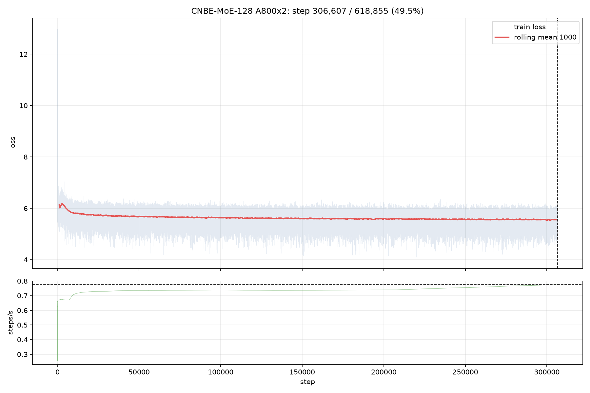
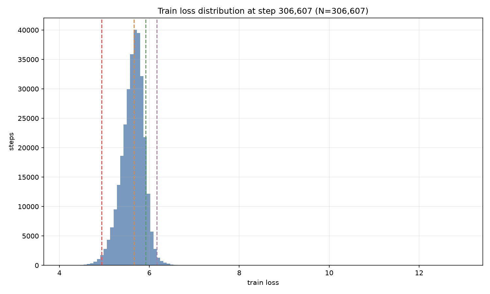

# A800 x 2 Half-Training Status

Date: 2026-08-20

## Current Progress

| Metric | Value |
|---|---:|
| Steps | 306,607 / 618,855 |
| Progress | 49.54% |
| Current loss | 5.7267 |
| Median loss | 5.6551 |
| Q1 / Q99 | 4.9366 / 6.1671 |
| Relative spread | 0.1093 |
| Recent steps/s | 0.7748 |
| Remaining ETA | ~4.7 days |

## Loss Curve

The model converges quickly in the early phase and then enters a slow-improvement stage. The 1000-step rolling mean is stable around 5.6, and no divergence or loss explosion has been observed.

## Loss Distribution

- 99% of steps are below loss 6.17;
- relative spread `(Q90-Q10)/Q50 = 0.1093`, indicating low variance;
- `max = 12.9702` comes from the first step and does not affect convergence analysis;
- `min = 4.0943` is below the previous DCU 544M final eval loss (4.5915), but final conclusions still require the completed eval.

## Throughput and Storage

- Recent median throughput: 0.7748 steps/s (~6,347 tokens/s with a global batch of 8,192 tokens/step);
- Remaining ETA: about 112 hours, roughly 4.7 days;
- Checkpoints are retained every 20,000 steps plus the latest step and `last.pt` to stay within the 450GB storage budget;
- Checkpoint weights are intentionally not uploaded to GitHub.

## Next Steps

- Finish 618,855 steps and save `final.pt`;
- Run final evaluation and collect `eval_metrics.json`;
- Publish the final convergence curve;
- Complete Dense same-config and Unicode same-config controls;
- Add multi-seed significance checks.

Machine-readable summary: [A800_HALF_TRAINING_SUMMARY_2026-08-20.json](A800_HALF_TRAINING_SUMMARY_2026-08-20.json)
